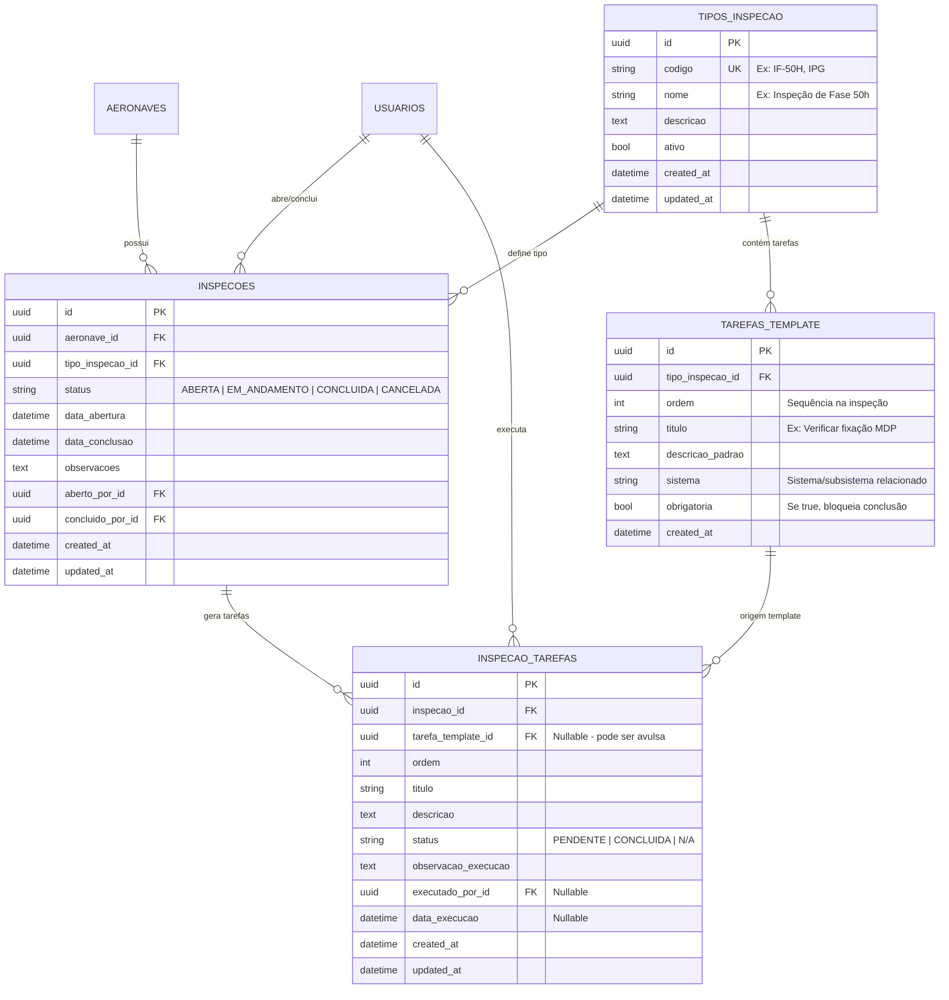

# Plano de Implementação — Módulo de Inspeções

> **Projeto:** SAA29 — Sistema de Apoio à Aviônica A-29  
> **Data:** 2026-04-25  
> **Status:** Implementação inicial isolada iniciada em 2026-04-29  

---

## 0. Estado Atual da Implementação

Em `2026-04-29`, foi iniciado um scaffold backend isolado em `app/modules/inspecoes/`.

Arquivos criados:

- `app/modules/inspecoes/__init__.py`
- `app/modules/inspecoes/models.py`
- `app/modules/inspecoes/schemas.py`
- `app/modules/inspecoes/service.py`
- `app/modules/inspecoes/router.py`

Escopo implementado:

- modelos ORM locais para `TipoInspecao`, `TarefaTemplate`, `Inspecao` e `InspecaoTarefa`;
- schemas Pydantic e enums locais ao módulo, sem alterar `app/shared/core/enums.py`;
- service com CRUD inicial, abertura de inspeção com instanciação de tarefas, bloqueio de duplicidade ativa, atualização de tarefa com rastreabilidade, cancelamento e conclusão condicionada a tarefas obrigatórias;
- router FastAPI definido, mas ainda não registrado no app principal.

Isolamento mantido:

- não houve alteração em `app/bootstrap/main.py`;
- não houve import dos modelos de inspeção no bootstrap;
- não houve migration Alembic;
- não houve alteração em `Aeronave`, `Usuario`, `base.html`, `configuracoes.html`, rotas web ou frontend ativo;
- o módulo não altera o schema do banco nem aparece na API ativa enquanto não for registrado explicitamente.

Validação executada:

- `venv/bin/python -m py_compile app/modules/inspecoes/...`
- import de `app.modules.inspecoes.models`, `schemas`, `service` e `router`;
- `sqlalchemy.orm.configure_mappers()` com modelos principais carregados.
- `venv/bin/python -m pytest tests/unit/test_inspecoes.py -q` (`8 passed`);
- `venv/bin/python -m pytest tests/unit -q` (`84 passed`).

---

## 1. Visão Geral

O módulo **Inspeções** gerencia o ciclo de vida de inspeções programadas em aeronaves A-29.  
Cada inspeção possui um **tipo** (ex: IF-50h, IF-100h, IF-200h, IPG, IPE, etc.), é composta por **tarefas** pré-definidas, e registra **quem executou** cada tarefa e **quando**.

### Funcionalidades Principais

| # | Funcionalidade | Localização |
|---|---------------|-------------|
| 1 | Visualizar aeronaves em inspeção (cards/tabela) | Página `/inspecoes` |
| 2 | Detalhar tarefas de uma inspeção e seus executores | Página `/inspecoes/{id}/detalhes` |
| 3 | Abrir/concluir inspeções vinculadas a aeronaves | Página `/inspecoes` |
| 4 | Cadastrar/editar **tipos de inspeção** | Página `/configuracoes` |
| 5 | Definir **tarefas-template** por tipo de inspeção | Página `/configuracoes` |
| 6 | Ícone de acesso rápido na barra de navegação | `base.html` (header nav) |

---

## 2. Modelagem de Banco de Dados

### 2.1 Diagrama ER



### 2.2 Detalhamento das Tabelas

#### `tipos_inspecao` — Catálogo de Tipos de Inspeção
| Coluna | Tipo | Restrição | Descrição |
|--------|------|-----------|-----------|
| `id` | UUID | PK | Identificador único |
| `codigo` | VARCHAR(30) | UNIQUE, NOT NULL | Código curto (ex: `IF-50H`, `IPG`, `IPE`) |
| `nome` | VARCHAR(150) | NOT NULL | Nome descritivo |
| `descricao` | TEXT | Nullable | Descrição detalhada do tipo de inspeção |
| `ativo` | BOOLEAN | NOT NULL, default=True | Soft delete / controle de visibilidade |
| `created_at` | DATETIME(tz) | NOT NULL | Criação automática |
| `updated_at` | DATETIME(tz) | Nullable | Atualização automática |

#### `tarefas_template` — Tarefas Padrão por Tipo de Inspeção
| Coluna | Tipo | Restrição | Descrição |
|--------|------|-----------|-----------|
| `id` | UUID | PK | Identificador único |
| `tipo_inspecao_id` | UUID | FK → `tipos_inspecao.id`, NOT NULL | Tipo de inspeção pai |
| `ordem` | INTEGER | NOT NULL | Sequência de execução dentro da inspeção |
| `titulo` | VARCHAR(200) | NOT NULL | Título da tarefa (ex: "Verificar fixação MDP") |
| `descricao_padrao` | TEXT | Nullable | Instruções padrão da tarefa |
| `sistema` | VARCHAR(100) | Nullable | Sistema/subsistema aeronáutico relacionado |
| `obrigatoria` | BOOLEAN | NOT NULL, default=True | Se obrigatória, impede conclusão da inspeção sem execução |
| `created_at` | DATETIME(tz) | NOT NULL | Criação automática |

#### `inspecoes` — Inspeções Realizadas
| Coluna | Tipo | Restrição | Descrição |
|--------|------|-----------|-----------|
| `id` | UUID | PK | Identificador único |
| `aeronave_id` | UUID | FK → `aeronaves.id`, NOT NULL | Aeronave inspecionada |
| `tipo_inspecao_id` | UUID | FK → `tipos_inspecao.id`, NOT NULL | Tipo da inspeção |
| `status` | VARCHAR(20) | NOT NULL, default=`ABERTA` | Status: `ABERTA`, `EM_ANDAMENTO`, `CONCLUIDA`, `CANCELADA` |
| `data_abertura` | DATETIME(tz) | NOT NULL | Data/hora de abertura |
| `data_conclusao` | DATETIME(tz) | Nullable | Preenchido ao concluir |
| `observacoes` | TEXT | Nullable | Observações gerais da inspeção |
| `aberto_por_id` | UUID | FK → `usuarios.id`, NOT NULL | Quem abriu a inspeção |
| `concluido_por_id` | UUID | FK → `usuarios.id`, Nullable | Quem concluiu a inspeção |
| `created_at` | DATETIME(tz) | NOT NULL | Criação automática |
| `updated_at` | DATETIME(tz) | Nullable | Atualização automática |

#### `inspecao_tarefas` — Tarefas Instanciadas de uma Inspeção
| Coluna | Tipo | Restrição | Descrição |
|--------|------|-----------|-----------|
| `id` | UUID | PK | Identificador único |
| `inspecao_id` | UUID | FK → `inspecoes.id`, CASCADE, NOT NULL | Inspeção pai |
| `tarefa_template_id` | UUID | FK → `tarefas_template.id`, Nullable | Template de origem (nullable para tarefas avulsas) |
| `ordem` | INTEGER | NOT NULL | Sequência de execução |
| `titulo` | VARCHAR(200) | NOT NULL | Título copiado do template ou customizado |
| `descricao` | TEXT | Nullable | Descrição/instruções |
| `status` | VARCHAR(20) | NOT NULL, default=`PENDENTE` | `PENDENTE`, `CONCLUIDA`, `N/A` |
| `observacao_execucao` | TEXT | Nullable | Observações do executor |
| `executado_por_id` | UUID | FK → `usuarios.id`, Nullable | Quem executou |
| `data_execucao` | DATETIME(tz) | Nullable | Quando foi executada |
| `created_at` | DATETIME(tz) | NOT NULL | Criação automática |
| `updated_at` | DATETIME(tz) | Nullable | Atualização automática |

### 2.3 Relacionamentos com Módulos Existentes

```
aeronaves (existente)
  └── 1:N → inspecoes

usuarios (existente)
  └── 1:N → inspecoes.aberto_por_id
  └── 1:N → inspecoes.concluido_por_id
  └── 1:N → inspecao_tarefas.executado_por_id

tipos_inspecao (novo)
  └── 1:N → tarefas_template
  └── 1:N → inspecoes

tarefas_template (novo)
  └── 1:N → inspecao_tarefas (via instanciação)
```

---

## 3. Enums e Status

Adicionar ao arquivo `app/shared/core/enums.py`:

```python
class StatusInspecao(str, enum.Enum):
    """Status de uma inspeção aeronáutica."""
    ABERTA = "ABERTA"             # Recém-criada, aguardando início
    EM_ANDAMENTO = "EM_ANDAMENTO" # Pelo menos 1 tarefa iniciada
    CONCLUIDA = "CONCLUIDA"       # Todas tarefas obrigatórias concluídas
    CANCELADA = "CANCELADA"       # Inspeção cancelada/abortada

class StatusTarefa(str, enum.Enum):
    """Status de uma tarefa dentro de uma inspeção."""
    PENDENTE = "PENDENTE"     # Aguardando execução
    CONCLUIDA = "CONCLUIDA"   # Executada com sucesso
    NA = "N/A"                # Não aplicável nesta aeronave
```

---

## 4. Estrutura de Arquivos (Backend)

Seguindo o padrão existente dos módulos (`panes`, `aeronaves`, `equipamentos`):

```
app/modules/inspecoes/
├── __init__.py          # Exporta router
├── models.py            # TipoInspecao, TarefaTemplate, Inspecao, InspecaoTarefa
├── schemas.py           # Pydantic schemas (Create, Update, Out, Filtros)
├── service.py           # Lógica de negócio (CRUD + regras)
└── router.py            # Endpoints FastAPI
```

### 4.1 Endpoints da API

#### Tipos de Inspeção (Configurações)
| Método | Rota | Descrição |
|--------|------|-----------|
| `GET` | `/api/inspecoes/tipos` | Listar todos os tipos de inspeção |
| `POST` | `/api/inspecoes/tipos` | Criar novo tipo de inspeção |
| `PUT` | `/api/inspecoes/tipos/{id}` | Editar tipo de inspeção |
| `DELETE` | `/api/inspecoes/tipos/{id}` | Desativar tipo (soft delete) |

#### Tarefas Template (Configurações)
| Método | Rota | Descrição |
|--------|------|-----------|
| `GET` | `/api/inspecoes/tipos/{tipo_id}/tarefas` | Listar tarefas de um tipo |
| `POST` | `/api/inspecoes/tipos/{tipo_id}/tarefas` | Adicionar tarefa ao template |
| `PUT` | `/api/inspecoes/tarefas-template/{id}` | Editar tarefa template |
| `DELETE` | `/api/inspecoes/tarefas-template/{id}` | Remover tarefa do template |
| `PATCH` | `/api/inspecoes/tipos/{tipo_id}/tarefas/reordenar` | Reordenar tarefas |

#### Inspeções (Operacional)
| Método | Rota | Descrição |
|--------|------|-----------|
| `GET` | `/api/inspecoes` | Listar inspeções (filtros: aeronave, status, tipo) |
| `GET` | `/api/inspecoes/{id}` | Detalhe de uma inspeção (com tarefas e executores) |
| `POST` | `/api/inspecoes` | Abrir nova inspeção (instancia tarefas do template) |
| `PUT` | `/api/inspecoes/{id}` | Atualizar observações da inspeção |
| `POST` | `/api/inspecoes/{id}/concluir` | Concluir inspeção (valida tarefas obrigatórias) |
| `POST` | `/api/inspecoes/{id}/cancelar` | Cancelar inspeção |

#### Tarefas da Inspeção (Execução)
| Método | Rota | Descrição |
|--------|------|-----------|
| `GET` | `/api/inspecoes/{id}/tarefas` | Listar tarefas da inspeção |
| `PUT` | `/api/inspecoes/tarefas/{tarefa_id}` | Atualizar tarefa (status, observação, executor) |
| `POST` | `/api/inspecoes/{id}/tarefas` | Adicionar tarefa avulsa à inspeção |

---

## 5. Estrutura de Arquivos (Frontend)

### 5.1 Templates Jinja2

```
app/web/templates/
├── inspecoes/
│   ├── lista.html        # Listagem de inspeções ativas (cards por aeronave)
│   └── detalhe.html      # Detalhe: tarefas, executores, progresso
└── configuracoes.html    # Adicionar painel "Inspeções" (tipos + tarefas)
```

### 5.2 JavaScript

```
app/web/static/js/
├── inspecoes.js          # Lógica da página de listagem
├── inspecao_detalhe.js   # Lógica da página de detalhe
└── configuracoes.js      # Atualizar com funções de inspeção (existente)
```

### 5.3 Rotas de Página

Adicionar em `app/web/pages/router.py`:

```python
@router.get("/inspecoes", response_class=HTMLResponse, include_in_schema=False)
async def inspecoes_page(request: Request):
    """Listagem de Inspeções Aeronáuticas"""
    return templates.TemplateResponse("inspecoes/lista.html", {"request": request})

@router.get("/inspecoes/{inspecao_id}/detalhes", response_class=HTMLResponse, include_in_schema=False)
async def inspecao_detalhe_page(request: Request, inspecao_id: str):
    """Detalhe de uma Inspeção"""
    return templates.TemplateResponse("inspecoes/detalhe.html", {"request": request, "inspecao_id": inspecao_id})
```

---

## 6. Navegação (Ícone na Barra)

Adicionar ícone no `base.html`, dentro do `<nav id="admin-nav">`, ao lado de Panes e Inventário:

```html
<!-- Ícone de Inspeções (checklist) -->
<a href="/inspecoes" class="btn-icon" aria-label="Inspeções" title="Inspeções"
    style="width: 38px; height: 38px; color: var(--primary-color); background: var(--bg-tertiary); border-color: var(--primary-color);">
    <svg width="22" height="22" fill="none" stroke="currentColor" viewBox="0 0 24 24">
        <path stroke-linecap="round" stroke-linejoin="round" stroke-width="2"
            d="M9 5H7a2 2 0 00-2 2v12a2 2 0 002 2h10a2 2 0 002-2V7a2 2 0 00-2-2h-2M9 5a2 2 0 002 2h2a2 2 0 002-2M9 5a2 2 0 012-2h2a2 2 0 012 2m-3 7h3m-3 4h3m-6-4h.01M9 16h.01"/>
    </svg>
</a>
```

---

## 7. Regras de Negócio

| ID | Regra | Descrição |
|----|-------|-----------|
| RN-I01 | Instanciação automática | Ao abrir uma inspeção, as tarefas do template são copiadas para `inspecao_tarefas` |
| RN-I02 | Validação de conclusão | Inspeção só pode ser concluída se todas as tarefas **obrigatórias** estiverem `CONCLUIDA` ou `N/A` |
| RN-I03 | Transição automática | Status muda para `EM_ANDAMENTO` quando a primeira tarefa é concluída |
| RN-I04 | Rastreabilidade | `executado_por_id` e `data_execucao` são obrigatórios ao marcar tarefa como `CONCLUIDA` |
| RN-I05 | Imutabilidade | Inspeções `CONCLUIDA` ou `CANCELADA` não podem ser editadas |
| RN-I06 | Status aeronave | Ao abrir inspeção, aeronave pode ter seu status alterado para `INDISPONIVEL` (configurável) |
| RN-I07 | Unicidade | Não pode haver 2 inspeções `ABERTA`/`EM_ANDAMENTO` do mesmo tipo para a mesma aeronave |

---

## 8. Página de Configurações — Seção Inspeções

Adicionar novo card na grade do `configuracoes.html`:

```
┌─────────────────────────────────────────────┐
│ 🔍 Inspeções                                │
│                                             │
│ Cadastro de tipos de inspeção e definição   │
│ das tarefas padrão para cada tipo.          │
│                                             │
│ [+ Cadastrar Tipo de Inspeção]              │
│ [✏ Editar Tipo de Inspeção]                 │
│ [📋 Gerenciar Tarefas do Tipo]              │
└─────────────────────────────────────────────┘
```

### Modais necessários:
1. **Modal Cadastrar/Editar Tipo** — código, nome, descrição
2. **Modal Gerenciar Tarefas** — listar tarefas do tipo selecionado, adicionar/remover/reordenar (drag-and-drop ou setas)

---

## 9. Página de Listagem (`/inspecoes`)

### Layout proposto:

```
┌──────────────────────────────────────────────────────────────────┐
│  Filtros: [Tipo ▼] [Status ▼] [Aeronave ▼]  [🔍 Buscar]        │
├──────────────────────────────────────────────────────────────────┤
│                                                                  │
│  ┌─────────────┐  ┌─────────────┐  ┌─────────────┐              │
│  │  FAB 5916   │  │  FAB 5902   │  │  FAB 5700   │              │
│  │  IF-100H    │  │  IPG        │  │  IF-50H     │              │
│  │  ██████░░   │  │  █████████░ │  │  ████░░░░░  │              │
│  │  12/18 tasks│  │  28/30 tasks│  │  8/20 tasks  │              │
│  │  Status: EM │  │  Status: EM │  │  Status: AB  │              │
│  │  ANDAMENTO  │  │  ANDAMENTO  │  │  ERTA        │              │
│  │ [Detalhes →]│  │ [Detalhes →]│  │ [Detalhes →] │              │
│  └─────────────┘  └─────────────┘  └─────────────┘              │
│                                                                  │
│  [+ Nova Inspeção]                                               │
└──────────────────────────────────────────────────────────────────┘
```

### Informações no card:
- Matrícula da aeronave
- Tipo de inspeção (código)
- Barra de progresso (tarefas concluídas / total)
- Status com badge colorido
- Data de abertura
- Link para página de detalhes

---

## 10. Página de Detalhe (`/inspecoes/{id}/detalhes`)

### Layout proposto:

```
┌──────────────────────────────────────────────────────────────────┐
│  ← Voltar   Inspeção IF-100H — FAB 5916                         │
│  Status: EM_ANDAMENTO    Aberta em: 20/04/2026 por SGT SILVA    │
│  Progresso: ████████░░░░░░ 12/18 tarefas (67%)                  │
├──────────────────────────────────────────────────────────────────┤
│                                                                  │
│  # │ Tarefa                    │ Sistema  │ Status    │ Executor │
│  ──┼───────────────────────────┼──────────┼───────────┼──────────│
│  1 │ Verificar fixação MDP     │ Aviônica │ ✅ CONC.  │ SGT ABC  │
│  2 │ Testar CMFD 1 e 2         │ Display  │ ✅ CONC.  │ SGT DEF  │
│  3 │ Inspecionar VUHF          │ Rádio    │ ⏳ PEND.  │ —        │
│  4 │ Verificar antena IFF      │ IFF      │ ⏳ PEND.  │ —        │
│  ...                                                             │
│                                                                  │
│  [Concluir Inspeção]   [Cancelar Inspeção]                       │
└──────────────────────────────────────────────────────────────────┘
```

### Interações:
- Clicar em uma tarefa pendente → abre modal para marcar como concluída (selecionar executor + observação)
- Badge de status com cores (verde=concluída, amarelo=pendente, cinza=N/A)
- Botão "Concluir Inspeção" só habilitado quando todas obrigatórias estão resolvidas

---

## 11. Faseamento da Implementação

### Fase 1 — Banco de Dados e Models (~2h)
- [x] Criar `app/modules/inspecoes/__init__.py` (isolado, sem autoimport do router)
- [x] Criar `app/modules/inspecoes/models.py` (4 tabelas)
- [x] Adicionar enums `StatusInspecao` e `StatusTarefa` localmente em `schemas.py` para manter isolamento
- [ ] Adicionar enums `StatusInspecao` e `StatusTarefa` em `enums.py` (pendente para ativação)
- [ ] Adicionar relationships em `Aeronave` e `Usuario` (pendente para ativação)
- [ ] Gerar migration Alembic
- [ ] Testar migration (upgrade/downgrade)

### Fase 2 — Backend: Schemas + Service + Router (~4h)
- [x] Criar `schemas.py` com Pydantic models
- [x] Criar `service.py` com lógica de negócio (CRUD + regras RN-I01 a RN-I07)
- [x] Criar `router.py` com endpoints da API
- [ ] Registrar router no app principal (pendente por isolamento)
- [ ] Testar endpoints via Swagger/docs

### Fase 3 — Frontend: Navegação + Configurações (~3h)
- [ ] Adicionar ícone de Inspeções no `base.html` (nav)
- [ ] Adicionar card "Inspeções" em `configuracoes.html`
- [ ] Criar modais de tipo de inspeção e tarefas
- [ ] Implementar JS para CRUD de tipos e tarefas
- [ ] Adicionar rotas de página em `pages/router.py`

### Fase 4 — Frontend: Listagem e Detalhe (~4h)
- [ ] Criar template `inspecoes/lista.html` (cards com progresso)
- [ ] Criar template `inspecoes/detalhe.html` (tabela de tarefas)
- [ ] Implementar `inspecoes.js` (listagem, filtros, nova inspeção)
- [ ] Implementar `inspecao_detalhe.js` (execução de tarefas, conclusão)

### Fase 5 — Polimento e Testes (~2h)
- [x] Testes unitários do service isolado
- [x] Testes de autenticação/RBAC do router isolado
- [x] Teste de regressão garantindo que a API de inspeções não está ativa no app principal
- [ ] Testes de integração dos endpoints
- [ ] Ajustes de UX (responsividade, animações, dark mode)
- [ ] Documentação da API (docstrings)

---

## 12. Impacto em Arquivos Existentes

| Arquivo | Alteração |
|---------|-----------|
| `app/shared/core/enums.py` | Adicionar `StatusInspecao`, `StatusTarefa` |
| `app/modules/aeronaves/models.py` | Adicionar relationship `inspecoes` |
| `app/modules/auth/models.py` | Adicionar relationships de inspeção |
| `app/web/templates/base.html` | Adicionar ícone na nav |
| `app/web/templates/configuracoes.html` | Adicionar card + modais |
| `app/web/static/js/configuracoes.js` | Adicionar funções de CRUD inspeção |
| `app/web/pages/router.py` | Adicionar rotas `/inspecoes` |
| `app/bootstrap/` | Registrar router de inspeções |
| `migrations/` | Nova migration Alembic |

---

## 13. Considerações Técnicas

### Performance
- Usar `joinedload` para carregar tarefas e executores no detalhe da inspeção
- Índices em `inspecoes.aeronave_id`, `inspecoes.status`, `inspecao_tarefas.inspecao_id`
- Paginação na listagem de inspeções

### Segurança
- Apenas `ENCARREGADO` e `ADMINISTRADOR` podem abrir/concluir inspeções
- `MANTENEDOR` pode apenas executar tarefas atribuídas
- Validação JWT em todos os endpoints (padrão existente)

### Integridade
- `ON DELETE RESTRICT` para aeronave e tipo (impedir exclusão com inspeções vinculadas)
- `ON DELETE CASCADE` para tarefas ao excluir inspeção cancelada
- Constraint `UNIQUE(aeronave_id, tipo_inspecao_id)` filtrado por status não-finalizado (RN-I07)


==================================

Plano criado com sucesso em docs/implementacao_inspecao.md. Aqui está um resumo dos pontos-chave:

📋 Resumo do Plano
Banco de Dados — 4 novas tabelas:

tipos_inspecao — catálogo de tipos (IF-50H, IPG, IPE, etc.)
tarefas_template — tarefas padrão por tipo de inspeção
inspecoes — inspeções realizadas (vinculadas a aeronaves + usuários)
inspecao_tarefas — tarefas instanciadas com rastreio de executor
Frontend — 3 áreas:

Ícone na nav ao lado de Panes, Inventário e Frota
Página /inspecoes com cards mostrando aeronaves em inspeção + barra de progresso
Página /inspecoes/{id}/detalhes com tabela de tarefas, status e executor
Card em /configuracoes para cadastro de tipos e tarefas-template
7 regras de negócio (instanciação automática de tarefas, validação de conclusão, rastreabilidade obrigatória, etc.)

5 fases de implementação (~15h estimadas total)

❓ Decisões pendentes para você validar:
Os tipos de inspeção sugeridos (IF-50H, IF-100H, IPG, IPE) são adequados ao contexto da unidade?
Deseja que a abertura de inspeção altere automaticamente o status da aeronave para INDISPONIVEL?
A regra de unicidade (não permitir 2 inspeções ativas do mesmo tipo na mesma aeronave) faz sentido?
Quer começar a implementação por alguma fase específica?
