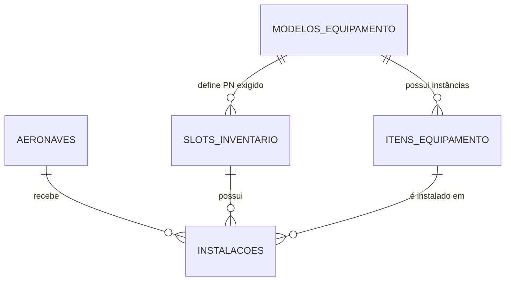

# MODEL_DB.md
**Modelo de Banco de Dados – SAA29 (Sistema de Acompanhamento de Aeronaves A-29)**

> Documento sincronizado com o código-fonte em 19/04/2026.
> Fonte da verdade: arquivos `app/*/models.py` e `app/core/enums.py`.

---

## 1. Visão Geral

O banco de dados do SAA29 é composto por **11 tabelas** organizadas em 4 domínios:

| Domínio | Tabelas | Status |
| :--- | :--- | :---: |
| **Autenticação** | `usuarios`, `token_blacklist` | ✅ Implementado |
| **Aeronaves** | `aeronaves` | ✅ Implementado |
| **Panes** | `panes`, `anexos`, `pane_responsaveis` | ✅ Implementado |
| **Equipamentos** | `modelos_equipamento`, `slots_inventario`, `itens_equipamento`, `instalacoes`, `tipos_controle`, `equipamento_controles`, `controle_vencimentos` | ✅ Implementado |

**Banco:** SQLite (modo WAL) via `aiosqlite` + SQLAlchemy 2.x async.
**Migrações:** Alembic.
**IDs:** UUID v4 em todas as tabelas.

---

## 2. Entidades de Equipamentos (PN vs Slot)

O domínio de equipamentos segue a arquitetura de rastreabilidade completa, separando o catálogo (PN) da posição na aeronave (Slot) e da instância física (Item/SN).

### 2.7 Modelos de Equipamento (Catálogo de PNs)

**Tabela:** `modelos_equipamento`
**Arquivo:** `app/equipamentos/models.py` → classe `ModeloEquipamento`

| Coluna | Tipo | Restrições | Descrição |
| :--- | :--- | :--- | :--- |
| `id` | UUID | PK, default uuid4 | Identificador único |
| `part_number` | String(50) | UNIQUE, NOT NULL, INDEX | PN oficial (ex: MA902B-02) |
| `nome_generico` | String(100) | NOT NULL | Nome do equipamento (ex: MDP) |
| `descricao` | String(500) | nullable | Detalhes técnicos |
| `created_at` | DateTime(tz) | NOT NULL, default now() | — |

---

### 2.8 Slots de Inventário (Posições na Aeronave)

**Tabela:** `slots_inventario`
**Arquivo:** `app/equipamentos/models.py` → classe `SlotInventario`

| Coluna | Tipo | Restrições | Descrição |
| :--- | :--- | :--- | :--- |
| `id` | UUID | PK, default uuid4 | Identificador único |
| `nome_posicao` | String(100) | NOT NULL, INDEX | Nome da vaga (ex: MDP1, CMFD1) |
| `sistema` | String(50) | nullable | Localização/Sigla (ex: CEI, 1P, 2P, CES) |
| `modelo_id` | UUID | FK → modelos_equipamento.id, NOT NULL | PN exigido para esta posição |

---

### 2.9 Itens de Equipamento (Serial Number)

**Tabela:** `itens_equipamento`
**Arquivo:** `app/equipamentos/models.py` → classe `ItemEquipamento`

| Coluna | Tipo | Restrições | Descrição |
| :--- | :--- | :--- | :--- |
| `id` | UUID | PK, default uuid4 | Identificador único |
| `modelo_id` | UUID | FK → modelos_equipamento.id, NOT NULL, INDEX | Part Number do item |
| `numero_serie` | String(100) | NOT NULL, INDEX | Número de série físico |
| `status` | String(20) | NOT NULL, default "ATIVO" | `ATIVO` \| `ESTOQUE` \| `REMOVIDO` |
| `created_at` | DateTime(tz) | NOT NULL, default now() | — |
| `updated_at` | DateTime(tz) | nullable, onupdate now() | — |

**Constraint:** `UNIQUE(modelo_id, numero_serie)` — Garante que um SN só exista uma vez para o mesmo PN.

---

### 2.10 Instalação em Aeronaves (Movimentação e Histórico)

**Tabela:** `instalacoes`
**Arquivo:** `app/equipamentos/models.py` → classe `Instalacao`

| Coluna | Tipo | Restrições | Descrição |
| :--- | :--- | :--- | :--- |
| `id` | UUID | PK, default uuid4 | Identificador único |
| `item_id` | UUID | FK → itens_equipamento.id, NOT NULL, INDEX | SN que está sendo instalado |
| `aeronave_id` | UUID | FK → aeronaves.id, NOT NULL, INDEX | Aeronave destino |
| `slot_id` | UUID | FK → slots_inventario.id, NOT NULL, INDEX | Posição ocupada |
| `data_instalacao` | Date | NOT NULL | Data de entrada na aeronave |
| `data_remocao` | Date | nullable | NULL = item ainda está instalado |
| `created_at` | DateTime(tz) | NOT NULL, default now() | Timestamp para rastreabilidade precisa |

**Regra de Negócio:**
- `data_remocao = NULL` indica instalação ativa.
- A busca por **"Aeronave Anterior"** ordena por `data_remocao DESC` e `created_at DESC` para garantir precisão em trocas no mesmo dia.

---

## 3. Diagrama de Relacionamentos (Simplificado)



---

## 6. Consulta-Chave: Inventário por Aeronave

```sql
-- Inventário atual da aeronave (itens instalados nos slots)
SELECT
    s.sistema AS Localizacao,
    s.nome_posicao AS Slot,
    m.part_number AS PN,
    ie.numero_serie AS SN,
    i.data_instalacao
FROM slots_inventario s
    JOIN modelos_equipamento m ON m.id = s.modelo_id
    LEFT JOIN instalacoes i ON i.slot_id = s.id AND i.data_remocao IS NULL AND i.aeronave_id = :aeronave_id
    LEFT JOIN itens_equipamento ie ON ie.id = i.item_id
ORDER BY s.sistema, s.nome_posicao;
```

### Resultado esperado (exemplo para 5916)

| Localização | Slot | PN | SN | Data Instalação |
| :--- | :--- | :--- | :--- | :--- |
| CEI | ADF | 622-7382-101 | SN-ADF-9988 | 2026-04-19 |
| CEI | MDP1 | MA902B-02 | SN-MDP-1122 | 2026-04-19 |
| 1P | CMFD1 | MB387B-01 | SN-CMFD-4455 | 2026-04-19 |

---

## 7. Índices de Performance

| Tabela | Coluna(s) | Motivo |
| :--- | :--- | :--- |
| `itens_equipamento` | `modelo_id, numero_serie` | Unicidade de Item físico |
| `instalacoes` | `aeronave_id, slot_id, data_remocao` | Busca rápida de inventário atual |
| `slots_inventario` | `nome_posicao` | Filtro de posição |
| `aeronaves` | `matricula` | Busca rápida por aeronave |

---

*Documento atualizado em 19 de abril de 2026 para refletir a arquitetura PN vs Slot implementada.*
