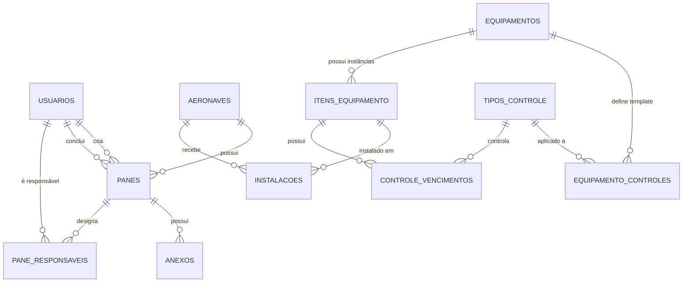

# MODEL_DB.md
**Modelo de Banco de Dados – SAA29 (Sistema de Acompanhamento de Aeronaves A-29)**

> Documento sincronizado com o código-fonte em 18/04/2026.
> Fonte da verdade: arquivos `app/*/models.py` e `app/core/enums.py`.

---

## 1. Visão Geral

O banco de dados do SAA29 é composto por **10 tabelas** organizadas em 4 domínios:

| Domínio | Tabelas | Status |
| :--- | :--- | :---: |
| **Autenticação** | `usuarios`, `token_blacklist` | ✅ Implementado |
| **Aeronaves** | `aeronaves` | ✅ Implementado |
| **Panes** | `panes`, `anexos`, `pane_responsaveis` | ✅ Implementado |
| **Equipamentos** | `equipamentos`, `tipos_controle`, `equipamento_controles`, `itens_equipamento`, `instalacoes`, `controle_vencimentos` | ⚙️ Modelo ORM criado, pendente de UI/rotas |

**Banco:** SQLite (modo WAL) via `aiosqlite` + SQLAlchemy 2.x async.
**Migrações:** Alembic (9 migrações aplicadas até o momento).
**IDs:** UUID v4 em todas as tabelas.

---

## 2. Entidades

---

### 2.1 Usuários (Efetivo)

**Tabela:** `usuarios`
**Arquivo:** `app/auth/models.py` → classe `Usuario`

| Coluna | Tipo | Restrições | Descrição |
| :--- | :--- | :--- | :--- |
| `id` | UUID | PK, default uuid4 | Identificador único |
| `nome` | String(150) | NOT NULL | Nome completo do militar |
| `posto` | String(30) | NOT NULL | Posto ou graduação (ex: Ten, Cap, Sgt) |
| `especialidade` | String(50) | nullable | Especialidade técnica |
| `funcao` | String(50) | NOT NULL | `ADMINISTRADOR` \| `ENCARREGADO` \| `MANTENEDOR` |
| `ramal` | String(20) | nullable | Ramal telefônico |
| `trigrama` | String(3) | nullable | Código de 3 letras identificador |
| `username` | String(50) | UNIQUE, NOT NULL, INDEX | Login |
| `senha_hash` | String(255) | NOT NULL | Hash bcrypt |
| `ativo` | Boolean | default True, INDEX | Soft delete |
| `created_at` | DateTime(tz) | NOT NULL, default now() | — |
| `updated_at` | DateTime(tz) | nullable, onupdate now() | — |

**Relacionamentos:**
- `1:N` → `panes` (como criador via `criado_por_id`)
- `1:N` → `panes` (como responsável da conclusão via `concluido_por_id`)
- `1:N` → `pane_responsaveis`

---

### 2.2 Token Blacklist

**Tabela:** `token_blacklist`
**Arquivo:** `app/auth/models.py` → classe `TokenBlacklist`

| Coluna | Tipo | Restrições | Descrição |
| :--- | :--- | :--- | :--- |
| `jti` | String(36) | PK, INDEX | JWT ID do token invalidado |
| `expira_em` | DateTime(tz) | NOT NULL | Expiração original do token |
| `criado_em` | DateTime(tz) | NOT NULL, default now() | Data de invalidação |

---

### 2.3 Aeronaves

**Tabela:** `aeronaves`
**Arquivo:** `app/aeronaves/models.py` → classe `Aeronave`

| Coluna | Tipo | Restrições | Descrição |
| :--- | :--- | :--- | :--- |
| `id` | UUID | PK, default uuid4 | Identificador único |
| `part_number` | String(50) | nullable | Part number da aeronave |
| `serial_number` | String(50) | UNIQUE, NOT NULL, INDEX | Número de série |
| `matricula` | String(20) | UNIQUE, NOT NULL, INDEX | Matrícula operacional (ex: 5916) |
| `modelo` | String(50) | NOT NULL, default "A-29" | Modelo da aeronave |
| `status` | String(20) | NOT NULL, default "OPERACIONAL" | `OPERACIONAL` \| `INDISPONIVEL` \| `INATIVA` |
| `created_at` | DateTime(tz) | NOT NULL, default now() | — |
| `updated_at` | DateTime(tz) | nullable, onupdate now() | — |

**Relacionamentos:**
- `1:N` → `panes`
- `1:N` → `instalacoes`

---

### 2.4 Panes

**Tabela:** `panes`
**Arquivo:** `app/panes/models.py` → classe `Pane`

| Coluna | Tipo | Restrições | Descrição |
| :--- | :--- | :--- | :--- |
| `id` | UUID | PK, default uuid4 | Identificador único |
| `aeronave_id` | UUID | FK → aeronaves.id, NOT NULL, INDEX | Aeronave vinculada |
| `status` | String(20) | NOT NULL, default "ABERTA", INDEX | `ABERTA` \| `RESOLVIDA` |
| `sistema_subsistema` | String(100) | nullable | Sistema/subsistema da falha |
| `descricao` | Text | NOT NULL, default "AGUARDANDO EDICAO" | Descrição da pane |
| `data_abertura` | DateTime(tz) | NOT NULL, default now() | Data de abertura automática |
| `data_conclusao` | DateTime(tz) | nullable | Preenchido ao concluir |
| `observacao_conclusao` | Text | nullable | Ação corretiva |
| `comentarios` | Text | nullable | Observações internas |
| `ativo` | Boolean | default True, INDEX | Soft delete |
| `criado_por_id` | UUID | FK → usuarios.id, NOT NULL | Quem registrou |
| `concluido_por_id` | UUID | FK → usuarios.id, nullable | Quem concluiu |
| `created_at` | DateTime(tz) | NOT NULL, default now() | — |
| `updated_at` | DateTime(tz) | nullable, onupdate now() | — |

**Relacionamentos:**
- `N:1` → `aeronaves`
- `N:1` → `usuarios` (criador)
- `N:1` → `usuarios` (responsável conclusão)
- `1:N` → `anexos` (cascade delete)
- `1:N` → `pane_responsaveis` (cascade delete)

**Regras de Negócio:**
- RN-03: Apenas panes ABERTA podem ser editadas.
- RN-04: `data_conclusao` é preenchida automaticamente ao concluir.
- RN-05: Descrição padrão = "AGUARDANDO EDICAO" se vazio.
- Soft delete via campo `ativo`.

---

### 2.5 Anexos

**Tabela:** `anexos`
**Arquivo:** `app/panes/models.py` → classe `Anexo`

| Coluna | Tipo | Restrições | Descrição |
| :--- | :--- | :--- | :--- |
| `id` | UUID | PK, default uuid4 | Identificador único |
| `pane_id` | UUID | FK → panes.id (CASCADE), NOT NULL, INDEX | Pane vinculada |
| `caminho_arquivo` | String(500) | NOT NULL | Caminho relativo ao diretório de uploads |
| `tipo` | String(20) | NOT NULL, default "IMAGEM" | `IMAGEM` \| `DOCUMENTO` |
| `created_at` | DateTime(tz) | NOT NULL, default now() | — |

---

### 2.6 Responsáveis por Pane

**Tabela:** `pane_responsaveis`
**Arquivo:** `app/panes/models.py` → classe `PaneResponsavel`

| Coluna | Tipo | Restrições | Descrição |
| :--- | :--- | :--- | :--- |
| `id` | UUID | PK, default uuid4 | Identificador único |
| `pane_id` | UUID | FK → panes.id (CASCADE), NOT NULL, INDEX | Pane vinculada |
| `usuario_id` | UUID | FK → usuarios.id (RESTRICT), NOT NULL | Usuário responsável |
| `papel` | String(30) | NOT NULL | `ADMINISTRADOR` \| `ENCARREGADO` \| `MANTENEDOR` |
| `created_at` | DateTime(tz) | NOT NULL, default now() | — |

**Propriedade auxiliar:** `trigrama` (acessa `usuario.trigrama`).

---

### 2.7 Equipamentos (Tipo / Part Number)

**Tabela:** `equipamentos`
**Arquivo:** `app/equipamentos/models.py` → classe `Equipamento`
**Status:** ⚙️ Modelo ORM criado. Pendente: rotas, serviço, templates de UI.

| Coluna | Tipo | Restrições | Descrição |
| :--- | :--- | :--- | :--- |
| `id` | UUID | PK, default uuid4 | Identificador único |
| `part_number` | String(50) | NOT NULL, INDEX | Part number do tipo |
| `nome` | String(100) | NOT NULL | Nome do equipamento (ex: VUHF2, ELT, MDP) |
| `sistema` | String(50) | nullable | Sistema ao qual pertence (ex: COM, NAV, AP) |
| `descricao` | String(500) | nullable | Descrição do equipamento |
| `created_at` | DateTime(tz) | NOT NULL, default now() | — |
| `updated_at` | DateTime(tz) | nullable, onupdate now() | — |

**Relacionamentos:**
- `1:N` → `equipamento_controles` (template de controles)
- `1:N` → `itens_equipamento` (instâncias físicas)

---

### 2.8 Tipos de Controle

**Tabela:** `tipos_controle`
**Arquivo:** `app/equipamentos/models.py` → classe `TipoControle`
**Status:** ⚙️ Modelo ORM criado. Pendente: rotas, serviço, templates de UI.

| Coluna | Tipo | Restrições | Descrição |
| :--- | :--- | :--- | :--- |
| `id` | UUID | PK, default uuid4 | Identificador único |
| `nome` | String(50) | UNIQUE, NOT NULL, INDEX | Nome do controle (ex: TBV, RBA, CRI) |
| `descricao` | String(300) | nullable | Descrição do controle |
| `periodicidade_meses` | Integer | NOT NULL | Intervalo em meses entre execuções |
| `created_at` | DateTime(tz) | NOT NULL, default now() | — |

**Relacionamentos:**
- `1:N` → `equipamento_controles`
- `1:N` → `controle_vencimentos`

---

### 2.9 Relação Equipamento × Controle (TEMPLATE)

**Tabela:** `equipamento_controles`
**Arquivo:** `app/equipamentos/models.py` → classe `EquipamentoControle`
**Status:** ⚙️ Modelo ORM criado. Pendente: rotas, serviço, templates de UI.

| Coluna | Tipo | Restrições | Descrição |
| :--- | :--- | :--- | :--- |
| `id` | UUID | PK, default uuid4 | Identificador único |
| `equipamento_id` | UUID | FK → equipamentos.id (CASCADE), NOT NULL | Tipo de equipamento |
| `tipo_controle_id` | UUID | FK → tipos_controle.id (CASCADE), NOT NULL | Tipo de controle |

**Constraint:** `UNIQUE(equipamento_id, tipo_controle_id)` — nome: `uq_equip_controle`

**Regra de Negócio:**
- Ao inserir um novo `EquipamentoControle`, propagar automaticamente para todos os `itens_equipamento` existentes desse equipamento (criar `ControleVencimento` para cada item).

---

### 2.10 Itens de Equipamento (Serial Number)

**Tabela:** `itens_equipamento`
**Arquivo:** `app/equipamentos/models.py` → classe `ItemEquipamento`
**Status:** ⚙️ Modelo ORM criado. Pendente: rotas, serviço, templates de UI.

| Coluna | Tipo | Restrições | Descrição |
| :--- | :--- | :--- | :--- |
| `id` | UUID | PK, default uuid4 | Identificador único |
| `equipamento_id` | UUID | FK → equipamentos.id (RESTRICT), NOT NULL, INDEX | Tipo de equipamento |
| `numero_serie` | String(100) | UNIQUE, NOT NULL, INDEX | Número de série do item físico |
| `status` | String(20) | NOT NULL, default "ATIVO" | `ATIVO` \| `ESTOQUE` \| `REMOVIDO` |
| `created_at` | DateTime(tz) | NOT NULL, default now() | — |
| `updated_at` | DateTime(tz) | nullable, onupdate now() | — |

**Relacionamentos:**
- `N:1` → `equipamentos`
- `1:N` → `controle_vencimentos`
- `1:N` → `instalacoes`

**Regra de Negócio:**
- Ao criar um novo item, herdar automaticamente os controles do equipamento pai (criar registros em `controle_vencimentos`).

---

### 2.11 Instalação em Aeronaves (Histórico)

**Tabela:** `instalacoes`
**Arquivo:** `app/equipamentos/models.py` → classe `Instalacao`
**Status:** ⚙️ Modelo ORM criado. Pendente: rotas, serviço, templates de UI.

| Coluna | Tipo | Restrições | Descrição |
| :--- | :--- | :--- | :--- |
| `id` | UUID | PK, default uuid4 | Identificador único |
| `item_id` | UUID | FK → itens_equipamento.id (RESTRICT), NOT NULL, INDEX | Item instalado |
| `aeronave_id` | UUID | FK → aeronaves.id (RESTRICT), NOT NULL, INDEX | Aeronave destino |
| `data_instalacao` | Date | NOT NULL | Data em que o item foi instalado |
| `data_remocao` | Date | nullable | NULL = item ainda está instalado |
| `created_at` | DateTime(tz) | NOT NULL, default now() | Timestamp para rastreabilidade precisa |

**Relacionamentos:**
- `N:1` → `itens_equipamento`
- `N:1` → `aeronaves`

**Regra de Negócio:**
- `data_remocao = NULL` indica que o item está **atualmente instalado** na aeronave.
- Para consultar o inventário atual de uma aeronave: `SELECT * FROM instalacoes WHERE aeronave_id = ? AND data_remocao IS NULL`.

---

### 2.12 Controle de Vencimentos (Instância Real)

**Tabela:** `controle_vencimentos`
**Arquivo:** `app/equipamentos/models.py` → classe `ControleVencimento`
**Status:** ⚙️ Modelo ORM criado. Pendente: rotas, serviço, templates de UI.

| Coluna | Tipo | Restrições | Descrição |
| :--- | :--- | :--- | :--- |
| `id` | UUID | PK, default uuid4 | Identificador único |
| `item_id` | UUID | FK → itens_equipamento.id (CASCADE), NOT NULL, INDEX | Item físico |
| `tipo_controle_id` | UUID | FK → tipos_controle.id (RESTRICT), NOT NULL | Tipo de controle |
| `data_ultima_exec` | Date | nullable | Última execução do controle |
| `data_vencimento` | Date | nullable, INDEX | Calculada: `data_ultima_exec + periodicidade_meses` |
| `status` | String(20) | NOT NULL, default "OK" | `OK` \| `VENCENDO` \| `VENCIDO` |
| `origem` | String(20) | NOT NULL, default "PADRAO" | `PADRAO` (herdado) \| `ESPECIFICO` |
| `created_at` | DateTime(tz) | NOT NULL, default now() | — |

**Constraint:** `UNIQUE(item_id, tipo_controle_id)` — nome: `uq_item_controle`

---

## 3. Diagrama de Relacionamentos



---

## 4. Enumeradores (app/core/enums.py)

| Enum | Valores | Usado em |
| :--- | :--- | :--- |
| `StatusPane` | `ABERTA`, `RESOLVIDA` | `panes.status` |
| `StatusItem` | `ATIVO`, `ESTOQUE`, `REMOVIDO` | `itens_equipamento.status` |
| `StatusVencimento` | `OK`, `VENCENDO`, `VENCIDO` | `controle_vencimentos.status` |
| `OrigemControle` | `PADRAO`, `ESPECIFICO` | `controle_vencimentos.origem` |
| `TipoPapel` | `MANTENEDOR`, `ENCARREGADO`, `ADMINISTRADOR` | `pane_responsaveis.papel`, `usuarios.funcao` |
| `StatusAeronave` | `OPERACIONAL`, `INDISPONIVEL`, `INATIVA` | `aeronaves.status` |
| `TipoAnexo` | `IMAGEM`, `DOCUMENTO` | `anexos.tipo` |

---

## 5. Regras de Negócio (Banco)

### Panes
- RN-03: Apenas panes com `status = ABERTA` podem ser editadas.
- RN-04: `data_conclusao` é preenchida automaticamente ao concluir.
- RN-05: Descrição padrão = "AGUARDANDO EDICAO".
- Exclusão lógica via campo `ativo` (soft delete).

### Equipamentos e Herança
- Ao criar um `ItemEquipamento`, herdar automaticamente os controles do `Equipamento` pai (criar registros em `controle_vencimentos` para cada `equipamento_controle`).
- Ao criar um novo `EquipamentoControle`, propagar para todos os itens existentes daquele equipamento.
- `UNIQUE(item_id, tipo_controle_id)` impede duplicidade de controle por item.

### Instalações
- `data_remocao = NULL` indica instalação ativa.
- Um item só pode estar instalado em uma aeronave por vez (validação no serviço).
- Ao remover um item, `data_remocao` é preenchida e o item pode ser reinstalado em outra aeronave.

### Usuários
- `ativo = False` impede login (soft delete).
- Username é único e indexado para busca rápida.

---

## 6. Consulta-Chave: Inventário por Aeronave

> Esta é a consulta principal para a página de inventário físico.

```sql
-- Inventário atual da aeronave (itens instalados)
SELECT
    a.matricula,
    e.nome AS equipamento,
    e.part_number,
    e.sistema,
    ie.numero_serie,
    ie.status AS status_item,
    i.data_instalacao
FROM instalacoes i
    JOIN itens_equipamento ie ON ie.id = i.item_id
    JOIN equipamentos e ON e.id = ie.equipamento_id
    JOIN aeronaves a ON a.id = i.aeronave_id
WHERE a.id = :aeronave_id
  AND i.data_remocao IS NULL
ORDER BY e.sistema, e.nome;
```

### Resultado esperado (exemplo)

| Matrícula | Equipamento | Part Number | Sistema | Nº Série | Status | Data Instalação |
| :--- | :--- | :--- | :--- | :--- | :--- | :--- |
| 5916 | VUHF2 | 822-1468-002 | COM | SN-00123 | ATIVO | 2025-06-15 |
| 5916 | ELT | 453-6603 | EMG | SN-00456 | ATIVO | 2024-11-20 |
| 5916 | MDP | 980-6144-001 | NAV | SN-00789 | ATIVO | 2025-01-10 |

---

## 7. Índices Existentes

| Tabela | Coluna(s) | Tipo |
| :--- | :--- | :--- |
| `usuarios` | `username` | UNIQUE INDEX |
| `usuarios` | `ativo` | INDEX |
| `aeronaves` | `serial_number` | UNIQUE INDEX |
| `aeronaves` | `matricula` | UNIQUE INDEX |
| `panes` | `aeronave_id` | INDEX |
| `panes` | `status` | INDEX |
| `panes` | `ativo` | INDEX |
| `anexos` | `pane_id` | INDEX |
| `pane_responsaveis` | `pane_id` | INDEX |
| `equipamentos` | `part_number` | INDEX |
| `itens_equipamento` | `equipamento_id` | INDEX |
| `itens_equipamento` | `numero_serie` | UNIQUE INDEX |
| `instalacoes` | `item_id` | INDEX |
| `instalacoes` | `aeronave_id` | INDEX |
| `controle_vencimentos` | `item_id` | INDEX |
| `controle_vencimentos` | `data_vencimento` | INDEX |
| `token_blacklist` | `jti` | PRIMARY KEY + INDEX |

---

## 8. PRAGMAs SQLite (app/database.py)

O sistema habilita automaticamente ao conectar:
- `PRAGMA foreign_keys=ON` — Garante integridade referencial.
- `PRAGMA journal_mode=WAL` — Permite leituras concorrentes sem bloqueio.

---

## 9. Migrações (Alembic)

| Data | Migração | Descrição |
| :--- | :--- | :--- |
| 2026-03-28 | `d6a790b729ac` | Schema inicial (todas as tabelas) |
| 2026-03-28 | `1e829a9c6428` | Schema inicial (complemento) |
| 2026-03-28 | `dfb912f1f531` | Adicionar `observacao_conclusao` e `ativo` em panes |
| 2026-03-29 | `986779966fdc` | Adicionar `updated_at` (colunas de auditoria) |
| 2026-03-29 | `d04aaba36e56` | Adicionar `trigrama` em usuarios |
| 2026-03-30 | `fc37a9cf5271` | Adicionar `ativo` em usuarios (soft delete) |
| 2026-04-06 | `2bbaf0779b57` | Compatibilidade SQLite |
| 2026-04-14 | `37195ef51f55` | Tabela `token_blacklist` |
| 2026-04-14 | `e7d64985f1b2` | Adicionar `comentarios` em panes |

---

*Documento atualizado em 18 de abril de 2026. Fonte da verdade: código-fonte em `app/*/models.py`.*