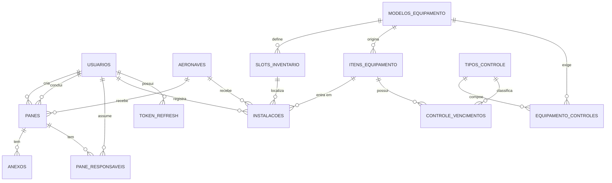

# Modelo de Banco de Dados - SAA29

Documento sincronizado com o codigo-fonte em 22/04/2026.
Fontes da verdade:

- `app/modules/auth/models.py`
- `app/modules/aeronaves/models.py`
- `app/modules/panes/models.py`
- `app/modules/equipamentos/models.py`
- `app/shared/core/enums.py`

---

## 1. Visao Geral

O banco de dados atual do SAA29 possui **14 tabelas** em 4 dominios:

| Dominio | Tabelas | Status |
| :--- | :--- | :---: |
| **Autenticacao** | `usuarios`, `token_blacklist`, `token_refresh` | Implementado |
| **Aeronaves** | `aeronaves` | Implementado |
| **Panes** | `panes`, `anexos`, `pane_responsaveis` | Implementado |
| **Equipamentos** | `modelos_equipamento`, `slots_inventario`, `tipos_controle`, `equipamento_controles`, `itens_equipamento`, `instalacoes`, `controle_vencimentos` | Implementado |

Caracteristicas gerais:

- ORM: SQLAlchemy 2.x async.
- Banco padrao: SQLite via `aiosqlite`.
- Migrações: Alembic.
- IDs primarios: UUID em todas as tabelas.
- Datas de negocio: `Date` em movimentacoes e vencimentos; `DateTime(timezone=True)` para auditoria.

---

## 2. Dominio de Autenticacao

### 2.1 Usuarios

**Tabela:** `usuarios`  
**Arquivo:** `app/modules/auth/models.py` -> classe `Usuario`

| Coluna | Tipo | Restricoes | Descricao |
| :--- | :--- | :--- | :--- |
| `id` | UUID | PK, default `uuid4` | Identificador unico |
| `nome` | String(150) | NOT NULL | Nome completo |
| `posto` | String(30) | NOT NULL | Posto ou graduacao |
| `especialidade` | String(50) | nullable | Especialidade tecnica |
| `funcao` | String(50) | NOT NULL | `ADMINISTRADOR` \| `ENCARREGADO` \| `MANTENEDOR` |
| `ramal` | String(20) | nullable | Ramal de contato |
| `trigrama` | String(3) | nullable | Identificacao curta |
| `username` | String(50) | UNIQUE, NOT NULL, INDEX | Login do usuario |
| `senha_hash` | String(255) | NOT NULL | Hash bcrypt |
| `ativo` | bool | NOT NULL, INDEX, default `True` | Exclusao logica |
| `failed_login_attempts` | int | NOT NULL, default `0` | Bloqueio por tentativa |
| `locked_until` | DateTime tz | nullable | Bloqueio temporario |
| `created_at` | DateTime tz | NOT NULL, default `now()` | Auditoria |
| `updated_at` | DateTime tz | nullable, onupdate `now()` | Auditoria |

Observacoes:

- `username` e convertido para minusculo no service.
- O bloqueio de conta usa `failed_login_attempts` e `locked_until`.

### 2.2 Token Blacklist

**Tabela:** `token_blacklist`  
**Arquivo:** `app/modules/auth/models.py` -> classe `TokenBlacklist`

| Coluna | Tipo | Restricoes | Descricao |
| :--- | :--- | :--- | :--- |
| `jti` | String(36) | PK, INDEX | ID do JWT revogado |
| `expira_em` | DateTime tz | NOT NULL | Expiracao original do token |
| `criado_em` | DateTime tz | NOT NULL, default `now()` | Momento do registro |

Objetivo:

- Persistir os JWTs invalidos para logout e revogacao.
- Manter a invalidaçao apos restart da aplicacao.

### 2.3 Token Refresh

**Tabela:** `token_refresh`  
**Arquivo:** `app/modules/auth/models.py` -> classe `TokenRefresh`

| Coluna | Tipo | Restricoes | Descricao |
| :--- | :--- | :--- | :--- |
| `id` | UUID | PK, default `uuid4` | Identificador do refresh token |
| `usuario_id` | UUID | INDEX, NOT NULL | Referencia logica ao usuario |
| `jti` | String(36) | UNIQUE, INDEX, NOT NULL | ID do refresh token |
| `expira_em` | DateTime tz | NOT NULL | Expiracao do refresh token |
| `criado_em` | DateTime tz | NOT NULL, default `now()` | Criacao |
| `revogado_em` | DateTime tz | nullable | Momento da revogacao |

Observacao:

- O modelo atual guarda `usuario_id` como referencia logica, sem FK declarada no ORM.

---

## 3. Dominio de Aeronaves

### 3.1 Aeronaves

**Tabela:** `aeronaves`  
**Arquivo:** `app/modules/aeronaves/models.py` -> classe `Aeronave`

| Coluna | Tipo | Restricoes | Descricao |
| :--- | :--- | :--- | :--- |
| `id` | UUID | PK, default `uuid4` | Identificador unico |
| `part_number` | String(50) | nullable | PN da aeronave |
| `serial_number` | String(50) | UNIQUE, NOT NULL, INDEX | Numero de serie |
| `matricula` | String(20) | UNIQUE, NOT NULL, INDEX | Matricula operacional |
| `modelo` | String(50) | NOT NULL, default `A-29` | Modelo da aeronave |
| `status` | String(20) | NOT NULL, default `OPERACIONAL` | `OPERACIONAL` \| `INDISPONIVEL` \| `INATIVA` |
| `created_at` | DateTime tz | NOT NULL, default `now()` | Auditoria |
| `updated_at` | DateTime tz | nullable, onupdate `now()` | Auditoria |

---

## 4. Dominio de Panes

### 4.1 Panes

**Tabela:** `panes`  
**Arquivo:** `app/modules/panes/models.py` -> classe `Pane`

| Coluna | Tipo | Restricoes | Descricao |
| :--- | :--- | :--- | :--- |
| `id` | UUID | PK, default `uuid4` | Identificador unico |
| `aeronave_id` | UUID | FK -> `aeronaves.id`, NOT NULL, INDEX | Aeronave vinculada |
| `status` | String(20) | NOT NULL, default `ABERTA`, INDEX | `ABERTA` \| `RESOLVIDA` |
| `sistema_subsistema` | String(100) | nullable | Localizacao da pane |
| `descricao` | Text | NOT NULL, default `AGUARDANDO EDICAO` | Descricao da ocorrencia |
| `data_abertura` | DateTime tz | NOT NULL, default `now()` | Abertura automatica |
| `data_conclusao` | DateTime tz | nullable | Conclusao automatica |
| `observacao_conclusao` | Text | nullable | Observacao de fechamento |
| `comentarios` | Text | nullable | Comentarios internos |
| `ativo` | bool | NOT NULL, INDEX, default `True` | Exclusao logica |
| `criado_por_id` | UUID | FK -> `usuarios.id`, NOT NULL | Usuario que registrou |
| `concluido_por_id` | UUID | FK -> `usuarios.id`, nullable | Usuario que concluiu |
| `created_at` | DateTime tz | NOT NULL, default `now()` | Auditoria |
| `updated_at` | DateTime tz | nullable, onupdate `now()` | Auditoria |

### 4.2 Anexos

**Tabela:** `anexos`  
**Arquivo:** `app/modules/panes/models.py` -> classe `Anexo`

| Coluna | Tipo | Restricoes | Descricao |
| :--- | :--- | :--- | :--- |
| `id` | UUID | PK, default `uuid4` | Identificador unico |
| `pane_id` | UUID | FK -> `panes.id`, NOT NULL, INDEX | Pane vinculada |
| `caminho_arquivo` | String(500) | NOT NULL | Caminho relativo ou URL |
| `tipo` | String(20) | NOT NULL, default `IMAGEM` | `IMAGEM` \| `DOCUMENTO` |
| `created_at` | DateTime tz | NOT NULL, default `now()` | Auditoria |

### 4.3 PaneResponsavel

**Tabela:** `pane_responsaveis`  
**Arquivo:** `app/modules/panes/models.py` -> classe `PaneResponsavel`

| Coluna | Tipo | Restricoes | Descricao |
| :--- | :--- | :--- | :--- |
| `id` | UUID | PK, default `uuid4` | Identificador unico |
| `pane_id` | UUID | FK -> `panes.id`, NOT NULL, INDEX | Pane |
| `usuario_id` | UUID | FK -> `usuarios.id`, NOT NULL | Usuario responsavel |
| `papel` | String(30) | NOT NULL | Papel exercido na pane |
| `created_at` | DateTime tz | NOT NULL, default `now()` | Auditoria |

Observacao:

- A propriedade `trigrama` do modelo e apenas um atalho para o usuario relacionado.

---

## 5. Dominio de Equipamentos

### 5.1 Modelos de Equipamento

**Tabela:** `modelos_equipamento`  
**Arquivo:** `app/modules/equipamentos/models.py` -> classe `ModeloEquipamento`

| Coluna | Tipo | Restricoes | Descricao |
| :--- | :--- | :--- | :--- |
| `id` | UUID | PK, default `uuid4` | Identificador unico |
| `part_number` | String(50) | UNIQUE, NOT NULL, INDEX | PN do catalogo |
| `nome_generico` | String(100) | NOT NULL | Nome do equipamento |
| `descricao` | String(500) | nullable | Descricao complementar |
| `created_at` | DateTime tz | NOT NULL, default `now()` | Auditoria |

### 5.2 Slots de Inventario

**Tabela:** `slots_inventario`  
**Arquivo:** `app/modules/equipamentos/models.py` -> classe `SlotInventario`

| Coluna | Tipo | Restricoes | Descricao |
| :--- | :--- | :--- | :--- |
| `id` | UUID | PK, default `uuid4` | Identificador unico |
| `nome_posicao` | String(100) | NOT NULL, INDEX | Nome do slot |
| `sistema` | String(50) | nullable | Sistema ou localizacao |
| `modelo_id` | UUID | FK -> `modelos_equipamento.id`, NOT NULL | PN exigido no slot |

### 5.3 Tipos de Controle

**Tabela:** `tipos_controle`  
**Arquivo:** `app/modules/equipamentos/models.py` -> classe `TipoControle`

| Coluna | Tipo | Restricoes | Descricao |
| :--- | :--- | :--- | :--- |
| `id` | UUID | PK, default `uuid4` | Identificador unico |
| `nome` | String(50) | UNIQUE, NOT NULL, INDEX | Nome do controle |
| `descricao` | String(300) | nullable | Texto auxiliar |
| `periodicidade_meses` | int | NOT NULL | Periodicidade em meses |
| `created_at` | DateTime tz | NOT NULL, default `now()` | Auditoria |

### 5.4 EquipamentoControle

**Tabela:** `equipamento_controles`  
**Arquivo:** `app/modules/equipamentos/models.py` -> classe `EquipamentoControle`

| Coluna | Tipo | Restricoes | Descricao |
| :--- | :--- | :--- | :--- |
| `id` | UUID | PK, default `uuid4` | Identificador unico |
| `modelo_id` | UUID | FK -> `modelos_equipamento.id`, NOT NULL | PN |
| `tipo_controle_id` | UUID | FK -> `tipos_controle.id`, NOT NULL | Controle exigido |

Restricao:

- `UNIQUE(modelo_id, tipo_controle_id)` garante um controle por PN.

### 5.5 Itens de Equipamento

**Tabela:** `itens_equipamento`  
**Arquivo:** `app/modules/equipamentos/models.py` -> classe `ItemEquipamento`

| Coluna | Tipo | Restricoes | Descricao |
| :--- | :--- | :--- | :--- |
| `id` | UUID | PK, default `uuid4` | Identificador unico |
| `modelo_id` | UUID | FK -> `modelos_equipamento.id`, NOT NULL, INDEX | PN do item |
| `numero_serie` | String(100) | NOT NULL, INDEX | Serial number fisico |
| `status` | String(20) | NOT NULL, default `ATIVO` | `ATIVO` \| `ESTOQUE` \| `REMOVIDO` |
| `created_at` | DateTime tz | NOT NULL, default `now()` | Auditoria |
| `updated_at` | DateTime tz | nullable, onupdate `now()` | Auditoria |

Restricao:

- `UNIQUE(modelo_id, numero_serie)` evita duplicidade de SN por PN.

### 5.6 Instalacoes

**Tabela:** `instalacoes`  
**Arquivo:** `app/modules/equipamentos/models.py` -> classe `Instalacao`

| Coluna | Tipo | Restricoes | Descricao |
| :--- | :--- | :--- | :--- |
| `id` | UUID | PK, default `uuid4` | Identificador unico |
| `item_id` | UUID | FK -> `itens_equipamento.id`, NOT NULL, INDEX | Item instalado |
| `aeronave_id` | UUID | FK -> `aeronaves.id`, NOT NULL, INDEX | Aeronave destino |
| `slot_id` | UUID | FK -> `slots_inventario.id`, NOT NULL, INDEX | Slot ocupado |
| `usuario_id` | UUID | FK -> `usuarios.id`, nullable | Usuario que registrou a movimentacao |
| `data_instalacao` | Date | NOT NULL | Data de instalacao |
| `data_remocao` | Date | nullable | NULL indica instalacao ativa |
| `created_at` | DateTime tz | NOT NULL, default `now()` | Auditoria |
| `updated_at` | DateTime tz | nullable, onupdate `now()` | Auditoria |

### 5.7 ControleVencimento

**Tabela:** `controle_vencimentos`  
**Arquivo:** `app/modules/equipamentos/models.py` -> classe `ControleVencimento`

| Coluna | Tipo | Restricoes | Descricao |
| :--- | :--- | :--- | :--- |
| `id` | UUID | PK, default `uuid4` | Identificador unico |
| `item_id` | UUID | FK -> `itens_equipamento.id`, NOT NULL, INDEX | Item controlado |
| `tipo_controle_id` | UUID | FK -> `tipos_controle.id`, NOT NULL | Tipo de controle |
| `data_ultima_exec` | Date | nullable | Ultima execucao |
| `data_vencimento` | Date | nullable, INDEX | Vencimento calculado |
| `status` | String(20) | NOT NULL, default `OK` | `OK` \| `VENCENDO` \| `VENCIDO` |
| `origem` | String(20) | NOT NULL, default `PADRAO` | `PADRAO` \| `ESPECIFICO` |
| `created_at` | DateTime tz | NOT NULL, default `now()` | Auditoria |

Restricao:

- `UNIQUE(item_id, tipo_controle_id)` garante um controle por item e tipo.

---

## 6. Diagramas de Relacionamento



---

## 7. Consulta-Chave: Inventario Atual

```sql
SELECT
    s.sistema AS localizacao,
    s.nome_posicao AS slot,
    m.part_number AS pn,
    ie.numero_serie AS sn,
    i.data_instalacao
FROM slots_inventario s
    JOIN modelos_equipamento m ON m.id = s.modelo_id
    LEFT JOIN instalacoes i
        ON i.slot_id = s.id
       AND i.data_remocao IS NULL
       AND i.aeronave_id = :aeronave_id
    LEFT JOIN itens_equipamento ie ON ie.id = i.item_id
ORDER BY s.sistema, s.nome_posicao;
```

Essa consulta representa o comportamento de `listar_inventario_aeronave()` no service.

---

## 8. Indexes e Unicidade

| Tabela | Coluna(s) | Tipo |
| :--- | :--- | :--- |
| `usuarios` | `username` | UNIQUE + INDEX |
| `usuarios` | `ativo` | INDEX |
| `aeronaves` | `serial_number` | UNIQUE + INDEX |
| `aeronaves` | `matricula` | UNIQUE + INDEX |
| `panes` | `aeronave_id` | INDEX |
| `panes` | `status` | INDEX |
| `panes` | `ativo` | INDEX |
| `anexos` | `pane_id` | INDEX |
| `pane_responsaveis` | `pane_id` | INDEX |
| `modelos_equipamento` | `part_number` | UNIQUE + INDEX |
| `slots_inventario` | `nome_posicao` | INDEX |
| `tipos_controle` | `nome` | UNIQUE + INDEX |
| `itens_equipamento` | `modelo_id` | INDEX |
| `itens_equipamento` | `numero_serie` | INDEX |
| `instalacoes` | `item_id` | INDEX |
| `instalacoes` | `aeronave_id` | INDEX |
| `instalacoes` | `slot_id` | INDEX |
| `controle_vencimentos` | `item_id` | INDEX |
| `controle_vencimentos` | `data_vencimento` | INDEX |
| `token_blacklist` | `jti` | PK + INDEX |
| `token_refresh` | `jti` | UNIQUE + INDEX |
| `token_refresh` | `usuario_id` | INDEX |

---

## 9. Observacao Sobre Evolucao

Os modelos de equipamentos e vencimentos hoje cobrem catalogo, item fisico, instalacao historica e controle periodico. Se houver novos campos, a regra correta e atualizar primeiro os modelos e depois revisar os docs desta pasta para manter a sincronizacao.
