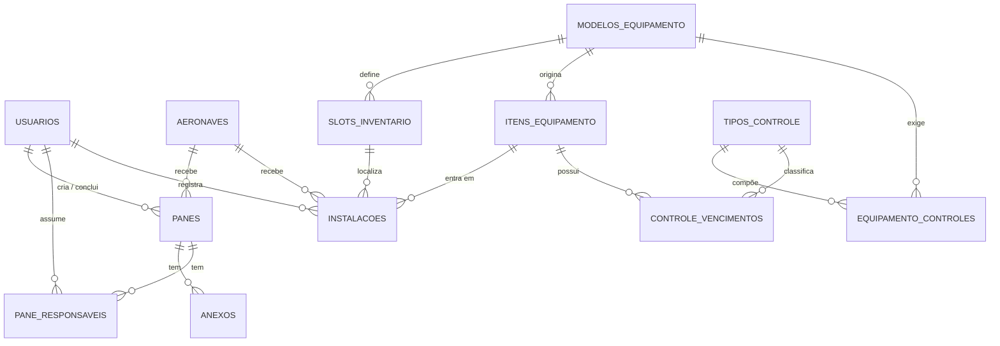

# Visao Geral da Arquitetura - SAA29

Documento sincronizado com o codigo-fonte em 22/04/2026.
Fontes principais: `app/bootstrap/*`, `app/modules/*`, `app/shared/*` e `app/web/*`.

## 1. Estilo Arquitetural

O SAA29 adota um **monolito modular em camadas**.
O fluxo principal e:

```text
Cliente -> Router FastAPI -> Service -> ORM SQLAlchemy -> Banco de dados
```

Camadas e responsabilidades:

```text
CLIENTE (browser / cliente HTTP)
    |
    v
WEB OU API
    |
    +--> app/web/pages/router.py  -> paginas HTML
    +--> app/modules/*/router.py  -> endpoints JSON
    |
    v
SERVICES
    | regras de negocio, orquestracao e validacoes de dominio
    v
MODELS / ORM
    | entidades SQLAlchemy e relacoes
    v
DATABASE
    | SQLite async por padrao, com SQLite WAL habilitado
```

Regras principais:

- O router nao acessa o banco diretamente.
- As regras de negocio ficam na camada `service`.
- Os modelos ORM ficam em `models.py` dentro de cada modulo.
- Configuracao, sessão e bootstrap da aplicacao ficam em `app/bootstrap`.
- Regras compartilhadas ficam em `app/shared`.

## 2. Estrutura do Projeto

```text
app/
├── bootstrap/        -> create_app, config, database, dependencies
├── modules/
│   ├── auth/         -> autenticao, usuarios, JWT, blacklist e refresh token
│   ├── aeronaves/    -> cadastro e status de aeronaves
│   ├── equipamentos/ -> modelos, slots, itens, instalacoes e controles
│   └── panes/        -> panes, anexos e responsaveis
├── shared/
│   ├── core/         -> enums, helpers, storage, validadores, limiter
│   └── middleware/   -> CSRF
└── web/
    ├── pages/        -> rotas HTML
    ├── templates/    -> Jinja2
    └── static/       -> CSS, JS e assets
```

Arquivos de apoio:

- `migrations/` para Alembic.
- `scripts/` para automacoes operacionais.
- `data/`, `uploads/` e `var/` para arquivos gerados em execucao.

## 3. Bootstrap da Aplicacao

O ponto de entrada principal e `app/bootstrap/main.py`.
Ele:

- importa explicitamente todos os modelos para registrar o mapeamento SQLAlchemy;
- cria a aplicacao FastAPI;
- registra middlewares de seguranca, CSRF, CORS e Trusted Host;
- monta os routers de `auth`, `aeronaves`, `equipamentos`, `panes` e das paginas HTML;
- monta `app/web/static` em `/static`;
- executa inicializacoes no lifespan:
    - Garante a existência da frota padrão;
    - Inicia a rotina de limpeza automática de tokens expirados (`limpar_tokens_expirados`);
    - Executa o backup orientado a eventos para R2 quando configurado;
    - Garante o fechamento limpo do pool de conexões via `dispose_engine()` no shutdown.

## 4. Fluxo de Requisicao

O SAA29 adota uma arquitetura **Zero Trust** para o frontend:

1. **Requisicao de Pagina HTML:** O `app/web/pages/router.py` valida a sessao e o papel do usuario (RBAC) *antes* de renderizar o template Jinja2.
2. **Requisicao de Dados (API):** Os endpoints em `app/modules/*/router.py` validam o JWT (presente no cookie ou header) e as permissoes especificas do recurso.
3. **Consumo no Frontend:** O Vanilla JS consome as APIs e manipula o DOM utilizando funcoes de escape (`escapeHtml`) para prevenir XSS persistente ou refletido.

Exemplo simplificado para uma operacao de pane:

```text
POST /panes/{pane_id}/concluir
    |
    v
router.py valida input e permissao
    |
    v
service.py aplica regras de dominio
    |
    v
SQLAlchemy grava Pane, Anexo, PaneResponsavel e relacoes
    |
    v
Banco persiste a transacao
    |
    v
Pydantic serializa a resposta
```

Exemplo simplificado para inventario:

```text
GET /equipamentos/inventario/{aeronave_id}
    |
    v
router.py chama service.listar_inventario_aeronave()
    |
    v
service.py cruza Slots, Itens, Instalacoes e Aeronave
    |
    v
resposta consolidada em JSON
```

## 5. Dominios e Entidades

```text
auth:
  usuarios
  token_blacklist
  token_refresh

aeronaves:
  aeronaves

panes:
  panes
  anexos
  pane_responsaveis

equipamentos:
  modelos_equipamento
  slots_inventario
  tipos_controle
  equipamento_controles
  itens_equipamento
  instalacoes
  controle_vencimentos
```

## 6. Relacionamentos Principais



## 7. Decisoes de Arquitetura

| ADR | Decisao |
|-----|---------|
| [ADR-001](./adr/001-stack-tecnologica.md) | Stack principal, bootstrap e persistencia |
| [ADR-002](./adr/002-autenticacao-jwt.md) | Autenticacao JWT com refresh token e blacklist |
| [ADR-003](./adr/003-heranca-controles-vencimento.md) | Heranca de controles de vencimento no service layer |

## 8. Consideracoes Nao Funcionais

| Requisito | Implementacao atual |
|-----------|---------------------|
| Desempenho | SQLAlchemy async, SQLite WAL e consultas agregadas no service |
| Seguranca | Zero Trust em HTML/API, JWT 15min, Refresh Token HttpOnly, CSP estrita, CSRF prod-restricted, _escape_like contra SQLi |
| Rastreabilidade | Soft delete, auditoria de datas, blacklist de JWT, refresh token persistido, limpeza automatica de sessoes |
| Uploads | Validacao de MIME/tamanho e armazenamento local ou R2 com backup assincrono |
| Testabilidade | Camadas desacopladas, dependencias injetadas e banco isolado nos testes |

## 9. Observacao Importante

Este documento descreve o estado atual do projeto. Quando houver mudanca em modelos, rotas ou bootstrap, a atualizacao deve começar por esta pasta para evitar divergencia entre arquitetura e implementacao.
