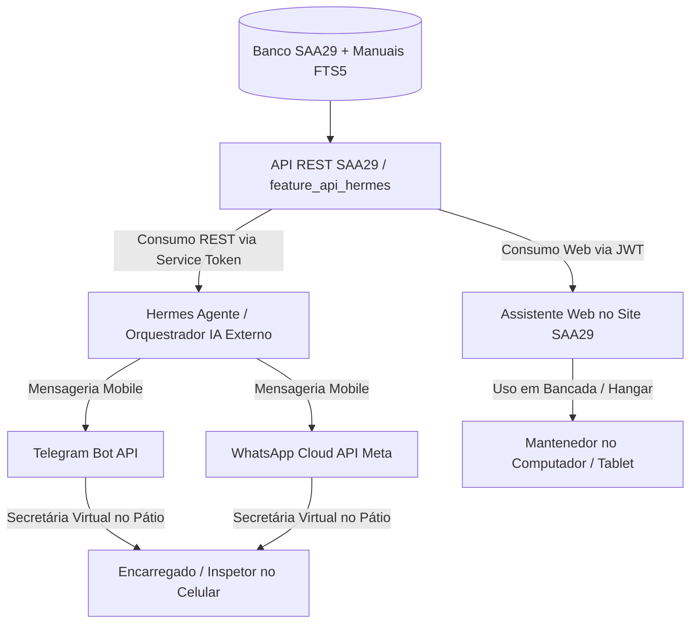

# 🤖 Estudo e Arquitetura: Hermes Agente como Secretária Virtual Mobile (Telegram/WhatsApp) do SAA29

**Data:** 04/08/2026  
**Status:** Proposta de Integração Arquitetural (Fases 1–5)  
**Autor:** Gemini (Google DeepMind - Antigravity)  
**Documentos Relacionados:** [feature_hermes_api.md](file:///c:/Users/brgar/Projetos/SAA29/docs/backlog/feature_api_hermes/feature_hermes_api.md), [feature_hermes_api_plan.md](file:///c:/Users/brgar/Projetos/SAA29/docs/backlog/feature_api_hermes/feature_hermes_api_plan.md) e [implementacao_whatsapp.md](file:///c:/Users/brgar/Projetos/SAA29/docs/backlog/Melhorias%20Futuras/implementacao_whatsapp.md)

---

## 1. Contexto e Motivação Operacional

Na rotina da manutenção aeronáutica da frota A-29 Super Tucano, **Encarregados de Manutenção, Inspetores e Pilotos não permanecem 100% do tempo na frente de um computador**. Eles atuam diretamente no pátio de aeronaves, linha de voo, hangares e bancadas.

A proposta do **Hermes Agente** é atuar como uma **Secretária Virtual Móvel**, operando externamente ao SAA29 através de canais de mensageria instantânea (**Telegram Bot / WhatsApp Cloud API**). 

Em vez de exigir que o usuário abra um navegador Web, o Hermes permite:
- **Consultas ativas por voz/áudio ou texto no celular** durante o trabalho de campo.
- **Notificações proativas (Push Notifications)** sobre novas panes graves, vencimentos e inspeções pendentes.
- **Consultas rápidas a manuais técnicos (AMM/FIM) e boletins (BO, BS, NPO, BT)** diretamente pelo chat do Telegram/WhatsApp.

---

## 2. Arquitetura da Solução Híbrida

Para garantir a máxima segurança, desacoplamento e isolamento de falhas, a integração adota um **Modelo Híbrido baseado em API REST com Service Token**:

### Princípios da Arquitetura:
1. **Zero Impacto no SAA29:** O Hermes é um agente externo. Se o Telegram/WhatsApp ficar fora do ar, o monolito SAA29 continua operando normalmente sem nenhuma degradação.
2. **Mesma Fonte da Verdade (API Unificada):** O backend do SAA29 expõe o módulo `feature_api_hermes` (`/api/v1/hermes/*`), que serve tanto a interface Web do sistema quanto o Hermes Agente externo.
3. **Autenticação Segura via Service Token:** Comunicação protegida por tokens de serviço estáticos criptografados com permissão estrita de **leitura (Read-Only)**.
4. **Sem Execução de Ações Críticas sem Confirmação:** O Hermes pode consultar qualquer dado, mas **nunca altera ou aprova registros operacionais** no SAA29 sem confirmação manual via UI.

---

## 3. Casos de Uso do Hermes como Secretária Virtual

### 3.1 Consulta de Panes por Áudio/Texto no Pátio
- **Cenário:** O Inspetor está na pista, grava um áudio no WhatsApp: *"Hermes, a FAB 5702 tá com alguma pane pendente de voo?"*
- **Fluxo:**
  1. O Hermes transcreve o áudio para texto.
  2. O Hermes aciona o endpoint da API Hermes: `GET /api/v1/hermes/panes?aeronave=FAB5702&status=ABERTA`.
  3. O Hermes processa a resposta JSON e envia uma mensagem de texto/voz curta no WhatsApp: *"Inspetor, a FAB 5702 possui 1 pane aberta em 02/08 (Vibração no compressor - ATA 75). O FIM pág. 14 recomenda verificação da sangria."*

### 3.2 Notificações Proativas (Secretária Ativa)
- **Cenário:** Uma nova pane de alta severidade é registrada no SAA29 por um mecânico no computador.
- **Fluxo:**
  1. O SAA29 dispara um webhook/evento para o Hermes Agente.
  2. O Hermes envia uma mensagem proativa para o grupo do Telegram dos Encarregados:  
     🚨 *"Atenção Encarregado: Nova pane Nível 1 registrada na FAB 5704 por 3º Sgt Silva (Fuselagem - ATA 53). Deseja que eu consulte os Boletins de Serviço (BS) aplicáveis?"*

### 3.3 Consulta Rápida a Manuais Técnicos e Boletins (BO, BS, NPO, BT)
- **Cenário:** O Encarregado precisa saber se existe algum boletim sobre torque de parafusos da asa.
- **Pergunta no Telegram:** *"Hermes, qual o BS recente sobre torque da asa do A-29?"*
- **Resposta do Hermes:** *"Localizei o Boletim de Serviço BS A29-57-004 de 10/05/2026 (Torque dos parafusos da junção da asa). Resumo: Aplicação de 45 N.m com torquímetro calibrado. [Link para abrir PDF no SAA29]"*

---

## 4. Mapeamento de APIs e Endpoints (`feature_api_hermes`)

O Hermes consumirá os endpoints REST seguros disponibilizados pelo SAA29:

| Endpoint SAA29 | Método | Função Operacional do Hermes |
|---|---|---|
| `/api/v1/hermes/panes` | `GET` | Consulta panes por aeronave, sistema ATA ou severidade |
| `/api/v1/hermes/vencimentos` | `GET` | Consulta inspeções de 50h/100h e controles temporais |
| `/api/v1/hermes/aeronaves` | `GET` | Consulta status de disponibilidade da frota |
| `/api/v1/hermes/manuais/search` | `GET` | Busca full-text no índice de manuais FIM/AMM (`catalog.db`) |
| `/api/v1/hermes/boletins` | `GET` | Consulta boletins cadastrados (BO, BS, NPO, BT) por tipo/ATA |

---

## 5. Roteiro de Implementação em Fases

- **Fase 1 — API Read-Only SAA29 (`feature_api_hermes`):**
  - Desenvolver os endpoints de leitura no SAA29 com autenticação por Service Token.
  - Documentar JSON Schemas para Function Calling.
- **Fase 2 — Conexão Telegram Bot:**
  - Configurar o bot do Hermes no Telegram com integração à API do SAA29.
  - Testar comandos de texto e consultas de panes/frota.
- **Fase 3 — Suporte a Mensagens de Voz (Áudio):**
  - Adicionar transcrição de áudio (Gemini Multimodal / Whisper) para aceitar comandos de voz dos inspetores.
- **Fase 4 — Notificações Proativas (WhatsApp / Telegram):**
  - Conectar webhooks do SAA29 para disparo automático de alertas de novas panes Nível 1.
- **Fase 5 — RAG & Manuais:**
  - Integrar a busca semântica de manuais e boletins às respostas do Hermes no celular.

---

## 6. Parecer Conclusivo

Esta arquitetura entrega a **melhor combinação possível**:
1. **O SAA29 permanece um monolito modular limpo**, sem acoplamento direto com código de Telegram ou WhatsApp.
2. **O Hermes atua com total mobilidade como uma Secretária Virtual inteligente** no bolso dos Encarregados e Inspetores.
3. **Segurança total**, com permissões estritas de leitura via API protegida por Service Token.
