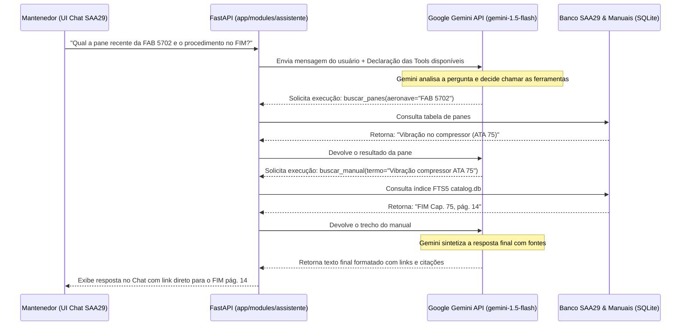

# 🤖 Proposta Técnica: Incorporação do Assistente Virtual IA Gemini ao SAA29

**Data:** 04/08/2026  
**Status:** Proposta de Melhoria Futura  
**Autor:** Gemini (Google DeepMind - Antigravity)  
**Escopo:** Integração nativa de um Agente de Inteligência Artificial baseado na API do Google Gemini ao monolito SAA29, atuando como um **Copiloto Tático de Manutenção** com acesso aos dados do sistema e manuais técnicos.

---

## 1. Visão Geral e Objetivo

A incorporação de um **Agente Inteligente Gemini** no SAA29 visa transformar o sistema de uma plataforma passiva de cadastro em uma ferramenta **ativa e conversacional**.

Qualquer usuário autenticado (`MANTENEDOR`, `ENCARREGADO`, `INSPETOR`, `ADMINISTRADOR`) poderá interagir em linguagem natural com o assistente, que terá a capacidade de **"ler e consultar tudo"** no sistema — desde o histórico de panes e vencimentos até páginas de manuais FIM/AMM e boletins (BO, BS, NPO, BT).

### Cenários de Uso Típicos
- 🔧 **Diagnóstico no Hangar:** *"O motor da FAB 5702 apresentou oscilação de rotação na partida. Já ocorreu algo parecido neste mês? Qual a página do FIM para essa pane?"*
- ⏱️ **Consulta de Vencimentos:** *"Quais inspeções de 50h vencem na frota nesta semana?"*
- 📄 **Leitura de Procedimentos:** *"Qual o procedimento e o torque dos parafusos do painel de acesso da asa segundo o AMM?"*
- 📢 **Verificação de Boletins:** *"Existe algum Boletim de Serviço (BS) ativo sobre fissuras na empenagem?"*

---

## 2. Arquitetura e Funcionamento Técnico

### 2.1 Orquestração via Function Calling (Chamada de Ferramentas / Tools)

Para garantir respostas rápidas, de baixo custo e baseadas em dados em tempo real, o agente Gemini **não carrega todo o banco de dados no prompt**. Em vez disso, ele utiliza a capacidade nativa de **Function Calling / Tools**:

O Gemini recebe a pergunta do usuário e uma lista de **ferramentas Python** registradas no backend FastAPI. Ele decide autonomamente qual ferramenta chamar, o FastAPI executa a consulta no banco de dados e devolve o resultado para o Gemini formatar a resposta final.



### 2.2 Catálogo de Ferramentas (Tools) do Agente

O módulo de assistente registrará as seguintes funções Python no SDK do Gemini:

| Ferramenta (Tool) | Módulo Consultado | O que faz |
|---|---|---|
| `consultar_panes(aeronave_id, status)` | `app/modules/panes` | Busca histórico e detalhes de panes registradas |
| `consultar_vencimentos(aeronave_id)` | `app/modules/vencimentos` | Lista controles de tempo e vencimentos pendentes |
| `consultar_inspecoes(status)` | `app/modules/inspecoes` | Consulta status de ordens de inspeção e tarefas |
| `buscar_manuais(termo_busca, ata)` | `app/modules/manuais` | Consulta o índice FTS5 (`catalog.db`) para localizar páginas de AMM/FIM/AIPC |
| `consultar_boletins(tipo, ata)` | `app/modules/manuais` | Consulta publicações avulsas registradas (BO, BS, NPO, BT) |
| `status_frota()` | `app/modules/aeronaves` | Retorna a disponibilidade operacional atual das aeronaves |

---

## 3. Segurança, Controle de Acesso (RBAC) e Privacidade

1. **Autenticação Obrigatória (`CurrentUser`):**
   - O chat só está acessível para usuários autenticados via JWT/Cookie no SAA29.
2. **Respeito às Permissões de Perfil (RBAC):**
   - Antes de executar qualquer ferramenta solicitada pelo Gemini, a função Python no backend verifica as permissões do usuário logado (`MANTENEDOR`, `ENCARREGADO`, `INSPETOR`, `ADMINISTRADOR`).
3. **Regra de Ouro de Fundamentação (Grounding):**
   - O *System Instruction* do agente exige que **toda afirmação técnica aponte a fonte oficial** (ex: *"Conforme FIM ATA 75-30-00, pág. 14"* ou *"Conforme Registro de Pane #104"*). Se o agente não encontrar a informação nas ferramentas, ele responderá *"Não encontrei registros sobre isso nos manuais ou dados do sistema"*, prevenindo alucinações.
4. **Privacidade dos Dados:**
   - As requisições utilizarão chaves empresariais da API do Gemini (Google AI Studio ou Vertex AI), cujos termos garantem que **os dados e conversas não são utilizados para treinamento de modelos públicos da Google**.

---

## 4. Design de Interface (UI) e Experiência do Usuário (UX)

A interface do assistente será totalmente integrada ao Design System do SAA29 (`base.html` / `index.css`):

1. **Widget Flutuante de Chat (Floating Assistant Button):**
   - Ícone do assistente no canto inferior direito de todas as telas do SAA29. Ao ser clicado, abre uma gaveta lateral (*drawer*) de chat rápido sem sair da tela atual.
2. **Página Dedicada (`/assistente`):**
   - Interface expandida de conversa com painel de histórico de chat, sugestões de perguntas frequentes e atalhos diretos para abrir os PDFs citados no viewer PDF.js.
3. **Histórico de Conversas Salvo:**
   - As conversas ficam salvas na tabela `chat_sessoes` e `chat_mensagens` do banco de dados principal (`saa29_local.db`), permitindo que o usuário retome consultas anteriores.

---

## 5. Modelo Recomendado, Desempenho e Custos

- **Modelo Recomendado:** `gemini-1.5-flash`
  - **Motivos:** Resposta ultrarrápida (< 1,5 segundos), janela de contexto gigante (1 milhão de tokens), custo por requisição de frações de centavo e suporte nativo a *Function Calling*.
- **Proteção contra Abuso (Rate Limit):**
  - Implementação via SlowAPI para limitar o uso por usuário (ex: máximo de 20 mensagens por minuto por usuário).

---

## 6. Estrutura de Código Proposta para o Módulo `assistente`

```text
app/modules/assistente/
├── __init__.py
├── models.py           # Modelos ORM SQLAlchemy: chat_sessoes e chat_mensagens
├── schemas.py          # Contratos Pydantic v2 para requisições/respostas do chat
├── service.py          # Orquestração do SDK do Gemini (google-genai) e gestão de sessões
├── router.py           # Controller FastAPI: POST /api/v1/assistente/chat e página GET /assistente
└── tools.py            # Definição e implementação das ferramentas executadas pelo Gemini
```

---

## 7. Roteiro de Implementação em Fases

- **Fase 1 — MVP (Leitura de Manuais & Panes):**
  - Implementar o pacote `app/modules/assistente` e integração com a API do Gemini.
  - Registrar as ferramentas `buscar_manuais` e `consultar_panes`.
  - Disponibilizar a tela de chat `/assistente`.
- **Fase 2 — Expansão de Ferramentas & Notificações:**
  - Adicionar ferramentas de `vencimentos`, `inspecoes` e `boletins`.
  - Implementar o widget flutuante de chat nas telas do SAA29.
- **Fase 3 — Histórico e Atalhos de Viewer:**
  - Persistir histórico de sessões em `saa29_local.db`.
  - Adicionar botões na resposta do chat para abrir o PDF.js diretamente na página citada pelo Gemini.
