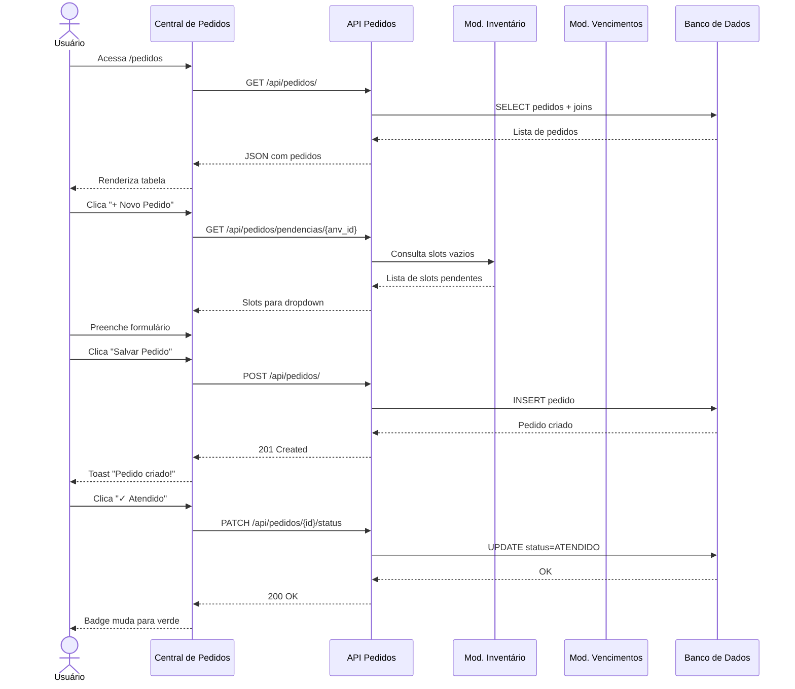

# 📦 Feature: Central de Pedidos — Módulo de Controle de Pedidos

> **Versão:** 1.1  
> **Data:** 2026-08-01  
> **Autor:** Equipe SAA29  
> **Status:** 🟢 Layout Aprovado — Aguardando Implementação  
> **Prioridade:** Alta  

---

## 1. Visão Geral

### 1.1 Problema

Atualmente o SAA29 possui um módulo de **Inventário** que rastreia quais equipamentos estão instalados em cada posição (slot) de cada aeronave, e um módulo de **Vencimentos** que monitora prazos de calibração e manutenção. Porém, **não existe um mecanismo formal** para:

- Identificar automaticamente quais aeronaves possuem **slots vazios** (equipamentos faltantes).
- Registrar e acompanhar **pedidos de reposição** para completar o inventário da aeronave.
- Diferenciar entre pedidos de rotina (**NORMAL**) e pedidos de urgência (**EMERGÊNCIA**).
- Manter um histórico auditável de todos os pedidos realizados e seus status.

### 1.2 Solução Proposta

Criar o módulo **Central de Pedidos** (`app/modules/pedidos/`) que:

1. **Consulta o inventário** de cada aeronave via integração direta com o módulo `equipamentos`.
2. **Identifica slots sem equipamento instalado** (posições físicas vazias).
3. **Identifica equipamentos com vencimentos críticos** via integração com o módulo `vencimentos`.
4. **Permite criar pedidos** associados a uma aeronave e equipamento pendente.
5. **Rastreia o ciclo de vida** do pedido (Pendente → Atendido / Cancelado).
6. **Oferece interface web** simples e intuitiva na identidade visual do SAA29.

---

## 2. Integração com Módulos Existentes

### 2.1 Módulo Inventário (`app/modules/equipamentos/`)

| Entidade | Tabela | Relação com Pedidos |
|---|---|---|
| `SlotInventario` | `slots_inventario` | Define as posições esperadas em cada aeronave. Um pedido referencia o **slot vazio** que precisa ser preenchido. |
| `Instalacao` | `instalacoes` | Se o slot não possui instalação ativa (`data_remocao IS NULL`), ele é candidato a pedido. Quando o pedido é atendido e o equipamento instalado, o slot sai da lista de pendências. |
| `ModeloEquipamento` | `modelos_equipamento` | O pedido referencia o **Part Number (PN)** do equipamento necessário, herdado do slot via `modelo_id`. |
| `ItemEquipamento` | `itens_equipamento` | Quando um pedido é atendido, o item físico (S/N) é instalado no slot da aeronave. |

#### Lógica de Detecção de Pendências

```python
# Pseudocódigo: Identificar slots vazios por aeronave
SELECT s.id, s.nome_posicao, m.part_number, m.nome_generico
FROM slots_inventario s
JOIN modelos_equipamento m ON s.modelo_id = m.id
WHERE s.id NOT IN (
    SELECT i.slot_id FROM instalacoes i 
    WHERE i.aeronave_id = :aeronave_id 
      AND i.data_remocao IS NULL
)
```

### 2.2 Módulo Vencimentos (`app/modules/vencimentos/`)

| Entidade | Tabela | Relação com Pedidos |
|---|---|---|
| `ControleVencimento` | `controle_vencimentos` | Equipamentos com status `VENCIDO` podem gerar pedidos de substituição automáticos ou manuais. |
| `TipoControle` | `tipos_controle` | Define qual tipo de manutenção venceu (TLV, CRI, etc.), contextualizando o motivo do pedido. |

#### Cenários de Integração com Vencimentos

1. **Equipamento vencido precisa de substituição:** O slot está preenchido, mas o item instalado possui um `ControleVencimento` com `status = VENCIDO`. O módulo de pedidos pode sinalizar a necessidade de um novo item calibrado.
2. **Equipamento prorrogado:** Status `PRORROGADO` — não gera pedido automaticamente, mas pode ser consultado como informação complementar.

### 2.3 Módulo Aeronaves (`app/modules/aeronaves/`)

| Entidade | Tabela | Relação com Pedidos |
|---|---|---|
| `Aeronave` | `aeronaves` | Cada pedido é vinculado a uma aeronave pela `matricula` (ex: 5906). O pedido utiliza o `aeronave_id` como FK. |

---

## 3. Modelo de Dados

### 3.1 Novas Entidades

#### Tabela: `pedidos`

```
┌──────────────────────────────────────────────────────────────┐
│                        pedidos                               │
├──────────────────────┬────────────┬──────────────────────────┤
│ Campo                │ Tipo       │ Descrição                │
├──────────────────────┼────────────┼──────────────────────────┤
│ id                   │ UUID (PK)  │ Identificador único      │
│ aeronave_id          │ UUID (FK)  │ → aeronaves.id           │
│ slot_id              │ UUID (FK)  │ → slots_inventario.id    │
│ numero_pedido        │ VARCHAR(50)│ Nº do pedido (ex: P-2026-001) │
│ tipo_pedido          │ ENUM       │ NORMAL | EMERGENCIA      │
│ numero_emergencia    │ VARCHAR(50)│ Nº emergência (se tipo=EMERGENCIA) │
│ status               │ ENUM       │ PENDENTE|ATENDIDO|CANCELADO │
│ quantidade           │ INTEGER    │ Qtd solicitada (default=1) │
│ observacao           │ TEXT       │ Observações extras       │
│ data_pedido          │ DATE       │ Data de criação do pedido│
│ data_atendimento     │ DATETIME   │ Quando foi atendido      │
│ solicitante_id       │ UUID (FK)  │ → usuarios.id            │
│ created_at           │ DATETIME   │ Criação do registro      │
│ updated_at           │ DATETIME   │ Última atualização       │
└──────────────────────┴────────────┴──────────────────────────┘
```

### 3.2 Novo Enum: `StatusPedido`

```python
class StatusPedido(str, enum.Enum):
    """Status do ciclo de vida de um pedido."""
    PENDENTE = "PENDENTE"
    ATENDIDO = "ATENDIDO"
    CANCELADO = "CANCELADO"
```

### 3.3 Novo Enum: `TipoPedido`

```python
class TipoPedido(str, enum.Enum):
    """Tipo/prioridade do pedido."""
    NORMAL = "NORMAL"
    EMERGENCIA = "EMERGENCIA"
```

### 3.4 Modelo ORM Proposto

```python
# app/modules/pedidos/models.py

class Pedido(Base):
    """Registro de pedido de equipamento para completar inventário da aeronave."""
    __tablename__ = "pedidos"

    id: Mapped[uuid.UUID] = mapped_column(primary_key=True, default=uuid.uuid4)
    aeronave_id: Mapped[uuid.UUID] = mapped_column(
        ForeignKey("aeronaves.id", ondelete="RESTRICT"), nullable=False, index=True
    )
    slot_id: Mapped[uuid.UUID | None] = mapped_column(
        ForeignKey("slots_inventario.id", ondelete="SET NULL"), nullable=True, index=True
    )
    numero_pedido: Mapped[str] = mapped_column(String(50), nullable=False, unique=True, index=True)
    tipo_pedido: Mapped[str] = mapped_column(String(20), nullable=False, default=TipoPedido.NORMAL.value)
    numero_emergencia: Mapped[str | None] = mapped_column(String(50), nullable=True)
    status: Mapped[str] = mapped_column(String(20), nullable=False, default=StatusPedido.PENDENTE.value)
    quantidade: Mapped[int] = mapped_column(Integer, nullable=False, default=1)
    observacao: Mapped[str | None] = mapped_column(String(1000), nullable=True)
    data_pedido: Mapped[date] = mapped_column(Date, nullable=False, default=date.today)
    data_atendimento: Mapped[datetime | None] = mapped_column(DateTime(timezone=True), nullable=True)
    solicitante_id: Mapped[uuid.UUID | None] = mapped_column(
        ForeignKey("usuarios.id"), nullable=True
    )
    created_at: Mapped[datetime] = mapped_column(DateTime(timezone=True), default=func.now())
    updated_at: Mapped[datetime | None] = mapped_column(DateTime(timezone=True), onupdate=func.now())

    # --- Relacionamentos ---
    aeronave: Mapped["Aeronave"] = relationship()
    slot: Mapped["SlotInventario"] = relationship()
    solicitante: Mapped["Usuario"] = relationship()
```

---

## 4. Regras de Negócio

### 4.1 Criação de Pedido

| # | Regra |
|---|---|
| RN-01 | Todo pedido **deve** estar vinculado a uma aeronave válida (por matrícula). |
| RN-02 | O campo `numero_pedido` é **obrigatório** e **único** no sistema. |
| RN-03 | Se `tipo_pedido = EMERGENCIA`, o campo `numero_emergencia` se torna **obrigatório**. |
| RN-04 | Se `tipo_pedido = NORMAL`, o campo `numero_emergencia` deve ser ignorado/nulo. |
| RN-05 | O status inicial de todo pedido é `PENDENTE`. |
| RN-06 | `quantidade` tem valor padrão 1 e deve ser ≥ 1. |
| RN-07 | O campo `slot_id` é **opcional** — permite pedidos genéricos não vinculados a um slot específico. |

### 4.2 Transições de Status

```
                ┌───────────┐
                │  PENDENTE  │
                └─────┬─────┘
                      │
            ┌─────────┼─────────┐
            ▼                   ▼
    ┌───────────┐       ┌───────────┐
    │  ATENDIDO │       │ CANCELADO │
    └───────────┘       └───────────┘
```

| Transição | Condição |
|---|---|
| PENDENTE → ATENDIDO | Botão "Atendido" clicado. Registra `data_atendimento = now()`. |
| PENDENTE → CANCELADO | Botão "Cancelar" clicado. Motivo pode ser incluído em `observacao`. |
| ATENDIDO → _(final)_ | Status terminal. Não permite alteração. |
| CANCELADO → _(final)_ | Status terminal. Não permite alteração. |

### 4.3 Alteração de Registro

| # | Regra |
|---|---|
| RN-08 | Pedidos com status `PENDENTE` podem ter todos os campos editados. |
| RN-09 | Pedidos com status `ATENDIDO` ou `CANCELADO` são **somente leitura**. |
| RN-10 | A matrícula da aeronave pode ser alterada somente enquanto `PENDENTE`. |

---

## 5. Estrutura de Arquivos (Novo Módulo)

```text
app/modules/pedidos/
├── __init__.py          # Registra o router
├── models.py            # Modelo ORM (Pedido)
├── schemas.py           # Schemas Pydantic (Create, Update, Out)
├── service.py           # Lógica de negócio (CRUD + integração inventário)
└── router.py            # Endpoints da API REST

app/web/
├── templates/
│   └── pedidos.html     # Template HTML (Jinja2) da Central de Pedidos
├── static/
│   └── js/
│       └── pedidos.js   # JavaScript da interface (fetch API, DOM)
└── pages/
    └── pedidos.py       # Rota da página web (serve o template)
```

---

## 6. API REST

### 6.1 Endpoints

| Método | Rota | Descrição |
|---|---|---|
| `GET` | `/api/pedidos/` | Lista todos os pedidos (com filtros por aeronave, status, tipo) |
| `GET` | `/api/pedidos/{id}` | Detalhes de um pedido específico |
| `POST` | `/api/pedidos/` | Cria um novo pedido |
| `PUT` | `/api/pedidos/{id}` | Altera campos de um pedido (somente se PENDENTE) |
| `PATCH` | `/api/pedidos/{id}/status` | Atualiza o status (Atendido ou Cancelado) |
| `GET` | `/api/pedidos/pendencias/{aeronave_id}` | Lista slots vazios da aeronave (integração inventário) |
| `GET` | `/api/pedidos/vencidos/{aeronave_id}` | Lista equipamentos vencidos da aeronave (integração vencimentos) |

### 6.2 Schemas Pydantic

```python
# app/modules/pedidos/schemas.py

class PedidoCreate(BaseModel):
    aeronave_id: uuid.UUID
    slot_id: uuid.UUID | None = None
    numero_pedido: str = Field(..., max_length=50)
    tipo_pedido: TipoPedido = TipoPedido.NORMAL
    numero_emergencia: str | None = Field(None, max_length=50)
    quantidade: int = Field(default=1, ge=1)
    observacao: str | None = Field(None, max_length=1000)
    data_pedido: date = Field(default_factory=date.today)

class PedidoUpdate(BaseModel):
    slot_id: uuid.UUID | None = None
    numero_pedido: str | None = Field(None, max_length=50)
    tipo_pedido: TipoPedido | None = None
    numero_emergencia: str | None = Field(None, max_length=50)
    quantidade: int | None = Field(None, ge=1)
    observacao: str | None = Field(None, max_length=1000)

class PedidoStatusUpdate(BaseModel):
    status: StatusPedido  # ATENDIDO ou CANCELADO

class PedidoOut(BaseModel):
    model_config = ConfigDict(from_attributes=True)
    id: uuid.UUID
    numero_pedido: str
    tipo_pedido: str
    numero_emergencia: str | None
    status: str
    quantidade: int
    observacao: str | None
    data_pedido: date
    data_atendimento: datetime | None
    aeronave_matricula: str      # desnormalizado para UI
    equipamento_nome: str | None  # nome do PN via slot (se vinculado)
    slot_nome: str | None         # nome da posição (se vinculado)
    solicitante_trigrama: str | None
    created_at: datetime
```

---

## 7. Interface do Usuário

### 7.1 Wireframe da Tela Principal

```
┌─────────────────────────────────────────────────────────────────────────┐
│ ✈ Eletrônica A-29  │  Central de Pedidos          [🌙] [⚙] [↗ Sair]   │
├─────────────────────────────────────────────────────────────────────────┤
│                                                                         │
│  ┌──────────────┐  ┌──────────────┐  ┌──────────────┐  ┌─────────────┐ │
│  │ Total Pedidos │  │  Pendentes   │  │  Atendidos   │  │ Emergências │ │
│  │     24        │  │     8        │  │     14       │  │     2       │ │
│  └──────────────┘  └──────────────┘  └──────────────┘  └─────────────┘ │
│                                                                         │
│  [Aeronave ▼]  [Status ▼]  [Tipo ▼]  [🔍 Buscar...]   [+ Novo Pedido] │
│                                                                         │
│  ┌─────────────────────────────────────────────────────────────────────┐│
│  │ STATUS │ DATA    │ ANV  │ TIPO       │ Nº PEDIDO │ Nº EMERG │ QTD ││
│  ├────────┼─────────┼──────┼────────────┼───────────┼──────────┼─────┤│
│  │🟡 PEND │01/08/26 │ 5906 │ NORMAL     │ P-2026-01 │    —     │  1  ││
│  │        │         │      │            │           │          │     ││
│  │  OBS: Aguardando recebimento do COMLOG                            ││
│  │                            [Cancelar] [Alterar] [✓ Atendido]      ││
│  ├───────────────────────────────────────────────────────────────────┤│
│  │🔴 EMRG │28/07/26 │ 5912 │ EMERGÊNCIA │ P-2026-02 │ EMG-0045 │  2  ││
│  │        │         │      │            │           │          │     ││
│  │  OBS: Substituição urgente - MDP1 danificado em voo               ││
│  │                            [Cancelar] [Alterar] [✓ Atendido]      ││
│  ├───────────────────────────────────────────────────────────────────┤│
│  │🟢 ATND │20/07/26 │ 5906 │ NORMAL     │ P-2026-03 │    —     │  1  ││
│  │        │         │      │            │           │          │     ││
│  │  OBS: Recebido e instalado                                        ││
│  │                            [ — Sem ações disponíveis — ]           ││
│  └─────────────────────────────────────────────────────────────────────┘│
│                                                                         │
│  Mostrando 3 de 24 registros                          [◀ 1 2 3 4 ▶]    │
└─────────────────────────────────────────────────────────────────────────┘
```

### 7.2 Elementos da Interface

| Elemento | Descrição |
|---|---|
| **Cards de Resumo** | 4 cards no topo com contadores: Total, Pendentes, Atendidos, Emergências. |
| **Filtros** | Dropdowns para aeronave, status e tipo. Campo de busca livre por nº de pedido. |
| **Botão "+ Novo Pedido"** | Abre modal para criar novo pedido. |
| **Tabela de Registros** | Cada linha mostra: Status (badge colorido), Data, Matrícula ANV, Tipo, Nº Pedido, Nº Emergência, Quantidade. |
| **Linha de Observação** | Abaixo de cada registro, exibe o campo OBS em texto menor e cor secundária. |
| **Botões de Ação** | À direita de cada registro PENDENTE: `Cancelar` (outline), `Alterar` (outline-primary), `✓ Atendido` (success). |
| **Status Terminal** | Registros ATENDIDO/CANCELADO não exibem botões de ação. |

### 7.3 Badges de Status

| Status | Cor | CSS Class |
|---|---|---|
| PENDENTE | 🟡 Amarelo/Warning | `badge-warning` / `badge-pesquisa` |
| ATENDIDO | 🟢 Verde/Success | `badge-ok` / `badge-resolvida` |
| CANCELADO | ⚫ Cinza/Muted | `badge-incompleta` |
| EMERGÊNCIA (tipo) | 🔴 Vermelho/Danger | `badge-danger` / `badge-aberta` |

### 7.4 Modal de Criação/Edição

```
┌─────────────────────────────────────────────┐
│  Novo Pedido                          [✕]   │
├─────────────────────────────────────────────┤
│                                             │
│  Aeronave (Matrícula)*                      │
│  ┌──────────────────────────────────────┐   │
│  │ [5906 ▼]                             │   │
│  └──────────────────────────────────────┘   │
│                                             │
│  ┌──────────────────┐ ┌────────────────┐    │
│  │ Nº Pedido*       │ │ Quantidade     │    │
│  │ [P-2026-___]     │ │ [1]            │    │
│  └──────────────────┘ └────────────────┘    │
│                                             │
│  Tipo de Pedido*                            │
│  ○ Normal    ● Emergência                   │
│                                             │
│  Nº Emergência* (visível se Emergência)     │
│  ┌──────────────────────────────────────┐   │
│  │ [EMG-____]                           │   │
│  └──────────────────────────────────────┘   │
│                                             │
│  Equipamento / Posição (opcional)           │
│  ┌──────────────────────────────────────┐   │
│  │ [Selecione um slot pendente ▼]       │   │
│  └──────────────────────────────────────┘   │
│                                             │
│  Observações                                │
│  ┌──────────────────────────────────────┐   │
│  │                                      │   │
│  │                                      │   │
│  └──────────────────────────────────────┘   │
│                                             │
│           [Cancelar]    [Salvar Pedido]      │
└─────────────────────────────────────────────┘
```

---

## 8. Navegação e UX

### 8.1 Acesso ao Módulo

- Adicionar ícone de **📦 Pedidos** na barra de navegação do `base.html` (admin-nav), entre "Vencimentos" e "Calendário".
- Rota da página: `/pedidos`
- O ícone seguirá o padrão dos demais botões `btn-icon` com SVG inline (ex: ícone de caixa/pacote).

### 8.2 Integração Visual

O módulo seguirá a identidade visual já definida no `index.css`:

- **Fonte:** Inter (via Google Fonts, já importada)
- **Tema:** Suporte completo a Light/Dark mode via CSS variables
- **Layout:** `glass-panel` para cards, `card` para contadores, `form-input` para campos
- **Botões:** Classes existentes `btn-primary`, `btn-success`, `btn-outline`, `btn-warning`
- **Badges:** Reutilizar `badge-*` existentes (ok, warning, danger, incompleta)
- **Modal:** Padrão `modal-overlay` + `modal-content` + `glass-panel` (como no inventário)
- **Toast:** Notificações via sistema de toasts existente

### 8.3 Cor Temática do Módulo

Para manter a consistência com as cores por seção do projeto (aeronave=azul, equipamento=roxo, vencimento=laranja, efetivo=verde, inspeção=teal):

- **Pedidos:** `#e74c3c` (Vermelho Carmesim) — reforça a urgência/atenção do módulo
- Botões: `.btn-pedido` e `.btn-outline-pedido` (a criar)

---

## 9. Fluxo de Uso Principal



---

## 10. Plano de Implementação

### Fase 1: Backend (Estimativa: 2-3 dias)

- [ ] Criar enums `StatusPedido` e `TipoPedido` em `app/shared/core/enums.py`
- [ ] Criar modelo ORM `Pedido` em `app/modules/pedidos/models.py`
- [ ] Criar schemas Pydantic em `app/modules/pedidos/schemas.py`
- [ ] Criar service com CRUD + integração inventário em `app/modules/pedidos/service.py`
- [ ] Criar router com endpoints REST em `app/modules/pedidos/router.py`
- [ ] Gerar migração Alembic para tabela `pedidos`
- [ ] Registrar router no bootstrap da aplicação

### Fase 2: Frontend (Estimativa: 2-3 dias)

- [ ] Criar template `app/web/templates/pedidos.html`
- [ ] Criar JavaScript `app/web/static/js/pedidos.js`
- [ ] Criar rota de página `app/web/pages/pedidos.py`
- [ ] Adicionar ícone de navegação no `base.html`
- [ ] Adicionar CSS do módulo (`.btn-pedido`, `.btn-outline-pedido`)
- [ ] Implementar modal de criação/edição
- [ ] Implementar filtros e paginação

### Fase 3: Testes (Estimativa: 1-2 dias)

- [ ] Testes unitários do service (CRUD, validações, regras de negócio)
- [ ] Testes de integração do router (endpoints REST)
- [ ] Testes de segurança (CSRF, autenticação)
- [ ] Testes de arquitetura (SOLID, imports)

### Fase 4: Polimento (Estimativa: 1 dia)

- [ ] Revisão de UX/UI
- [ ] Teste manual completo
- [ ] Documentação de uso

---

## 11. Critérios de Aceite

- [ ] O usuário consegue visualizar todos os pedidos com filtros funcionais.
- [ ] O usuário consegue criar um pedido NORMAL sem campo de emergência.
- [ ] O usuário consegue criar um pedido EMERGÊNCIA com campo de nº emergência obrigatório.
- [ ] O usuário consegue marcar um pedido como ATENDIDO e a data é registrada automaticamente.
- [ ] O usuário consegue cancelar um pedido PENDENTE.
- [ ] O usuário consegue alterar campos de um pedido PENDENTE.
- [ ] Pedidos ATENDIDO/CANCELADO não exibem botões de ação.
- [ ] Os cards de resumo exibem contadores corretos.
- [ ] O módulo funciona corretamente em Light e Dark mode.
- [ ] A integração com o inventário permite selecionar slots vazios ao criar pedido.
- [ ] Todos os testes passam (mínimo 15 novos testes).

---

## 12. Mockup Visual

> O mockup visual funcional (HTML/CSS/JS standalone) está disponível em:
> **`docs/backlog/mockup_pedidos.html`**
>
> Este arquivo pode ser aberto diretamente no navegador (`file:///`) para visualizar a interface proposta sem dependência do backend.

### ✅ Aprovação do Layout Visual

| Item | Status |
|---|---|
| **Data da Aprovação** | 01/08/2026 |
| **Aprovado por** | Usuário (solicitante) |
| **Resultado** | 🟢 **APROVADO** — Layout visual aprovado sem ressalvas |
| **Próximo passo** | Iniciar implementação do backend (Fase 1) |

> **Nota:** O mockup aprovado serve como referência visual definitiva para a implementação do frontend. Quaisquer alterações visuais futuras devem ser validadas antes da implementação.
