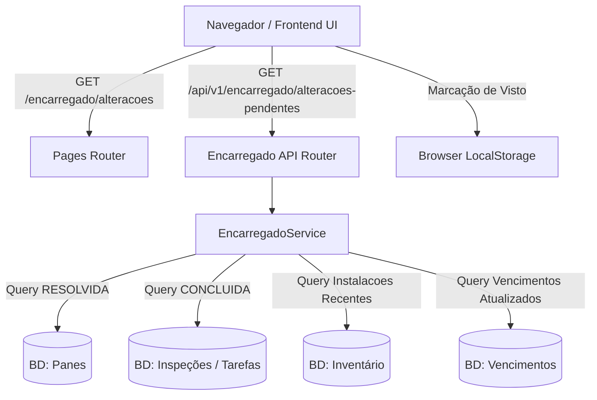

# Plano de Implementação: Módulo Encarregado — Ciência e Acompanhamento de Alterações Pendentes

> **Documento:** Plano de Implementação Detalhado  
> **Feature Referência:** `docs/backlog/feature_encarregado_alteracoes_pendentes.md`  
> **Data:** 26/07/2026  
> **Status:** Aguardando Revisão do Usuário  

---

## 1. Visão Geral e Objetivos

O objetivo deste plano é detalhar a criação de um módulo/página exclusiva para o **Encarregado (Chefe de Manutenção)** no **SAA29**. O módulo centraliza e consolida em uma visão unificada as alterações operacionais realizadas pelos Mantenedores nas 4 categorias de manutenção:

1. **[PANES]** Panes não-programadas concluídas/resolvidas.
2. **[INSPEÇÃO]** Tarefas de ordem de inspeção finalizadas/executadas.
3. **[INVENTÁRIO]** Trocas e movimentações recentes de equipamentos/componentes nos slots das aeronaves.
4. **[VENCIMENTOS]** Atualizações de datas e novos prazos de vencimento/calibração.

### Restrições Críticas (Conformidade com Spec)
- **Consulta Exclusiva (Read-Only no BD):** O módulo realiza apenas consultas agregadas no banco de dados. **Nenhuma ação do módulo alterará ou modificará tabelas/registros do banco de dados SAA29** (não altera status de panes, inspeções ou equipamentos no BD).
- **Visto Visual Responsivo:** A marcação de "visto" (check) por item será tratada exclusivamente no lado do cliente (persistida via `localStorage` do navegador), removendo/ocultando visualmente o card da lista de pendentes sem impactar a persistência do sistema backend.
- **Apoio Operacional:** Serve como suporte visual e operacional para o Encarregado transcrever/validar os dados no sistema oficial da FAB.

---

## 2. Arquitetura da Solução



---

## 3. Detalhamento dos Componentes a Serem Criados/Modificados

### 3.1. Backend: Módulo `app/modules/encarregado/` [NOVO]

- **`app/modules/encarregado/__init__.py`**
  - Exportação do pacote.

- **`app/modules/encarregado/schemas.py`**
  - **`AlteracaoPendenteItem`**: Schema Pydantic unificado contendo:
    - `id`: ID único da alteração/registro de origem.
    - `categoria`: Enum `['PANES', 'INSPECAO', 'INVENTARIO', 'VENCIMENTOS']`.
    - `aeronave_matricula`: Código da aeronave (ex: `FAB 5701`).
    - `titulo_descricao`: Descrição sucinta da alteração ou pane.
    - `detalhe_solucao`: Solução aplicada, serial que entrou/saiu ou novo vencimento.
    - `responsavel_trigrama`: Trigrama do militar que executou a ação.
    - `data_ocorrencia`: Data/hora em que a alteração ocorreu.
    - `detalhes_extras`: Dicionário/campos específicos da categoria.
  - **`ListaAlteracoesPendentesResponse`**: Resposta envelopada contendo os itens agrupados por categoria e total de pendências.

- **`app/modules/encarregado/service.py`**
  - Classe `EncarregadoService`:
    - **`get_alteracoes_pendentes(db: Session, limit: int = 50)`**:
      1. *Panes Concluídas:* Consulta `Pane` onde `status == RESOLVIDA`, ordenado por `data_conclusao desc`. Formata: `[AERONAVE] [DESCRICAO DA PANE] [SOLUÇÃO DA PANE] [TRIGRAMA RESPONSÁVEL]`.
      2. *Inspeções Realizadas:* Consulta `InspecaoTarefa` onde `status in ('CONCLUIDA', 'EXECUTADA')`, ordenado por `data_execucao desc`. Formata: `[AERONAVE] [TAREFA FINALIZADA] [TRIGRAMA RESPONSÁVEL]`.
      3. *Inventário Alterado:* Consulta `Instalacao` ordenado por `created_at desc`. Formata: `[AERONAVE] [SLOT] [SN SAIU] [SN ENTROU] [TRIGRAMA RESPONSÁVEL]`.
      4. *Vencimentos Atualizados:* Consulta `ControleVencimento` com atualizações recentes ou prorrogações. Formata: `[AERONAVE] [EQUIPAMENTO] [TIPO CONTROLE] [DATA VENCIMENTO NOVO] [TRIGRAMA RESPONSÁVEL]`.

- **`app/modules/encarregado/router.py`**
  - Rota `GET /api/v1/encarregado/alteracoes-pendentes`:
    - Protegida com dependência `get_current_user` e verificação de perfil (`ENCARREGADO` ou `ADMINISTRADOR`).
    - Retorna lista agregada dos registros de alteração.

### 3.2. Frontend: Rota da Página e Template HTML [NOVO]

- **`app/web/pages/router.py` [ALTERAÇÃO]**
  - Adicionar a rota HTML:
    ```python
    @router.get("/encarregado/alteracoes", response_class=HTMLResponse, include_in_schema=False)
    async def encarregado_alteracoes_page(request: Request, user=Depends(get_current_user)):
        return templates.TemplateResponse("encarregado/alteracoes.html", {"request": request, "user": user})
    ```

- **`app/web/templates/encarregado/alteracoes.html` [NOVO]**
  - Layout limpo, responsivo e moderno (CSS Vanilla/Dark Mode alinhado ao SAA29).
  - **Filtros e Abas:** Abas para filtrar por Categoria (`Todas`, `Panes`, `Inspeções`, `Inventário`, `Vencimentos`) e alternar visualização (`Apenas Pendentes de Visto` vs `Todas`).
  - **Cards Empilhados:** Lista de cards compactos e legíveis com crachás coloridos por categoria.
  - **Botão de Visto Visual (`check`):** Ao clicar no ícone de visto do card:
    - Adiciona o ID do item ao array `saa29_encarregado_vistos` armazenado no `localStorage` do navegador.
    - Executa animação suave de colapso/desaparecimento do card.
    - Atualiza o contador de pendências no topo da página.
  - **Botão Limpar Vistas Localmente:** Permite ao encarregado redefinir os vistos salvos caso deseje rever itens passados.

- **`app/web/templates/base.html` [ALTERAÇÃO]**
  - Incluir item no menu superior / sidebar: `"Ciência Encarregado"` visível para perfis `Encarregado` e `Administrador`.

### 3.3. Configuração do Servidor FastAPI [ALTERAÇÃO]

- **`app/bootstrap/main.py` [ALTERAÇÃO]**
  - Importar e registrar `encarregado_router` com prefixo `/api/v1/encarregado`.

---

## 4. Plano de Testes e Validação

### 4.1. Testes Automatizados (`tests/test_encarregado_alteracoes.py`) [NOVO]
1. **Teste de Autenticação e Permissão:**
   - Garantir que usuários não autenticados recebam HTTP 401/307.
   - Garantir que perfil `Mantenedor` sem acesso a rotas de encarregado seja restrito se aplicável ou possa visualizar se configurado.
2. **Teste de Agregação de Dados:**
   - Criar via fixtures: pane resolvida, tarefa de inspeção concluída, instalação de equipamento e vencimento atualizado.
   - Chamar o endpoint `GET /api/v1/encarregado/alteracoes-pendentes`.
   - Validar se os 4 itens são retornados com os campos e trigramas corretos.
3. **Teste de Imutabilidade (Read-Only):**
   - Garantir que a chamada ao endpoint não altere nenhuma tabela do banco de dados.

### 4.2. Teste Manual e Experiência do Usuário (UX)
1. Acessar `/encarregado/alteracoes` logado como Encarregado.
2. Verificar exibição dos cards empilhados organizados por categoria.
3. Clicar no botão de check/visto de um card e confirmar que o card desaparece da visão pendente.
4. Recarregar a página (`F5`) e confirmar que o item permanece oculto (persistido no `localStorage`).

---

## 5. Resumo dos Arquivos Envolvidos

| Arquivo | Ação | Descrição |
|---|---|---|
| `docs/backlog/feature_encarregado_alteracoes_pendentes_plano.md` | **[CRIADO]** | Plano de implementação detalhado |
| `app/modules/encarregado/__init__.py` | **[NOVO]** | Pacote do módulo encarregado |
| `app/modules/encarregado/schemas.py` | **[NOVO]** | Schemas Pydantic para os registros agregados |
| `app/modules/encarregado/service.py` | **[NOVO]** | Serviço com a lógica de busca read-only nas 4 categorias |
| `app/modules/encarregado/router.py` | **[NOVO]** | Router REST API `/api/v1/encarregado` |
| `app/web/templates/encarregado/alteracoes.html` | **[NOVO]** | Template Jinja2 com interface visual dos cards e vistos |
| `app/web/pages/router.py` | **[MODIFICAR]** | Adicionar rota de página `/encarregado/alteracoes` |
| `app/bootstrap/main.py` | **[MODIFICAR]** | Registrar router da API do Encarregado |
| `app/web/templates/base.html` | **[MODIFICAR]** | Adicionar atalho no menu de navegação |
| `tests/test_encarregado_alteracoes.py` | **[NOVO]** | Testes automatizados da API do Encarregado |
