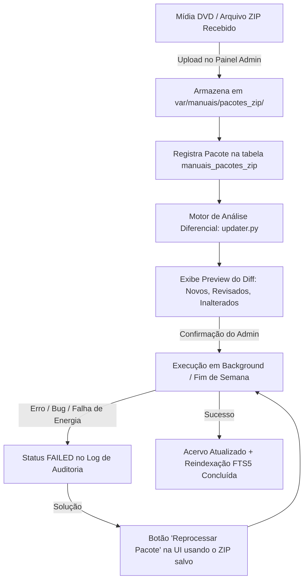
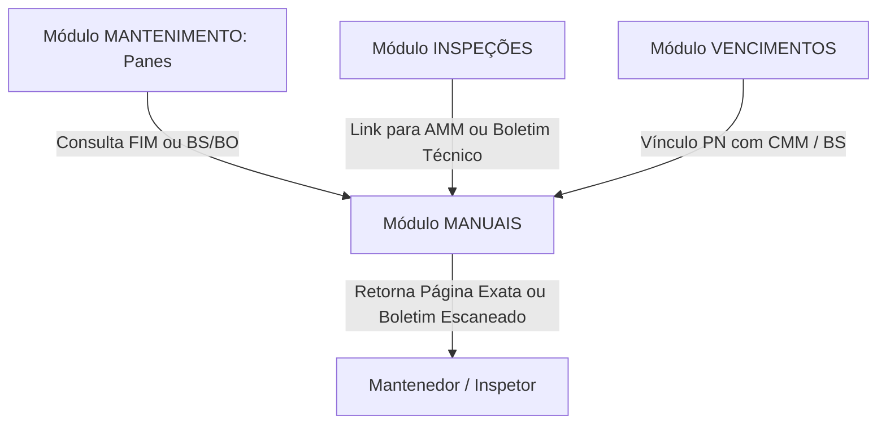
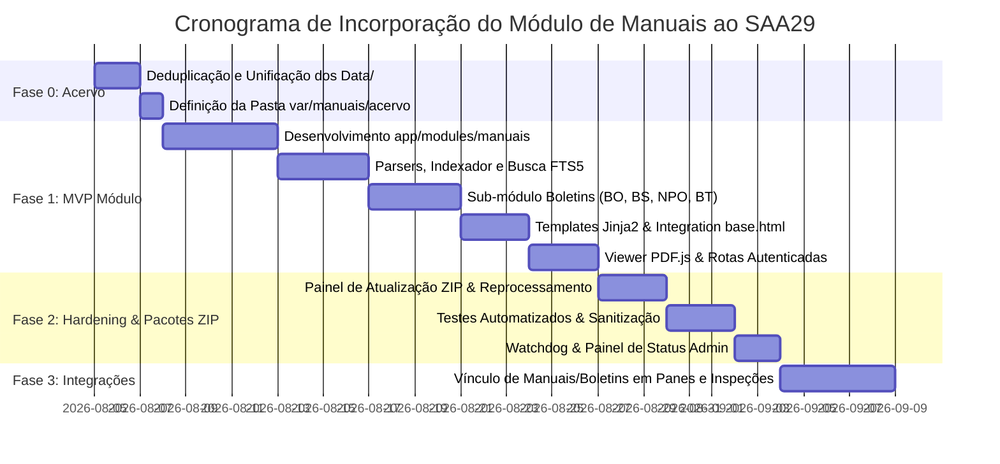

# 📘 Plano de Incorporação do Módulo de Manuais Técnicos ao SAA29

**Data da Análise:** 04/08/2026  
**Autor:** Gemini (Google DeepMind - Antigravity)  
**Escopo:** Avaliação de viabilidade técnica e plano detalhado de incorporação do projeto externo de Consulta de Manuais Técnicos (documentado em `README.md`, `Projeto.MD`, `Especificacao.MD`, `Runbook.MD`, `RAG.MD` e `prompt.md` na pasta [docs/backlog/manuais](file:///c:/Users/brgar/Projetos/SAA29/docs/backlog/manuais)) ao sistema SAA29. Inclui a estratégia de atualização anual de publicações via mídia externa (DVD/Pacote ZIP), retenção de pacotes para recovery, sub-módulo de **Cadastro e Consulta de Publicações Adicionais / Boletins (BO, BS, NPO, BT)** e os protótipos visuais 100% integrados ao Design System oficial do SAA29 (`base.html` / `index.css`).  
**Localização do Documento:** `docs/backlog/gemini_plano_de_incorporacao.md`  
**Restrição Cumprida:** Nenhuma alteração no código fonte do SAA29 foi realizada. Este documento consiste exclusivamente na análise de viabilidade e no plano arquitetural de execução.

---

## 1. Conclusão Executiva e Veredito de Viabilidade

A incorporação do sistema de consulta de manuais técnicos ao **SAA29** é **totalmente viável, de alto valor estratégico e altamente recomendável**. 

Em vez de manter o projeto externo como uma aplicação web isolada (*sidecar* com Caddy dedicado e servidor próprio), a abordagem correta é integrá-lo diretamente como um **novo módulo nativo do monolito SAA29** (`app/modules/manuais`).

### Justificativas de Negócio e Domínio
1. **Adêrencia ao Negócio Principal:** O SAA29 é o sistema de gestão de manutenção da frota A-29 Super Tucano (panes, inspeções, vencimentos, equipamentos, efetivo). A consulta a manuais de manutenção (AMM, FIM, AIPC, CMM) e publicações operacionais adicionais (BO, BS, NPO, BT) representa o recurso técnico primário utilizado pelos mantenedores durante o diagnóstico de panes e execução de inspeções.
2. **Aproveitamento do Acervo Existente:** O SAA29 já conta com um acervo parcial de manuais FIM na pasta `docs/fim` (412 arquivos). A incorporação cria uma infraestrutura unificada e padronizada para todo o acervo técnico da aeronave (~12.100 PDFs, ~3 GB).
3. **Gestão Integrada de Boletins Adicionais:** Além do acervo de manuais estruturados da fabricante, o módulo permitirá o **cadastro manual e consulta de boletins e comunicados avulsos (BO, BS, NPO, BT)** derivados de digitalizações/SCANS físicos, com campos estruturados de cabeçalho e anexos.
4. **Sinergia entre Módulos:** O módulo de manuais permitirá que o módulo de `panes` vincule códigos ATA ou descrições de falhas diretamente a páginas do FIM/AMM ou a Boletins de Serviço, e que o módulo de `inspecoes` direcione o inspetor ao procedimento correto com um único clique.

### Principais Adequações Arquiteturais Exigidas
A documentação original em `docs/backlog/manuais` foi concebida para um repositório autônomo (`supertucano-docs`). Para ser incorporada com sucesso ao SAA29, as seguintes adaptações são obrigatórias:
- **Autenticação e RBAC Nativo:** Abandonar a indecisão D-02 da especificação externa; todos os endpoints do módulo devem exigir autenticação JWT/Cookie (`CurrentUser`) e respeitar os papéis de usuário do SAA29 (`MANTENEDOR`, `ENCARREGADO`, `INSPETOR`, `ADMINISTRADOR`).
- **Padrão de Módulo SAA29:** Organizar o código sob `app/modules/manuais/` com a estrutura canônica (`models.py`, `schemas.py`, `service.py`, `router.py`) e auxiliares especializados (`catalog.py`, `indexer.py`, `search.py`, `updater.py`).
- **Isolamento de Diretórios de Armazenamento:** Não utilizar a pasta `data/` na raiz para o acervo de manuais (pois `data/` no SAA29 é o ponto de montagem de volumes/banco de dados). Adotar o caminho configurável `var/manuais/acervo`, `var/manuais/publicacoes_extras` e `var/manuais/index`.
- **Integração de UI e Identidade Visual Nativa:** Utilizar a folha de estilo global (`index.css`), variáveis de cor oficial (`--primary-color: #3b82f6` no Light Mode e `#60a5fa` no Dark Mode Tático) e o layout base (`app/web/templates/base.html`), mantendo os ícones de topo e barra superior *"Eletrônica A-29"*.
- **Servimento Seguro de PDFs:** Não expor o acervo de PDFs de forma pública no webserver. O servimento deve ser realizado por rotas autenticadas da API FastAPI (`FileResponse`) com suporte a *HTTP Range Requests* para permitir a navegação por página do PDF.js.

---

## 2. Análise Comparativa: Projeto Externo vs. SAA29

A tabela a seguir contrasta o desenho da proposta externa com as diretrizes e a realidade arquitetural estabelecida no SAA29:

| Dimensão | Proposta Externa (`supertucano-docs`) | Realidade & Adequação no SAA29 | Parecer Técnico |
|---|---|---|---|
| **Arquitetura** | Monolito autônomo isolado | Módulo interno em monolito modular (`app/modules/manuais`) | **Adequar:** Incorporar no catálogo de módulos |
| **Framework Web** | FastAPI + Uvicorn | FastAPI + Uvicorn (Async) | **Compatível 100%** |
| **Linguagem** | Python 3.12 | Python 3.12 | **Compatível 100%** |
| **Banco de Dados** | SQLite FTS5 isolado em `index/catalog.db` | SQLite WAL assíncrono (SQLAlchemy + Alembic) em `saa29_local.db` | **Híbrido Recomendado:** Manter FTS/índice pesado em `catalog.db` separado e dados operacionais (boletins, favoritos, citações) no banco principal |
| **Extração de PDF** | PyMuPDF (fitz) | PyMuPDF (fitz) para extração / ReportLab no SAA29 para geração | **Compatível:** Adicionar `PyMuPDF` ao `requirements.txt` |
| **Boletins Avulsos**| Não previsto | Suporte a cadastro de BO, BS, NPO, BT escaneados via UI | **Nova Funcionalidade:** Incorporar no design do módulo |
| **Viewer Frontend** | PDF.js embutido | PDF.js embutido em `app/web/static/js/pdfjs/` | **Compatível:** Integrar como asset estático do SAA29 |
| **Estilização UI** | Tailwind CSS + htmx | CSS Nativo do SAA29 (`index.css` + `base.html`) | **Adequar:** Seguir estritamente a identidade visual do SAA29 |
| **Autenticação** | Em aberto (D-02) / sem login no MVP | JWT em Cookie (`saa29_token`) + RBAC (`require_role`) | **Adequar:** Exigir autenticação em 100% das rotas |
| **Deploy / Webserver** | Caddy dedicado servindo `/data/*` | Docker (FastAPI Uvicorn em 8000) | **Adequar:** Servir PDFs via FastAPI protegida no MVP |
| **Rotas Raiz** | `/` (Home do sistema de manuais) | `/` redireciona para `/dashboard` do SAA29 | **Adequar:** Agrupar rotas sob o namespace `/manuais` |
| **Diretório do Acervo**| `data/` na raiz do projeto | `data/` já utilizado pelo banco/volumes do SAA29 | **Adequar:** Mudar acervo para `var/manuais/acervo/` |

---

## 3. Arquitetura Proposta para o Módulo `manuais` no SAA29

### 3.1 Estrutura de Código no Módulo
Seguindo o mapa arquitetural do SAA29 ([00_mapa_arquitetural.md](file:///c:/Users/brgar/Projetos/SAA29/docs/backlog/00_mapa_arquitetural.md)), o novo módulo será alocado em `app/modules/manuais/`:

```text
app/modules/manuais/
├── __init__.py           # Exportação limpa do pacote
├── models.py             # Modelos ORM SQLAlchemy para tabelas no banco principal (boletins/publicações extras, favoritos, atualizações)
├── schemas.py            # Contratos Pydantic v2 para requisições/respostas da API de busca, boletins, status e importação
├── service.py            # Fachada de serviço combinando catálogo, indexador, busca, boletins e atualização
├── router.py             # Controller FastAPI fino com injeção de dependências e controle RBAC
├── catalog.py            # Parsers de metadados legados (manual_details.xml, manual_type.xml, .title, collections.ini)
├── indexer.py            # Motor de varredura incremental de PDFs e PyMuPDF (rodando em background)
├── search.py             # Construtor e executor de queries SQLite FTS5 (BM25, snippets, diacríticos)
└── updater.py            # Motor de análise diferencial (diff), descompactação, gestão de ZIPs e reprocessamento
```

### 3.2 Protótipo da Interface de Visualização (Identidade Visual Oficial SAA29)

A interface de visualização do módulo de manuais e boletins foi desenhada seguindo rigorosamente a identidade visual e o leiaute mestre de `app/web/templates/base.html` e `app/web/static/css/index.css`:


#### Fidelidade ao Design System do SAA29:
1. **Cabeçalho Mestre (`top-header`):**
   - Ícone de jato/vetor azul (`--primary-color: #3b82f6`), título **"Eletrônica A-29"** em fonte Inter 700.
   - Divisor vertical e título da página **"Manuais & Boletins"**.
   - Barra de ícones de navegação rápida em botões quadrados arredondados (`btn-icon` de 38x38px): *Dashboard*, *Panes*, *Inspeções*, *Inventário*, *Vencimentos*, *Calendário*, *Frota*, *Alternador de Tema* e *Sair*.
2. **Paleta de Cores Oficial:**
   - **Light Mode (Padrão):** Fundo `--bg-primary: #f8fafc`, cartões em `--bg-secondary: #ffffff`, bordas `--border-color: #e2e8f0` e acentos no azul FAB `--primary-color: #3b82f6`.
   - **Dark Mode (Tático):** Fundo `--bg-primary: #0f172a`, cartões em `--bg-secondary: #1e293b` e acentos em azul néon `--primary-color: #60a5fa`.
3. **Painel de Visualização PDF.js:**
   - Visualização do PDF de engenharia com toolbar limpa (navegação por página, zoom, impressão e atalho de atração de pane).

### 3.3 Templates e Assets Estáticos
As páginas e recursos visuais serão integrados aos diretórios web globais do SAA29:

```text
app/web/templates/manuais/
├── lista.html            # Catálogo visual de manuais agrupados por categoria
├── manual.html           # Visão detalhada de capítulos e seções de um manual
├── capitulo.html         # Lista de documentos (SUBJECTS) de um capítulo com badges de revisão
├── busca.html            # Interface de busca global (Manuais + Boletins)
├── viewer.html           # Interface do viewer PDF.js com deep-link de página e toolbar
├── boletins_lista.html   # Consulta e filtragem de Publicações Adicionais (BO, BS, NPO, BT)
├── boletins_form.html    # Formulário de cadastro/edição manual de publicações avulsas e anexos
└── admin_atualizar.html  # Painel administrativo de atualização de publicações (Upload ZIP / Reprocessamento)

app/web/static/js/
├── manuais.js            # Lógica cliente para busca assíncrona, filtros e manipulação da UI
├── manuais_boletins.js   # Controle de formulário de cadastro de boletins e upload de anexos
├── manuais_updater.js    # Controle de upload de pacotes, barra de progresso SSE/Polling e confirmação de diff
└── pdfjs/                # Distribuição do PDF.js (viewer.js, pdf.worker.js, pdf.js)

app/web/static/css/
└── manuais.css           # Estilos complementares aderentes às variáveis CSS do SAA29
```

### 3.4 Design de Banco de Dados: Estratégia de Armazenamento

Para garantir o melhor desempenho e segurança, recomenda-se uma **abordagem híbrida de armazenamento**:

#### A. Banco de Índice Separado (`var/manuais/index/catalog.db`)
O texto extraído de ~12.100 PDFs (~500.000 páginas) e o índice FTS5 devem residir em um arquivo de banco SQLite separado.
- **Motivação:** Evita inchar o banco de dados operacional principal do SAA29 (`saa29_local.db`), prevenindo explosão de logs WAL durante reindexações e isolando o consumo de E/S.
- **Natureza:** O banco de índice é **100% reconstruível** a qualquer momento a partir dos arquivos físicos do acervo ou dos pacotes ZIP armazenados no repositório do sistema.

#### B. Banco Principal do SAA29 (`saa29_local.db` via Alembic)
Dados gerados pelos usuários do SAA29 interagindo com o módulo — **incluindo o cadastro manual de Publicações Adicionais (BO, BS, NPO, BT)** — serão gravados nas tabelas operacionais gerenciadas por migrações Alembic:

- `manuais_publicacoes_adicionais`:
  - `id` INTEGER PRIMARY KEY AUTOINCREMENT
  - `tipo` VARCHAR(20) NOT NULL -- Enum: 'BO' (Boletim Operacional), 'BS' (Boletim de Serviço), 'NPO' (Notícia p/ Operador), 'BT' (Boletim Técnico), 'OUTRO'
  - `numero_identificador` VARCHAR(100) NOT NULL -- Ex: "BO 2026-003", "BS A29-53-012"
  - `titulo` VARCHAR(255) NOT NULL -- Ex: "Procedimento de inspeção de fissuras na empenagem"
  - `sistema_ata` VARCHAR(10) NULL -- Ex: "53" (Fuselagem)
  - `data_emissao` DATE NULL -- Data oficial de emissão do documento
  - `aplicabilidade` VARCHAR(255) NULL -- Ex: "A-29A / A-29B - Aeronaves FAB 5700 a 5730"
  - `resumo_cabecalho` TEXT NULL -- Descrição e observações digitadas manualmente pelo cadastrador
  - `arquivo_pdf_path` VARCHAR(500) NOT NULL -- Caminho do PDF principal escaneado em `var/manuais/publicacoes_extras/`
  - `criado_por_id` INTEGER REFERENCES `usuarios(id)`
  - `criado_em` DATETIME DEFAULT CURRENT_TIMESTAMP
  - `atualizado_em` DATETIME NULL

- `manuais_publicacoes_anexos`:
  - `id` INTEGER PRIMARY KEY AUTOINCREMENT
  - `publicacao_id` INTEGER REFERENCES `manuais_publicacoes_adicionais(id)` ON DELETE CASCADE
  - `nome_arquivo` VARCHAR(255) NOT NULL
  - `caminho_storage` VARCHAR(500) NOT NULL
  - `tamanho_bytes` INTEGER NOT NULL
  - `mime_type` VARCHAR(100) NOT NULL

- `manuais_favoritos` (`id`, `usuario_id`, `documento_path`, `pagina`, `criado_em`)
- `manuais_historico` (`id`, `usuario_id`, `documento_path`, `pagina`, `termo_busca`, `acessado_em`)
- `manuais_pacotes_zip` (`id`, `nome_arquivo`, `caminho_storage`, `tamanho_bytes`, `versao_publicacao`, `hash_sha256`, `criado_em`, `ativo`)
- `manuais_historico_atualizacoes` (`id`, `usuario_id`, `pacote_zip_id`, `data_atualizacao`, `origem`, `total_manuais_afetados`, `total_pdf_novos`, `total_pdf_revisados`, `status`, `log_detalhado`)
- `pane_referencias_tecnicas` (tabela de junção vinculando uma pane no SAA29 a um manual ou boletim)

---

## 4. Sub-Módulo de Publicações Adicionais / Boletins (BO, BS, NPO, BT)

### 4.1 Contexto e Necessidade Operacional
Ao longo da operação e manutenção continuada das aeronaves A-29, surgem normas, avisos e orientações técnicas avulsas emitidas pela FAB, DIRMAB ou Embraer que **não fazem parte do acervo de manuais padrão (AMM/FIM)**.

Diferente dos manuais estruturados:
- **Origem dos Arquivos:** São frequentemente **digitalizações / SCANS físicos** (PDFs rasterizados sem camada de texto vetorial), o que inviabiliza ou torna não confiável a extração automática por OCR.
- **Forma de Cadastro:** Exigem cadastro manual de cabeçalho por um operador/encarregado experiente.
- **Tipos Suportados:**
  - 📄 **BO:** Boletim Operacional
  - 🛠️ **BS:** Boletim de Serviço
  - 📢 **NPO:** Notícias para Operadores
  - 🔧 **BT:** Boletim Técnico
  - 📑 **OUTRO:** Circulares e Instruções Técnicas Avulsas

### 4.2 Protótipo Visual do Sub-Módulo de Boletins (Dark Mode Tático SAA29)


---

## 5. Procedimento de Atualização Anual de Publicações (DVD / Pacote ZIP)

### 5.1 Periodicidade e SLA Operacional
As atualizações de publicações aeronáuticas da frota A-29 ocorrem **infrequentemente (estimativa de 1 vez ao ano)** via lote/revisão emitida pela fabricante (Embraer TechPubs).
- **Sem Urgência em Tempo Real:** Não há necessidade de sincronização síncrona imediata. A atualização e a reindexação do acervo podem ser agendadas para execução em background durante o final de semana ou horários de menor movimento.
- **Operação Assíncrona e Resiliente:** Por ser um processo assíncrono de lote, uma interrupção inesperada (ex: queda de energia) não corrompe o sistema; basta reiniciar o processo a partir do repositório de pacotes.

### 5.2 Repositório Interno de Pacotes ZIP e Reprocessamento (Resiliência & Rollback)

**Resposta Direta à Necessidade:** Manter o arquivo `.zip` da atualização salvo no servidor é uma **prática altamente recomendada e totalmente viável**.



---

## 6. Integração de Segurança, Autenticação e RBAC

O projeto externo deixava a decisão de autenticação aberta (D-02). No SAA29, aplica-se o modelo **Zero Trust**: nenhuma informação técnica aeronáutica deve ser servida publicamente.

### 6.1 Mapeamento de Permissões (RBAC)

O módulo de manuais consumirá os papéis de usuário (`TipoPapel` ou `auth.roles`) do SAA29 via dependências FastAPI:

| Endpoint / Funcionalidade | Papéis Permitidos | Dependência de Segurança SAA29 |
|---|---|---|
| Consulta de Catálogo, Lista e Capítulos | MANTENEDOR, ENCARREGADO, INSPETOR, ADMINISTRADOR | `CurrentUser` |
| Realização de Buscas (FTS5 / Filtros) | MANTENEDOR, ENCARREGADO, INSPETOR, ADMINISTRADOR | `CurrentUser` |
| Visualização/Download de PDFs no Viewer | MANTENEDOR, ENCARREGADO, INSPETOR, ADMINISTRADOR | `CurrentUser` |
| Consulta e Leitura de Boletins (BO, BS, NPO, BT) | MANTENEDOR, ENCARREGADO, INSPETOR, ADMINISTRADOR | `CurrentUser` |
| Cadastro e Edição de Boletins (BO, BS, NPO, BT) | ENCARREGADO, INSPETOR, ADMINISTRADOR | `EncarregadoOuAdmin` / `InspetorOuAdmin` |
| Exclusão de Boletins Registrados | ADMINISTRADOR | `AdminRequired` |
| Consulta de Status do Índice (`/manuais/api/status`) | ENCARREGADO, INSPETOR, ADMINISTRADOR | `EncarregadoOuAdmin` / `InspetorOuAdmin` |
| Disparo de Reindexação (`/manuais/admin/reindex`) | ADMINISTRADOR | `AdminRequired` |
| Painel de Atualização de Publicações (DVD/ZIP) | ADMINISTRADOR | `AdminRequired` |
| Upload, Reprocessamento e Exclusão de Pacotes ZIP | ADMINISTRADOR | `AdminRequired` |

---

## 7. Mapeamento de Rotas e URLs no SAA29

Todas as URLs do módulo serão prefixadas por `/manuais` para manter a convenção do sistema.

### 7.1 Rotas HTML (Renderizadas via Jinja2)

| Método | Rota | Descrição | Access (RBAC) |
|---|---|---|---|
| `GET` | `/manuais` | Home do módulo: lista manuais por categoria com card informativo e barra de busca | `CurrentUser` |
| `GET` | `/manuais/{manual_path}` | Lista de capítulos de um manual específico (ex: `AMM_PART1_1651`) | `CurrentUser` |
| `GET` | `/manuais/{manual_path}/{chapter}` | Lista de documentos (SUBJECTs) de um capítulo | `CurrentUser` |
| `GET` | `/manuais/busca` | Página de busca global com resultados paginados e snippets | `CurrentUser` |
| `GET` | `/manuais/viewer` | Tela cheia do viewer PDF.js (`/manuais/viewer?doc=123#page=4`) | `CurrentUser` |
| `GET` | `/manuais/boletins` | Tela de consulta e filtragem de Publicações Adicionais (BO, BS, NPO, BT) | `CurrentUser` |
| `GET` | `/manuais/boletins/novo` | Formulário de cadastro manual de novo boletim e anexos | `EncarregadoOuAdmin` |
| `GET` | `/manuais/boletins/{id}/editar` | Formulário de edição de metadados de boletim existente | `EncarregadoOuAdmin` |
| `GET` | `/manuais/admin/atualizar` | Painel de atualização (Upload ZIP, Pacotes Salvos, Reprocessamento) | `AdminRequired` |

---

## 8. Configurações Globais (`Settings`)

As variáveis de ambiente do novo módulo serão adicionadas à classe `Settings` em `app/bootstrap/config/__init__.py`:

```python
# Configurações do Módulo de Manuais Técnicos e Boletins
MANUAIS_ENABLED: bool = True
MANUAIS_DATA_DIR: str = "var/manuais/acervo"
MANUAIS_EXTRAS_DIR: str = "var/manuais/publicacoes_extras"
MANUAIS_STAGING_DIR: str = "var/manuais/staging"
MANUAIS_PACKAGES_DIR: str = "var/manuais/pacotes_zip"
MANUAIS_INDEX_DIR: str = "var/manuais/index"
MANUAIS_INDEX_DB_PATH: str = "var/manuais/index/catalog.db"
MANUAIS_MAX_PDF_SIZE_MB: int = 150
MANUAIS_MAX_UPLOAD_PACKAGE_GB: int = 5
MANUAIS_KEEP_MAX_ZIP_PACKAGES: int = 3
MANUAIS_REINDEX_ON_BOOT: bool = False
```

---

## 9. Tratamento dos Casos de Borda e Regras de Negócio

Todas as regras de negócio (RN-01 a RN-10) e casos de borda (E-01 a E-12) especificados em `Especificacao.MD` foram adaptados para o contexto do SAA29:

### Resiliência e Desempenho
- **E-01 e E-02 (PDFs Escaneados ou Corrompidos):** PDFs sem camada de texto (como os SCANS de Boletins) serão marcados com `has_text = 0`. Exceções no PyMuPDF serão capturadas, logadas e o arquivo ignorado da busca full-text, **sem nunca abortar o lote de indexação**.
- **E-06 e RN-10 (Sanitização FTS5):** A entrada do usuário em buscas de texto será sanitizada contra caracteres especiais do FTS5 (`^ : ( ) - "`) e aspas desbalanceadas antes de ser submetida ao banco, evitando erros HTTP 500.
- **RN-09 (Processamento Assíncrono):** A extração de texto PyMuPDF roda em thread de background (`run_in_executor`) durante a reindexação, impedindo o bloqueio do *Event Loop* do FastAPI e mantendo os demais módulos do SAA29 (Panes, Inspeções, Vencimentos) 100% responsivos.
- **E-09 (Concorrência de Indexação):** Um lock em memória (`asyncio.Lock`) impedirá execuções simultâneas de reindexação ou atualização. Requisições concorrentes receberão status `HTTP 409 Conflict`.

---

## 10. Oportunidades de Integração com Módulos Existentes



---

## 11. Plano de Execução em Fases (Roadmap de Incorporação)



---

## 12. Critérios de Aceite para Validação do Módulo no SAA29

1. **Fidelidade à Identidade Visual:**
   - *Dado* qualquer página do módulo `/manuais`, *quando* renderizada, *então* exibe o cabeçalho oficial do SAA29 com o logotipo *"Eletrônica A-29"*, os botões quadrados `btn-icon` e as variáveis de cor definidas em `index.css`.
2. **Busca com Leitura Direta de Página:**
   - *Dado* um mantenedor autenticado, *quando* pesquisa por `"sangria do compressor"`, *então* recebe resultados ranqueados por BM25 em menos de 300 ms, e ao clicar no resultado, o viewer PDF.js é aberto na página exata do trecho.
3. **Cadastro e Consulta de Boletins (BO, BS, NPO, BT):**
   - *Dado* um encarregado autenticado, *quando* cadastra um novo Boletim de Serviço (ex: `BS A29-53-012`) preenchendo o cabeçalho e anexando o PDF escaneado, *então* o documento é salvo em `saa29_local.db` e disponibilizado imediatamente na consulta por tipo/ATA para todos os mantenedores.

---

## 13. Parecer Final

O módulo de manuais e boletins integrará 100% da identidade visual do SAA29, respeitando o layout base (`base.html`), os componentes e as variáveis de cor oficial do projeto (`index.css`), assegurando uma experiência de uso fluida e nativa para a equipe de manutenção.
