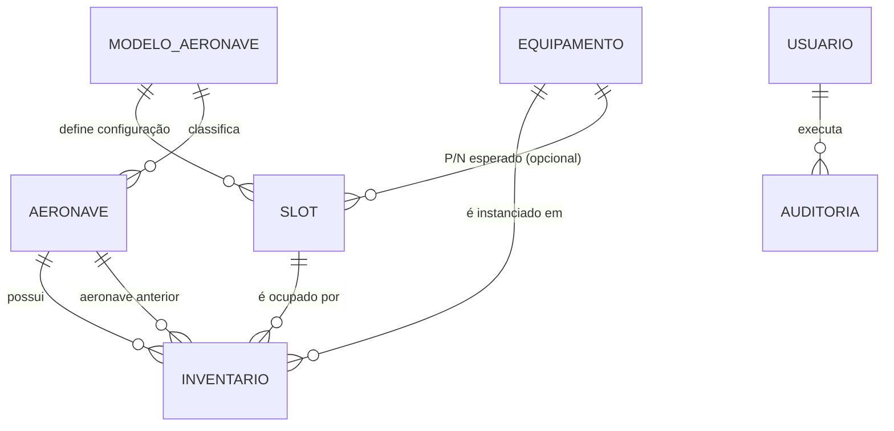

# SPEC-CONF-001 — Módulo de Gestão de Equipamentos, Slots e Inventário

| Campo | Valor |
|---|---|
| **ID** | SPEC-CONF-001 |
| **Título** | Gestão administrativa de Equipamentos, Slots e Inventário via tela de Configurações |
| **Tipo** | Feature Specification (PRD + Technical Design) |
| **Versão** | 1.0 — Draft |
| **Data** | 2026-08-10 |
| **Autor** | *(preencher)* |
| **Status** | 🟡 Em revisão |
| **Épico** | EP-INV — Manutenção de dados mestres de inventário |
| **Stakeholders** | Seção de Manutenção, Suprimento/Almoxarifado, Controle de Configuração, TI/Sustentação |

---

## 1. Contexto e Declaração do Problema

O sistema de gestão da manutenção aeronáutica possui uma tela de **Inventário** que exibe, por aeronave, os equipamentos instalados com as colunas:

`Loc | Slot | P/N | S/N (SILOMS) | Atualização/Trigrama | S/N (REAL) | Anv Ant.`

**Situação atual (AS-IS):**

- Os dados mestres (`equipamentos`, `slots`, `inventario`) só são criados por scripts de *seed* executados manualmente no servidor:
  - `scripts/seed/seed_slots.py`
  - `scripts/seed/seed_inventario.py`
  - `scripts/seed/seed_equipamentos.py`
- O *seed* popula os registros **sem número de série**.
- Na interface, o usuário **só consegue alterar o S/N**. Qualquer outra correção (P/N errado, slot inexistente, equipamento novo, item que saiu de configuração) exige intervenção de TI via script ou SQL direto no banco.

**Consequências / dor:**

| # | Impacto |
|---|---|
| 1 | Dependência de TI para operações rotineiras de dados mestres (lead time alto). |
| 2 | Alteração de dados por SQL direto **sem rastro de auditoria** — inaceitável em contexto de rastreabilidade aeronáutica. |
| 3 | Divergências entre o inventário do sistema e a configuração física da aeronave persistem até a próxima janela de manutenção do sistema. |
| 4 | Risco de perda de dados: um novo *seed* pode sobrescrever ajustes feitos manualmente. |

**Situação desejada (TO-BE):** um usuário autorizado realiza o ciclo completo de CRUD sobre Equipamentos, Slots e Inventário pela própria aplicação, com validação de integridade referencial, confirmação de operações destrutivas e trilha de auditoria completa.

---

## 2. Glossário

| Termo | Definição |
|---|---|
| **Loc** | Localização física/zona da aeronave onde o slot está posicionado (ex.: cabine, compartimento eletrônico, pilone). |
| **Slot** | Posição lógica de instalação prevista na configuração da aeronave. É o "endereço" que recebe um equipamento. |
| **P/N** | *Part Number* — identificação do modelo do equipamento no catálogo. |
| **S/N** | *Serial Number* — identificação unitária do equipamento físico. |
| **S/N (SILOMS)** | Serial registrado no sistema logístico externo (SILOMS). Fonte de verdade contábil/logística. |
| **S/N (REAL)** | Serial efetivamente instalado na aeronave, verificado fisicamente. |
| **Divergência** | Estado em que `S/N (SILOMS) ≠ S/N (REAL)`. Requer conciliação. |
| **Trigrama** | Identificação de três letras do militar/técnico responsável pelo lançamento. |
| **Atualização** | Data do último lançamento/verificação do item de inventário. |
| **Anv Ant.** | Aeronave anterior — última aeronave em que aquele serial estava instalado (rastreabilidade de rotação). |
| **Equipamento** | Registro de **catálogo** (o modelo). Não representa uma peça física. |
| **Item de Inventário** | Vínculo `Aeronave × Slot × Equipamento × Serial`. Representa a peça física instalada. |

---

## 3. Objetivos e Métricas de Sucesso

| Objetivo | Métrica (KPI) | Baseline | Meta |
|---|---|---|---|
| Eliminar dependência de TI para dados mestres | Nº de solicitações de ajuste de inventário abertas para TI / mês | *(medir)* | ≤ 1 |
| Rastreabilidade total | % de alterações em inventário com registro de auditoria (autor, data, valor anterior) | 0% | 100% |
| Reduzir tempo de correção | Tempo médio entre detecção da divergência e correção no sistema | dias | < 10 min |
| Qualidade dos dados | % de itens de inventário com S/N (REAL) preenchido | *(medir)* | ≥ 95% |

---

## 4. Escopo

### 4.1 Dentro do escopo (In Scope)

1. Botão de acesso na tela **Configurações** → nova página **"Gestão de Inventário"**.
2. CRUD de **Equipamentos** (catálogo): criar, editar, inativar/remover.
3. CRUD de **Slots**: criar, editar, inativar/remover.
4. **Editar** e **Remover** itens de **Inventário**.
5. Validação de integridade referencial com mensagens de erro acionáveis.
6. *Soft delete* + trilha de auditoria para todas as três entidades.
7. Controle de acesso por perfil (RBAC).
8. Adequação dos scripts de *seed* para operarem por *upsert* idempotente, sem sobrescrever edições manuais.

### 4.2 Fora do escopo (Out of Scope)

- Integração automática (API) de conciliação com o SILOMS — permanece manual nesta entrega.
- Importação/exportação em massa via planilha (CSV/XLSX) — candidato à Fase 2.
- Gestão de vida útil, TBO, horas/ciclos de componentes.
- Fluxo de aprovação em duas etapas (*maker-checker*) — candidato à Fase 2.
- Redesign da tela de Inventário operacional existente.

### 4.3 Premissas

> ⚠️ **Confirmar antes do desenvolvimento.** Premissas assumidas a partir do contexto informado:

- **P1** — Backend em Python (evidência: `scripts/seed/*.py`), com ORM e ferramenta de *migration* (assumido SQLAlchemy + Alembic).
- **P2** — As três entidades já existem como tabelas relacionadas: `inventario` referencia `slot` e `equipamento` por chave estrangeira.
- **P3** — Já existe autenticação com sessão de usuário identificável (necessário para trigrama e auditoria).
- **P4** — `Slot` é definido por **modelo/tipo de aeronave**, e o item de inventário é vinculado à **aeronave individual (matrícula)**. Ver Q3 na Seção 20.

---

## 5. Personas e Matriz de Permissões (RBAC)

| Ação | Operador de Manutenção | Supervisor / Controle de Config. | Administrador | Somente Leitura |
|---|---|---|---|---|
| Visualizar página de Gestão | ❌ | ✅ | ✅ | ❌ |
| Criar/Editar Equipamento | ❌ | ✅ | ✅ | ❌ |
| Remover Equipamento | ❌ | ❌ | ✅ | ❌ |
| Criar/Editar Slot | ❌ | ✅ | ✅ | ❌ |
| Remover Slot | ❌ | ❌ | ✅ | ❌ |
| Editar Inventário | ❌ | ✅ | ✅ | ❌ |
| Remover Inventário | ❌ | ❌ | ✅ | ❌ |
| Editar apenas S/N (tela operacional atual) | ✅ | ✅ | ✅ | ❌ |
| Consultar log de auditoria | ❌ | ✅ | ✅ | ❌ |

**Regra:** operações destrutivas (remoção) são restritas ao perfil Administrador. O botão em Configurações **não deve ser renderizado** para perfis sem permissão de leitura do módulo (defesa em profundidade: validar também no backend).

---

## 6. Modelo de Dados

### 6.1 Diagrama de Entidade-Relacionamento



### 6.2 `equipamento` (catálogo)

| Coluna | Tipo | Nulo | Regra |
|---|---|---|---|
| `id` | UUID / BIGINT PK | N | — |
| `pn` | VARCHAR(50) | N | **UNIQUE** (case-insensitive), normalizado para maiúsculas, sem espaços nas extremidades |
| `nomenclatura` | VARCHAR(120) | N | Nome do item |
| `descricao` | TEXT | S | — |
| `fabricante` | VARCHAR(120) | S | — |
| `categoria` | VARCHAR(50) | S | Enum configurável (aviônico, hidráulico, elétrico…) |
| `serializado` | BOOLEAN | N | Default `true`. Se `false`, S/N não é exigido |
| `ativo` | BOOLEAN | N | Default `true` |
| `origem` | ENUM(`SEED`,`MANUAL`) | N | Ver RN-11 |
| `created_at` / `created_by` | TIMESTAMPTZ / FK usuário | N | — |
| `updated_at` / `updated_by` | TIMESTAMPTZ / FK usuário | S | — |
| `deleted_at` / `deleted_by` | TIMESTAMPTZ / FK usuário | S | *Soft delete* |

### 6.3 `slot`

| Coluna | Tipo | Nulo | Regra |
|---|---|---|---|
| `id` | PK | N | — |
| `modelo_aeronave_id` | FK | N | — |
| `loc` | VARCHAR(30) | N | Localização |
| `codigo_slot` | VARCHAR(30) | N | **UNIQUE** com (`modelo_aeronave_id`, `loc`) |
| `descricao` | VARCHAR(200) | S | — |
| `equipamento_esperado_id` | FK `equipamento` | S | P/N previsto em configuração |
| `ordem_exibicao` | INTEGER | S | Ordenação na tela de Inventário |
| `obrigatorio` | BOOLEAN | N | Default `true` — slot que não pode ficar vazio |
| `ativo` | BOOLEAN | N | Default `true` |
| `origem`, timestamps, *soft delete* | — | — | Idem `equipamento` |

### 6.4 `inventario`

| Coluna | Tipo | Nulo | Regra |
|---|---|---|---|
| `id` | PK | N | — |
| `aeronave_id` | FK `aeronave` | N | — |
| `slot_id` | FK `slot` | N | — |
| `equipamento_id` | FK `equipamento` | N | Origem da coluna **P/N** |
| `sn_siloms` | VARCHAR(50) | S | Nulo permitido (estado pós-*seed*) |
| `sn_real` | VARCHAR(50) | S | Nulo permitido |
| `data_atualizacao` | DATE | S | Coluna **Atualização** |
| `trigrama` | CHAR(3) | S | Coluna **Trigrama** |
| `aeronave_anterior_id` | FK `aeronave` | S | Coluna **Anv Ant.** |
| `observacao` | TEXT | S | — |
| `status` | ENUM | N | `OK`, `PENDENTE_SN`, `DIVERGENTE`, `VAZIO` — **campo derivado** (ver RN-06) |
| `origem`, timestamps, *soft delete* | — | — | Idem acima |

### 6.5 Constraints e Índices

| ID | Constraint |
|---|---|
| `uq_equipamento_pn` | UNIQUE (`UPPER(pn)`) WHERE `deleted_at IS NULL` |
| `uq_slot_codigo` | UNIQUE (`modelo_aeronave_id`, `loc`, `codigo_slot`) WHERE `deleted_at IS NULL` |
| `uq_inventario_slot` | UNIQUE (`aeronave_id`, `slot_id`) WHERE `deleted_at IS NULL` — um slot só tem um item |
| `uq_serial_instalado` | UNIQUE (`equipamento_id`, `UPPER(sn_real)`) WHERE `sn_real IS NOT NULL AND deleted_at IS NULL` — o mesmo serial não pode estar instalado em dois lugares |
| `fk_inventario_equipamento` | ON DELETE **RESTRICT** |
| `fk_inventario_slot` | ON DELETE **RESTRICT** |
| `idx_inventario_aeronave` | INDEX (`aeronave_id`, `slot_id`) |
| `idx_equipamento_busca` | INDEX GIN/trigram em `pn`, `nomenclatura` para busca textual |

### 6.6 `auditoria_dados_mestres`

| Coluna | Tipo | Descrição |
|---|---|---|
| `id` | PK | — |
| `entidade` | ENUM(`EQUIPAMENTO`,`SLOT`,`INVENTARIO`) | — |
| `entidade_id` | VARCHAR | — |
| `acao` | ENUM(`CREATE`,`UPDATE`,`DELETE`,`RESTORE`) | — |
| `valores_anteriores` | JSONB | Somente campos alterados |
| `valores_novos` | JSONB | Somente campos alterados |
| `justificativa` | TEXT | Obrigatória em `DELETE` e em alteração de P/N |
| `usuario_id` / `trigrama` | FK / CHAR(3) | Autor |
| `ip_origem` | INET | — |
| `criado_em` | TIMESTAMPTZ | **Registro imutável** (sem UPDATE/DELETE) |

---

## 7. Requisitos Funcionais

| ID | Requisito | Prioridade |
|---|---|---|
| **RF-01** | A tela **Configurações** deve exibir um botão/card **"Gestão de Inventário"**, visível apenas a perfis autorizados, que navega para `/configuracoes/gestao-inventario`. | Must |
| **RF-02** | A página de gestão deve organizar as funções em três abas: **Equipamentos**, **Slots** e **Inventário**. | Must |
| **RF-03** | Cada aba deve apresentar listagem paginada com busca textual, ordenação por coluna e filtros específicos. | Must |
| **RF-04** | Permitir **adicionar** equipamento (P/N, nomenclatura, descrição, fabricante, categoria, serializado). | Must |
| **RF-05** | Permitir **editar** equipamento. Alteração de P/N exige justificativa. | Must |
| **RF-06** | Permitir **remover** equipamento, bloqueando a operação se houver item de inventário vinculado (RN-02). | Must |
| **RF-07** | Permitir **adicionar** slot (modelo de aeronave, Loc, código, descrição, P/N esperado, ordem, obrigatório). | Must |
| **RF-08** | Permitir **editar** slot. | Must |
| **RF-09** | Permitir **remover** slot, bloqueando se estiver ocupado (RN-03). | Must |
| **RF-10** | Permitir **editar** item de inventário: P/N, S/N (SILOMS), S/N (REAL), Atualização, Trigrama, Anv Ant., observação. | Must |
| **RF-11** | Permitir **remover** item de inventário, com justificativa obrigatória e *soft delete*. | Must |
| **RF-12** | Toda operação de escrita deve gerar registro em `auditoria_dados_mestres`. | Must |
| **RF-13** | Operações destrutivas exigem modal de confirmação exibindo o identificador do registro afetado. | Must |
| **RF-14** | Os scripts de *seed* devem operar por *upsert* idempotente por chave natural, sem sobrescrever registros de `origem = MANUAL` nem campos de serial preenchidos. | Must |
| **RF-15** | A aba Inventário deve destacar visualmente itens com `status = DIVERGENTE` ou `PENDENTE_SN`. | Should |
| **RF-16** | Permitir **adicionar** item de inventário (preencher slot vazio). Ver Q1 na Seção 20. | Should |
| **RF-17** | Disponibilizar visualização do histórico de auditoria por registro ("Ver histórico"). | Should |
| **RF-18** | Permitir restaurar registro removido logicamente (*undo* / *restore*) por Administrador. | Could |
| **RF-19** | Exportar a listagem filtrada em CSV. | Could |

---

## 8. Regras de Negócio

| ID | Regra |
|---|---|
| **RN-01** | `P/N` é normalizado (maiúsculas, *trim*) e validado por expressão regular configurável (padrão: `^[A-Z0-9][A-Z0-9\-\/\.]{2,49}$`). Duplicidade retorna erro `409`. |
| **RN-02** | Equipamento com itens de inventário ativos **não pode ser removido**. A API retorna `409` com a lista das aeronaves/slots impedientes. A ação sugerida ao usuário é **inativar** (`ativo = false`), o que remove o item de novas seleções mas preserva o histórico. |
| **RN-03** | Slot ocupado por item de inventário ativo **não pode ser removido**. Mesmo tratamento da RN-02. |
| **RN-04** | Alterar o `P/N` de um item de inventário caracteriza **troca de configuração**: exige justificativa, zera os campos de serial (com confirmação explícita do usuário) e registra o P/N anterior na auditoria. |
| **RN-05** | Ao salvar qualquer alteração em inventário, `data_atualizacao` recebe a data corrente e `trigrama` recebe o trigrama do usuário autenticado. O usuário pode sobrescrever manualmente ambos, se autorizado. |
| **RN-06** | `status` é derivado, nunca editado diretamente: <br>• sem `equipamento_id` → `VAZIO` <br>• equipamento `serializado` e (`sn_real` nulo ou `sn_siloms` nulo) → `PENDENTE_SN` <br>• `UPPER(sn_siloms) ≠ UPPER(sn_real)` → `DIVERGENTE` <br>• demais casos → `OK` |
| **RN-07** | Divergência entre S/N (SILOMS) e S/N (REAL) **não bloqueia** o salvamento — é um estado legítimo a ser conciliado. O sistema apenas sinaliza. |
| **RN-08** | `trigrama` aceita exatamente 3 letras (A-Z), normalizado para maiúsculas. |
| **RN-09** | Nenhuma entidade sofre exclusão física pela aplicação. Toda remoção é *soft delete*. Exclusão física só por procedimento de DBA documentado. |
| **RN-10** | Registros de auditoria são *append-only*: a aplicação não possui rotina de UPDATE ou DELETE sobre `auditoria_dados_mestres`. |
| **RN-11** | O campo `origem` protege dados curados manualmente: o *seed* trata `MANUAL` como somente-leitura e apenas insere ausentes. |
| **RN-12** | `aeronave_anterior_id` deve ser diferente de `aeronave_id`. |
| **RN-13** | Um mesmo `S/N (REAL)` para um mesmo P/N não pode constar como instalado em dois itens de inventário ativos (`uq_serial_instalado`). Violação retorna `409` indicando a instalação conflitante. |

---

## 9. Requisitos Não Funcionais

| ID | Categoria | Requisito |
|---|---|---|
| **RNF-01** | Desempenho | Listagens respondem em < 500 ms (p95) para até 50.000 registros, com paginação server-side de 25/50/100 itens. |
| **RNF-02** | Segurança | Autorização validada **no backend** em todo endpoint; proteção CSRF em formulários; toda entrada sanitizada; consultas exclusivamente parametrizadas. |
| **RNF-03** | Auditabilidade | 100% das escritas rastreáveis a um usuário, data/hora e IP. Retenção mínima de 5 anos. |
| **RNF-04** | Usabilidade | Mensagens de erro em português, específicas e acionáveis (ex.: *"P/N 622-4321-001 já cadastrado — ver registro existente"*). |
| **RNF-05** | Integridade | Toda operação multi-tabela executa em transação única, com *rollback* atômico. |
| **RNF-06** | Concorrência | Controle de edição concorrente por *optimistic locking* (campo `updated_at` ou `version`); conflito retorna `409`. |
| **RNF-07** | Acessibilidade | Navegação por teclado e rótulos ARIA nos formulários e modais. |
| **RNF-08** | Compatibilidade | A migração não deve quebrar a tela de Inventário existente nem a edição de S/N atual. |
| **RNF-09** | Observabilidade | Log estruturado de todas as operações de escrita, com `request_id` correlacionável. |

---

## 10. Contrato de API

**Base:** `/api/v1/configuracoes` · **Auth:** sessão/JWT · **Content-Type:** `application/json`

### 10.1 Equipamentos

| Método | Rota | Descrição | Perfil |
|---|---|---|---|
| `GET` | `/equipamentos?q=&ativo=&categoria=&page=&per_page=&sort=` | Lista paginada | Supervisor+ |
| `POST` | `/equipamentos` | Cria | Supervisor+ |
| `GET` | `/equipamentos/{id}` | Detalha | Supervisor+ |
| `PATCH` | `/equipamentos/{id}` | Atualiza parcialmente | Supervisor+ |
| `DELETE` | `/equipamentos/{id}` | *Soft delete* | Admin |
| `POST` | `/equipamentos/{id}/restore` | Restaura | Admin |
| `GET` | `/equipamentos/{id}/vinculos` | Lista itens de inventário dependentes | Supervisor+ |

<details>
<summary><b>POST /equipamentos</b> — exemplo</summary>

```json
{
  "pn": "622-4321-001",
  "nomenclatura": "TRANSCEPTOR VHF",
  "descricao": "Transceptor VHF/AM, 25 kHz",
  "fabricante": "Collins",
  "categoria": "AVIONICO",
  "serializado": true
}
```

**201 Created**
```json
{
  "data": {
    "id": "9c1f...",
    "pn": "622-4321-001",
    "nomenclatura": "TRANSCEPTOR VHF",
    "serializado": true,
    "ativo": true,
    "origem": "MANUAL",
    "created_at": "2026-08-10T14:02:11Z",
    "created_by": { "id": 42, "trigrama": "SLV" }
  }
}
```
</details>

### 10.2 Slots

| Método | Rota | Descrição | Perfil |
|---|---|---|---|
| `GET` | `/slots?modelo_aeronave_id=&loc=&q=&ativo=&page=` | Lista paginada | Supervisor+ |
| `POST` | `/slots` | Cria | Supervisor+ |
| `PATCH` | `/slots/{id}` | Atualiza | Supervisor+ |
| `DELETE` | `/slots/{id}` | *Soft delete* | Admin |
| `GET` | `/slots/{id}/ocupacao` | Aeronaves que ocupam o slot | Supervisor+ |

### 10.3 Inventário

| Método | Rota | Descrição | Perfil |
|---|---|---|---|
| `GET` | `/inventario?aeronave_id=&slot_id=&pn=&status=&page=` | Lista paginada | Supervisor+ |
| `POST` | `/inventario` | Cria item (RF-16) | Supervisor+ |
| `PATCH` | `/inventario/{id}` | Atualiza item | Supervisor+ |
| `DELETE` | `/inventario/{id}` | *Soft delete* (exige justificativa) | Admin |

<details>
<summary><b>PATCH /inventario/{id}</b> — exemplo</summary>

```json
{
  "equipamento_id": "9c1f...",
  "sn_siloms": "A-10457",
  "sn_real": "A-10457",
  "data_atualizacao": "2026-08-10",
  "trigrama": "SLV",
  "aeronave_anterior_id": 17,
  "observacao": "Conciliado com ficha de remoção nº 2431",
  "justificativa": "Correção de P/N lançado incorretamente na carga inicial",
  "updated_at": "2026-08-09T11:20:00Z"
}
```

**200 OK** — retorna o item atualizado com `status` recalculado.
</details>

### 10.4 Auditoria

| Método | Rota | Descrição |
|---|---|---|
| `GET` | `/auditoria?entidade=&entidade_id=&usuario_id=&de=&ate=&page=` | Consulta a trilha de auditoria |

### 10.5 Códigos de Status e Formato de Erro

| Código | Significado |
|---|---|
| `200` | Sucesso (leitura/atualização) |
| `201` | Criado |
| `204` | Removido logicamente com sucesso |
| `400` | Requisição malformada |
| `401` / `403` | Não autenticado / sem permissão |
| `404` | Recurso inexistente ou já removido |
| `409` | Conflito: duplicidade, dependência ou edição concorrente |
| `422` | Falha de validação de campo |

**Envelope de erro padronizado:**

```json
{
  "error": {
    "code": "DEPENDENCIA_EXISTENTE",
    "message": "Não é possível remover o equipamento: existem 3 itens de inventário vinculados.",
    "details": [
      { "aeronave": "FAB-2450", "loc": "CABINE", "slot": "VHF-1" },
      { "aeronave": "FAB-2451", "loc": "CABINE", "slot": "VHF-1" },
      { "aeronave": "FAB-2455", "loc": "RACK-E", "slot": "VHF-2" }
    ],
    "suggested_action": "INATIVAR"
  }
}
```

---

## 11. Épico e User Stories

> **EP-INV** — *Como área de Controle de Configuração, precisamos administrar os dados mestres de inventário pela aplicação, para corrigir a configuração das aeronaves com rastreabilidade e sem depender de TI.*

### US-01 — Acesso ao módulo

**Como** supervisor de manutenção, **quero** um botão em Configurações que abra a gestão de inventário, **para** acessar as funções administrativas sem apoio de TI.

```gherkin
Cenário: Botão visível para perfil autorizado
  Dado que estou autenticado com perfil "Supervisor"
  Quando acesso a tela "Configurações"
  Então vejo o card "Gestão de Inventário"
  E ao clicar sou direcionado para "/configuracoes/gestao-inventario"
  E a aba "Equipamentos" está selecionada por padrão

Cenário: Botão oculto para perfil não autorizado
  Dado que estou autenticado com perfil "Operador de Manutenção"
  Quando acesso a tela "Configurações"
  Então o card "Gestão de Inventário" não é exibido

Cenário: Acesso direto por URL é bloqueado
  Dado que estou autenticado com perfil "Operador de Manutenção"
  Quando acesso diretamente "/configuracoes/gestao-inventario"
  Então recebo resposta 403
  E vejo a mensagem "Você não tem permissão para acessar este módulo"
```

### US-02 — Adicionar equipamento

```gherkin
Cenário: Cadastro bem-sucedido
  Dado que estou na aba "Equipamentos"
  Quando clico em "Adicionar equipamento"
  E informo P/N "622-4321-001", nomenclatura "TRANSCEPTOR VHF" e marco "Serializado"
  E confirmo
  Então o equipamento é criado com status ativo
  E vejo a mensagem "Equipamento cadastrado com sucesso"
  E o registro aparece na listagem
  E um registro de auditoria CREATE é gravado com meu usuário

Cenário: P/N duplicado
  Dado que já existe o equipamento com P/N "622-4321-001"
  Quando tento cadastrar outro com o mesmo P/N
  Então recebo 409
  E vejo "P/N já cadastrado" com link para o registro existente
  E nenhum registro é criado

Cenário: Normalização de P/N
  Quando informo o P/N "  622-abc-001  "
  Então o valor é persistido como "622-ABC-001"

Cenário: Campo obrigatório ausente
  Quando submeto o formulário sem nomenclatura
  Então recebo 422 com o erro apontado no campo "Nomenclatura"
```

### US-03 — Editar equipamento

```gherkin
Cenário: Edição de dados descritivos
  Quando altero a nomenclatura de um equipamento e salvo
  Então a alteração é persistida
  E a auditoria registra valor anterior e novo apenas do campo alterado

Cenário: Alteração de P/N exige justificativa
  Quando altero o P/N de um equipamento
  Então o campo "Justificativa" torna-se obrigatório
  E sem preenchê-lo recebo 422

Cenário: Edição concorrente
  Dado que outro usuário salvou alterações neste registro após eu abrir o formulário
  Quando tento salvar
  Então recebo 409
  E vejo "Este registro foi alterado por outro usuário. Recarregue e tente novamente."
```

### US-04 — Remover equipamento

```gherkin
Cenário: Remoção de equipamento sem vínculos
  Dado um equipamento sem itens de inventário vinculados
  Quando solicito a remoção
  Então vejo modal de confirmação com o P/N e a nomenclatura
  E ao confirmar informando a justificativa, o registro sofre soft delete
  E deixa de aparecer na listagem padrão
  E a auditoria registra DELETE com a justificativa

Cenário: Remoção bloqueada por dependência
  Dado um equipamento com 3 itens de inventário ativos
  Quando solicito a remoção
  Então recebo 409
  E vejo a lista das aeronaves e slots impedientes
  E o sistema oferece a ação alternativa "Inativar equipamento"

Cenário: Inativação como alternativa
  Quando escolho "Inativar equipamento"
  Então o campo ativo passa a false
  E o equipamento não aparece mais como opção em novos cadastros
  E os itens de inventário existentes permanecem íntegros
```

### US-05 — Adicionar slot

```gherkin
Cenário: Cadastro bem-sucedido
  Quando cadastro um slot informando modelo de aeronave, Loc "RACK-E", código "VHF-2" e ordem 12
  Então o slot é criado e listado sob a Loc informada

Cenário: Slot duplicado
  Dado que já existe o slot "VHF-2" na Loc "RACK-E" para o mesmo modelo de aeronave
  Quando tento cadastrá-lo novamente
  Então recebo 409 com a mensagem "Já existe um slot com este código nesta localização"
```

### US-06 — Editar slot

```gherkin
Cenário: Alteração de descrição e ordem
  Quando altero a descrição e a ordem de exibição de um slot
  Então as alterações são persistidas
  E a tela de Inventário passa a refletir a nova ordenação

Cenário: Alteração de Loc de slot ocupado
  Dado um slot ocupado por itens de inventário
  Quando altero sua Loc
  Então a alteração é permitida
  E os itens de inventário vinculados passam a exibir a nova Loc
  E a auditoria registra a alteração
```

### US-07 — Remover slot

```gherkin
Cenário: Remoção bloqueada por ocupação
  Dado um slot ocupado por ao menos um item de inventário ativo
  Quando solicito a remoção
  Então recebo 409 listando as aeronaves que o ocupam
  E o sistema oferece a ação "Inativar slot"

Cenário: Remoção permitida
  Dado um slot sem ocupação
  Quando confirmo a remoção com justificativa
  Então o slot sofre soft delete
```

### US-08 — Editar inventário

```gherkin
Cenário: Correção de serial
  Dado um item de inventário com S/N (REAL) vazio
  Quando informo o S/N (REAL) "A-10457" e salvo
  Então o valor é persistido
  E "Atualização" recebe a data de hoje
  E "Trigrama" recebe o trigrama do meu usuário
  E o status é recalculado

Cenário: Sinalização de divergência
  Quando informo S/N (SILOMS) "A-10457" e S/N (REAL) "A-99999"
  Então o salvamento é concluído com sucesso
  E o item é exibido com status "DIVERGENTE" destacado visualmente

Cenário: Troca de P/N do item
  Quando altero o P/N do item de inventário
  Então vejo aviso de que os seriais serão limpos
  E a justificativa é obrigatória
  E ao confirmar, S/N (SILOMS) e S/N (REAL) são zerados
  E a auditoria registra o P/N anterior e o novo

Cenário: Serial já instalado em outro local
  Dado que o S/N (REAL) "A-10457" do P/N "622-4321-001" consta instalado na aeronave FAB-2451
  Quando tento informar o mesmo serial na aeronave FAB-2450
  Então recebo 409
  E vejo a localização da instalação conflitante

Cenário: Registro de aeronave anterior
  Quando informo a aeronave anterior igual à aeronave atual
  Então recebo 422 com "A aeronave anterior deve ser diferente da atual"
```

### US-09 — Remover inventário

```gherkin
Cenário: Remoção com justificativa
  Quando solicito a remoção de um item de inventário
  Então o modal exibe aeronave, Loc, Slot, P/N e S/N do item
  E a justificativa é obrigatória
  E ao confirmar, o item sofre soft delete
  E o slot correspondente passa a constar como vazio na tela de Inventário

Cenário: Consulta ao histórico após remoção
  Dado um item de inventário removido
  Quando consulto a auditoria filtrando pela entidade INVENTARIO
  Então vejo o registro DELETE com autor, data, justificativa e valores anteriores
```

### US-10 — Seed idempotente

```gherkin
Cenário: Seed não sobrescreve dado manual
  Dado que cadastrei manualmente o equipamento "622-4321-001" com nomenclatura ajustada
  E que este P/N também consta no arquivo de seed
  Quando o script seed_equipamentos.py é executado novamente
  Então nenhum registro é duplicado
  E a nomenclatura que ajustei manualmente é preservada
  E o script reporta o registro como "ignorado (origem MANUAL)"

Cenário: Seed não apaga seriais
  Dado um item de inventário com S/N (REAL) preenchido pelo usuário
  Quando seed_inventario.py é executado novamente
  Então o S/N (REAL) permanece intacto
```

---

## 12. UI / UX

### 12.1 Fluxo de navegação

```
Configurações
   └── [Card] Gestão de Inventário
          └── /configuracoes/gestao-inventario
                 ├── Aba: Equipamentos  → tabela + [+ Adicionar] + ações por linha (Editar | Histórico | Remover)
                 ├── Aba: Slots         → filtro por Modelo/Loc + tabela + [+ Adicionar] + ações por linha
                 └── Aba: Inventário    → filtro por Aeronave/Status + tabela + ações por linha
```

### 12.2 Layout — Aba Inventário (esboço)

```
┌──────────────────────────────────────────────────────────────────────────────────┐
│ Gestão de Inventário                                                             │
│ [ Equipamentos ] [ Slots ] [ ●Inventário ]                                       │
├──────────────────────────────────────────────────────────────────────────────────┤
│ Aeronave: [FAB-2450 ▾]  Status: [Todos ▾]  Busca: [____________]  [+ Adicionar]  │
├─────┬────────┬──────────────┬────────────┬───────────────┬───────────┬───────┬───┤
│ Loc │ Slot   │ P/N          │ S/N SILOMS │ Atualiz./Trig.│ S/N REAL  │ Anv   │   │
├─────┼────────┼──────────────┼────────────┼───────────────┼───────────┼───────┼───┤
│CABIN│ VHF-1  │ 622-4321-001 │ A-10457    │ 10/08/26 SLV  │ A-10457   │ 2451  │⋮  │
│CABIN│ VHF-2  │ 622-4321-001 │ A-10458    │ 09/08/26 MRQ  │ ⚠ A-99999 │ —     │⋮  │
│RACK │ ADF-1  │ 071-1234-000 │ —          │ —             │ —         │ —     │⋮  │
└─────┴────────┴──────────────┴────────────┴───────────────┴───────────┴───────┴───┘
   ⚠ Divergente   ○ Pendente de S/N                        ‹ 1 2 3 ›  [25 ▾] itens
```

### 12.3 Diretrizes de interface

| Item | Diretriz |
|---|---|
| Formulários | Modal para criação/edição simples; painel lateral (*drawer*) quando houver mais de 8 campos. |
| Confirmações destrutivas | Modal com resumo do registro + campo obrigatório de justificativa + botão vermelho rotulado com a ação ("Remover equipamento"), não "OK". |
| Feedback | *Toast* de sucesso; erros de campo exibidos inline; erros de conflito exibidos em banner com ação sugerida. |
| Estados | Definir explicitamente: carregando (*skeleton*), vazio ("Nenhum equipamento cadastrado — cadastre o primeiro"), erro (com botão de nova tentativa). |
| Indicadores | `DIVERGENTE` em âmbar com ícone ⚠; `PENDENTE_SN` em cinza; `OK` sem destaque. Nunca comunicar estado apenas por cor (acessibilidade). |
| Campos travados | `status` e `Atualização/Trigrama` exibidos como somente-leitura por padrão, com opção "editar manualmente" para perfis autorizados. |

---

## 13. Migração e Adequação dos Seeds

### 13.1 Migrations (Alembic)

| Ordem | Migration | Conteúdo |
|---|---|---|
| 1 | `add_audit_columns` | Adiciona `created_at/by`, `updated_at/by`, `deleted_at/by`, `origem`, `ativo` às três tabelas |
| 2 | `create_auditoria_table` | Cria `auditoria_dados_mestres` + índices |
| 3 | `backfill_origem_seed` | `UPDATE ... SET origem = 'SEED'` nos registros pré-existentes |
| 4 | `add_unique_constraints` | Cria as constraints da Seção 6.5 (**executar dry-run antes**: pode haver duplicidades legadas) |
| 5 | `add_search_indexes` | Índices de busca textual |

> ⚠️ **Atenção na migration 4.** Executar previamente um relatório de duplicidades em `pn`, `(modelo, loc, codigo_slot)` e `(equipamento_id, sn_real)`. Duplicidades existentes precisam ser sanadas manualmente antes da criação das *constraints*, sob pena de falha no *deploy*.

### 13.2 Refatoração dos seeds

Os três scripts passam a seguir o mesmo contrato:

```python
# Pseudocódigo do padrão de upsert idempotente
def upsert(session, chave_natural, dados_seed):
    registro = buscar_por_chave_natural(session, chave_natural)

    if registro is None:
        criar(session, dados_seed, origem="SEED")
        return "criado"

    if registro.origem == "MANUAL":
        return "ignorado (origem MANUAL)"

    # Nunca sobrescrever campos preenchidos pelo usuário
    campos_protegidos = {"sn_siloms", "sn_real", "trigrama", "data_atualizacao"}
    atualizar(session, registro, dados_seed, exceto=campos_protegidos)
    return "atualizado"
```

Requisitos adicionais dos scripts:
- Suportar `--dry-run` (relatório sem escrita).
- Emitir sumário final: `criados / atualizados / ignorados / erros`.
- Executar em transação única com *rollback* em caso de falha.
- Registrar as operações na tabela de auditoria com usuário técnico `SEED`.

---

## 14. Estratégia de Testes

| Nível | Cobertura | Ferramenta sugerida |
|---|---|---|
| **Unitário** | Validadores (P/N, trigrama), cálculo de `status` (RN-06), normalizações | `pytest` |
| **Integração** | Cada endpoint × cada perfil RBAC; violação de cada *constraint*; *rollback* transacional; *optimistic locking* | `pytest` + banco de teste |
| **E2E** | Fluxos das US-01 a US-10 pela interface | Playwright / Cypress |
| **Regressão** | Tela de Inventário existente e edição de S/N atual permanecem funcionais (RNF-08) | Suíte existente |
| **Idempotência** | Executar cada *seed* duas vezes e comparar *dump*; executar após edição manual e verificar preservação | Teste de integração dedicado |
| **Segurança** | Tentativa de acesso direto a endpoints sem permissão; *fuzzing* de payload; teste de injeção SQL | Manual + automatizado |
| **Carga** | Listagem de inventário com 50k registros dentro do p95 definido | Locust / k6 |

**Critério de cobertura:** ≥ 85% de linhas nos módulos de serviço e validação; 100% das regras de negócio (RN-01 a RN-13) com ao menos um teste dedicado.

---

## 15. Riscos e Mitigações

| ID | Risco | Prob. | Impacto | Mitigação |
|---|---|---|---|---|
| R1 | Duplicidades legadas impedem a criação das *constraints* | Alta | Alto | Relatório de duplicidades e saneamento antes do *deploy* (Seção 13.1) |
| R2 | Usuário remove item de inventário indevidamente | Média | Alto | *Soft delete* + justificativa obrigatória + restauração por Admin (RF-18) |
| R3 | Divergência sistema × SILOMS aumenta com edição livre | Média | Médio | Sinalização de status + relatório de divergências + conciliação periódica |
| R4 | Novo *seed* apaga trabalho manual | Média | Alto | Campo `origem` + campos protegidos + `--dry-run` (RF-14) |
| R5 | Perfil com permissão ampla demais altera configuração crítica | Média | Alto | RBAC granular + auditoria + avaliar *maker-checker* na Fase 2 |
| R6 | Modelo de dados assumido (P4) não corresponde ao real | Média | Alto | Validar premissas e responder Q1–Q6 antes de iniciar o desenvolvimento |
| R7 | Alteração indevida de P/N gera rastreabilidade incorreta de componente | Baixa | Muito alto | Justificativa obrigatória + limpeza de seriais + auditoria (RN-04) |

---

## 16. Plano de Entrega

| Sprint | Entregas | Stories |
|---|---|---|
| **Sprint 1 — Fundação** | Migrations, tabela e serviço de auditoria, *soft delete*, RBAC, refatoração dos *seeds*, relatório de duplicidades | US-10 · RF-12 · RF-14 |
| **Sprint 2 — Catálogo** | Página de gestão, navegação, abas, CRUD de Equipamentos e de Slots com todas as validações | US-01 a US-07 |
| **Sprint 3 — Inventário** | Edição e remoção de inventário, cálculo de status, indicadores visuais, visualização de histórico | US-08 · US-09 · RF-15 · RF-17 |
| **Fase 2 (backlog)** | Importação/exportação em massa, restauração via interface, *maker-checker*, integração de conciliação com SILOMS | RF-18 · RF-19 |

---

## 17. Definition of Ready (DoR)

- [ ] Premissas P1–P4 confirmadas pela equipe técnica
- [ ] Questões Q1–Q6 respondidas
- [ ] Esquema atual das três tabelas anexado à especificação
- [ ] Perfis de acesso existentes mapeados para a matriz da Seção 5
- [ ] Protótipo de tela aprovado pelo Controle de Configuração

## 18. Definition of Done (DoD)

- [ ] Todos os critérios de aceitação das US-01 a US-10 aprovados
- [ ] Cobertura de testes atingida; pipeline verde
- [ ] *Migrations* validadas em ambiente de homologação com cópia dos dados de produção
- [ ] *Seeds* comprovadamente idempotentes
- [ ] Revisão de código e revisão de segurança concluídas
- [ ] Auditoria verificada: toda escrita gera registro consultável
- [ ] Regressão da tela de Inventário atual aprovada
- [ ] Documentação de usuário e procedimento de *rollback* publicados
- [ ] Homologação (UAT) assinada pelo dono do produto

---

## 19. Rollback

1. As *migrations* possuem `downgrade` testado.
2. Recurso protegido por *feature flag* (`enable_gestao_inventario`): desativar oculta o botão e bloqueia os endpoints sem necessidade de *redeploy*.
3. *Backup* completo do banco imediatamente antes do *deploy*, com procedimento de restauração documentado e tempo estimado.

---

## 20. Questões Abertas

| ID | Questão | Impacto se não respondida | Responsável |
|---|---|---|---|
| **Q1** | Sua lista original prevê *editar* e *remover* inventário, mas não *adicionar*. Um slot vazio deve poder ser preenchido por esta tela (RF-16), ou a criação de item de inventário permanece exclusiva do fluxo operacional de instalação? | Escopo do RF-16 indefinido | Produto |
| **Q2** | O S/N (SILOMS) deve ser editável nesta tela ou é dado espelhado do sistema externo (somente leitura, alterável apenas por importação)? | Afeta RN-07 e o desenho do formulário | Suprimento |
| **Q3** | `Slot` é definido por **modelo** de aeronave ou por **matrícula** individual? (Premissa P4 assume por modelo.) | Afeta modelo de dados e *constraints* | Controle de Config. |
| **Q4** | Existe requisito normativo aplicável (ex.: RBAC/DCA de manutenção) que exija dupla assinatura para alteração de configuração? Se sim, o *maker-checker* sai da Fase 2 para o escopo inicial. | Pode invalidar a Seção 16 | Qualidade |
| **Q5** | Qual o volume atual de registros nas três tabelas? | Calibra RNF-01 e a estratégia de paginação | TI |
| **Q6** | O trigrama deve vir automaticamente do cadastro do usuário logado ou continua sendo digitado manualmente (por exemplo, quando o lançamento é feito por terceiro)? | Afeta RN-05 | Manutenção |

---

## Anexo A — Rastreabilidade Ideia → Requisito

| Item da ideia original | Requisito |
|---|---|
| Botão na página Configurações | RF-01, US-01 |
| 1 – Adicionar equipamento | RF-04, US-02 |
| 2 – Editar equipamento | RF-05, US-03 |
| 3 – Remover equipamento | RF-06, RN-02, US-04 |
| 4 – Adicionar slot | RF-07, US-05 |
| 5 – Editar slot | RF-08, US-06 |
| 6 – Remover slot | RF-09, RN-03, US-07 |
| 7 – Editar inventário | RF-10, US-08 |
| 8 – Remover inventário | RF-11, US-09 |
| Seeds já alimentam as três tabelas | RF-14, RN-11, US-10 |
| Seeds populam sem número de série | RN-06 (status `PENDENTE_SN`) |
| Hoje só é possível alterar o S/N | RNF-08 (regressão obrigatória) |