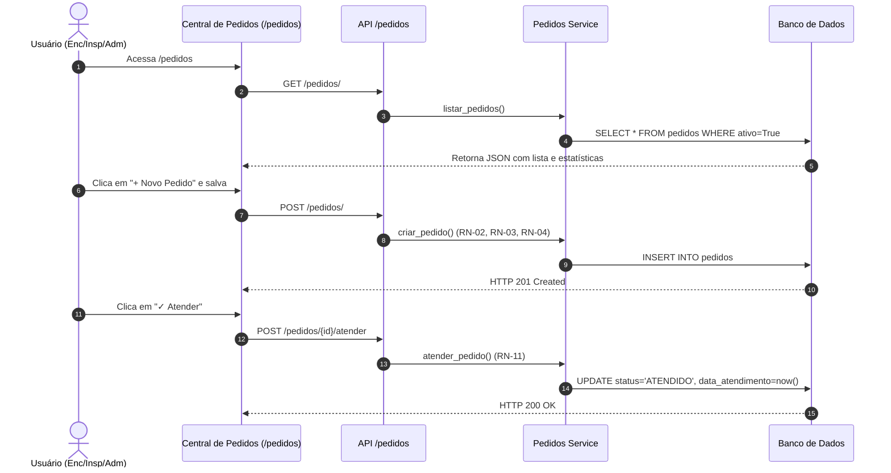

# 📦 Feature: Central de Pedidos — Módulo de Controle de Pedidos

> **Versão:** 2.0 (Simplificada e Desacoplada)  
> **Data:** 2026-08-09  
> **Autor:** Arquitetura de Software SAA29  
> **Status:** 🟢 Pronto para Novo Plano de Implementação — Alinhado a `modulo_pedidos.md`  
> **Prioridade:** Alta  
> **Nota v2.0:** Redefinição de escopo baseada no documento `docs/backlog/modulo_pedidos/modulo_pedidos.md`. O módulo PEDIDOS foi totalmente desacoplado dos módulos INVENTÁRIO e VENCIMENTOS. A responsabilidade de detecção de pendências foi removida do escopo do módulo, tornando-o um serviço independente de gestão do ciclo logístico/administrativo dos pedidos.

---

## 1. Visão Geral

### 1.1 Problema

O SAA29 necessita de um **mecanismo formal e auditável** para:

- Registrar e acompanhar **pedidos de reposição/substituição de equipamentos e suprimentos** vinculados às aeronaves da frota.
- Diferenciar solicitações de rotina (**NORMAL**) de requisições de urgência (**EMERGÊNCIA**).
- Manter o **histórico auditável** do ciclo de vida logístico dos pedidos (quem solicitou, quem atendeu e quem cancelou).
- Oferecer visibilidade gerencial (cards de resumo, filtros e exportação) das solicitações pendentes e atendidas.

### 1.2 Solução Proposta

Módulo standalone **Central de Pedidos** (`app/modules/pedidos/`) que:

1. Permite **criar, consultar, editar, atender e cancelar pedidos** associados a uma aeronave.
2. Registra o equipamento solicitado via dados de referência imutáveis (**Part Number** e **Nomenclatura**).
3. Rastreia o ciclo de vida **administrativo/logístico** do pedido (`PENDENTE` ──▶ `ATENDIDO` | `CANCELADO`).
4. Garante auditoria ponta a ponta e controle de acesso estrito por papéis (RBAC).
5. Oferece interface web integrada à identidade visual do SAA29.

> **Princípio de Design (v2.0):** **Desacoplamento e Independência de Domínio.**
> - **Detecção de Necessidade:** Cabe ao módulo de **INVENTÁRIO** ou a motores analíticos externos identificar que uma aeronave possui um item faltante ou vencido.
> - **Gestão do Pedido:** Cabe exclusivamente ao módulo **PEDIDOS** gerenciar a requisição solicitada ("Foi criado um pedido de 2 unidades do P/N XXXXX para a aeronave 5945").
> - Atender um pedido é uma marcação **administrativa** e **não** realiza instalação física nem altera tabelas de inventário/vencimentos (ver RN-11).

---

## 2. Referências Externas e Desacoplamento

### 2.1 Dados de Referência Consumidos

Para manter a independência entre módulos, a Central de Pedidos consome apenas **dados de referência básica**:

| Entidade Externa | Tabela | Dado Utilizado | Relação com Pedidos |
|---|---|---|---|
| `Aeronave` | `aeronaves` | `aeronave_id` / `matricula` | FK de Referência (`FK -> aeronaves.id`). Identifica a aeronave solicitante (ex: 5945). |
| `Equipamento` | N/A | `part_number` | Atributo de texto (`String(50)`). Part Number da peça requisitada. |
| `Equipamento` | N/A | `nomenclatura` | Atributo de texto (`String(100)`). Descrição/nome funcional da peça requisitada. |
| `Usuario` | `usuarios` | `usuario_id` / `trigrama` | FKs de Auditoria (`FK -> usuarios.id`). Registra solicitante, atendente e cancelador. |

### 2.2 Desacoplamento dos Módulos INVENTÁRIO e VENCIMENTOS

- ❌ **Sem Chaves Estrangeiras Inter-Módulos:** Remoção completa dos campos `slot_id`, `controle_vencimento_id`, `item_id` e `modelo_id`.
- ❌ **Sem Endpoints de Varredura:** O módulo PEDIDOS não possui rotas para varrer slots vagos ou itens vencidos em outros módulos.
- ❌ **Sem Validação de Estoque/Slots:** O módulo não valida se o slot está ocupado ou vago para aceitar o pedido.

---

## 3. Modelo de Dados

### 3.1 Tabela `pedidos`

| Campo | Tipo | Restrições | Descrição |
|---|---|---|---|
| `id` | UUID | PK, default `uuid4` | Identificador único |
| `numero_pedido` | String(50) | UNIQUE, NOT NULL, INDEX | Nº do pedido (informado manualmente pelo usuário — número emitido no sistema interno da FAB) |
| `aeronave_id` | UUID | FK -> `aeronaves.id` (RESTRICT), NOT NULL, INDEX | Aeronave de destino |
| `part_number` | String(50) | NOT NULL, INDEX | Part Number do item solicitado |
| `nomenclatura` | String(100) | NOT NULL | Nomenclatura / Descrição do equipamento |
| `tipo_pedido` | String(20) | NOT NULL, default `NORMAL` | `NORMAL` \| `EMERGENCIA` |
| `numero_emergencia` | String(50) | nullable | Obrigatório se `EMERGENCIA` (RN-03) |
| `quantidade` | Integer | NOT NULL, default `1` | Quantidade solicitada (1..999) |
| `status` | String(20) | NOT NULL, default `PENDENTE`, INDEX | `PENDENTE` \| `ATENDIDO` \| `CANCELADO` |
| `observacao` | String(1000) | nullable | Observações / Justificativas |
| `data_pedido` | Date | NOT NULL, default `today` | Data da solicitação (definida no servidor) |
| `data_atendimento` | DateTime tz | nullable | Timestamp de atendimento |
| `data_cancelamento` | DateTime tz | nullable | Timestamp de cancelamento |
| `motivo_cancelamento` | String(500) | nullable | Motivo do cancelamento |
| `solicitante_id` | UUID | FK -> `usuarios.id`, NOT NULL | Usuário solicitante (auditoria) |
| `atendido_por_id` | UUID | FK -> `usuarios.id`, nullable | Usuário que atendeu |
| `cancelado_por_id` | UUID | FK -> `usuarios.id`, nullable | Usuário que cancelou |
| `ativo` | Boolean | NOT NULL, default `True`, INDEX | Soft delete (padrão SAA29) |
| `created_at` | DateTime tz | default `now()` | Auditoria de criação |
| `updated_at` | DateTime tz | nullable, onupdate `now()` | Auditoria de atualização |

### 3.2 Enums (`app/shared/core/enums.py`)

```python
class StatusPedido(str, enum.Enum):
    PENDENTE = "PENDENTE"
    ATENDIDO = "ATENDIDO"
    CANCELADO = "CANCELADO"

class TipoPedido(str, enum.Enum):
    NORMAL = "NORMAL"
    EMERGENCIA = "EMERGENCIA"
```

### 3.3 Modelo ORM (`app/modules/pedidos/models.py`)

```python
import uuid
from datetime import date, datetime
from sqlalchemy import Boolean, Date, DateTime, ForeignKey, Integer, String, func
from sqlalchemy.orm import Mapped, mapped_column, relationship
from app.bootstrap.database import Base
from app.shared.core.enums import StatusPedido, TipoPedido

class Pedido(Base):
    """Modelo ORM relacional do ciclo de vida dos pedidos."""
    __tablename__ = "pedidos"

    id: Mapped[uuid.UUID] = mapped_column(primary_key=True, default=uuid.uuid4)
    numero_pedido: Mapped[str] = mapped_column(String(50), nullable=False, unique=True, index=True)
    aeronave_id: Mapped[uuid.UUID] = mapped_column(
        ForeignKey("aeronaves.id", ondelete="RESTRICT"), nullable=False, index=True
    )
    part_number: Mapped[str] = mapped_column(String(50), nullable=False, index=True)
    nomenclatura: Mapped[str] = mapped_column(String(100), nullable=False)
    tipo_pedido: Mapped[str] = mapped_column(String(20), nullable=False, default=TipoPedido.NORMAL.value)
    numero_emergencia: Mapped[str | None] = mapped_column(String(50), nullable=True)
    quantidade: Mapped[int] = mapped_column(Integer, nullable=False, default=1)
    status: Mapped[str] = mapped_column(String(20), nullable=False, default=StatusPedido.PENDENTE.value, index=True)
    observacao: Mapped[str | None] = mapped_column(String(1000), nullable=True)
    data_pedido: Mapped[date] = mapped_column(Date, nullable=False, default=date.today)
    data_atendimento: Mapped[datetime | None] = mapped_column(DateTime(timezone=True), nullable=True)
    data_cancelamento: Mapped[datetime | None] = mapped_column(DateTime(timezone=True), nullable=True)
    motivo_cancelamento: Mapped[str | None] = mapped_column(String(500), nullable=True)

    solicitante_id: Mapped[uuid.UUID] = mapped_column(ForeignKey("usuarios.id"), nullable=False)
    atendido_por_id: Mapped[uuid.UUID | None] = mapped_column(ForeignKey("usuarios.id"), nullable=True)
    cancelado_por_id: Mapped[uuid.UUID | None] = mapped_column(ForeignKey("usuarios.id"), nullable=True)

    ativo: Mapped[bool] = mapped_column(Boolean, default=True, nullable=False, index=True)
    created_at: Mapped[datetime] = mapped_column(DateTime(timezone=True), default=func.now(), nullable=False)
    updated_at: Mapped[datetime | None] = mapped_column(DateTime(timezone=True), onupdate=func.now(), nullable=True)

    # Relacionamentos com tipagem opcional coerente
    aeronave: Mapped["Aeronave"] = relationship()
    solicitante: Mapped["Usuario"] = relationship(foreign_keys=[solicitante_id])
    atendido_por: Mapped["Usuario | None"] = relationship(foreign_keys=[atendido_por_id])
    cancelado_por: Mapped["Usuario | None"] = relationship(foreign_keys=[cancelado_por_id])
```

---

## 4. Regras de Negócio

### 4.1 Criação / Validação

| # | Regra |
|---|---|
| RN-01 | Pedido obrigatoriamente vinculado a uma **aeronave válida** (por `aeronave_id`). |
| RN-02 | `numero_pedido` **único**; informado manualmente pelo usuário (número emitido no sistema interno da FAB, apenas transcrito para o SAA29). Conflito → **HTTP 409**. |
| RN-03 | `EMERGENCIA` ⇒ `numero_emergencia` **obrigatório** (validado no schema Pydantic e no service). |
| RN-04 | `NORMAL` ⇒ `numero_emergencia` é **forçado a NULL** no servidor. |
| RN-05 | Status inicial do pedido é sempre `PENDENTE` (imposto pelo service). |
| RN-06 | `quantidade` restrita ao intervalo **1..999**. |
| RN-07 | Identificação do equipamento exige `part_number` e `nomenclatura` preenchidos. |
| RN-08 | `data_pedido` definida exclusivamente pelo **servidor** (sem backdating pelo cliente). |

### 4.2 Transições de Status

```text
               ┌──────────┐
               │ PENDENTE │
               └────┬─────┘
                    │
         ┌──────────┴──────────┐
         ▼                     ▼
   ┌──────────┐          ┌───────────┐
   │ ATENDIDO │          │ CANCELADO │
   └──────────┘          └───────────┘
    (terminal)            (terminal)
```

| # | Regra |
|---|---|
| RN-09 | Pedidos com status `PENDENTE` são editáveis. Pedidos `ATENDIDO` ou `CANCELADO` são **somente leitura**. |
| RN-10 | Transições de status permitidas **exclusivamente a partir de `PENDENTE`**. Qualquer outra tentativa → **HTTP 409**. |
| RN-11 | **Atendimento é Administrativo**: marca status `ATENDIDO`, registra `data_atendimento` + `atendido_por_id`. **Não** cria registros em `instalacoes` nem altera o estado físico do Inventário. |
| RN-12 | **Cancelamento**: marca status `CANCELADO`, exige `motivo_cancelamento` (obrigatório, min 1 char) e registra `data_cancelamento` + `cancelado_por_id`. |

### 4.3 Ciclo de Vida do Registro

| # | Regra |
|---|---|
| RN-13 | Exclusão realizada por **Soft Delete** (`ativo=False`). Operação de restauração (`/restaurar`) disponível. |

---

## 5. RBAC (Controle de Acesso)

> **Princípio:** Consultar é livre para usuários autenticados do sistema; **gerir pedidos** (criar, editar, atender, cancelar) exige perfil de coordenação/fiscalização.

| Ação | Perfis Permitidos | Dependência Backend |
|---|---|---|
| Visualizar pedidos e detalhes | Autenticado (MAN, ENC, INSP, ADM) | `CurrentUser` |
| Criar / Editar / Atender / Cancelar / Excluir / Restaurar | ENCARREGADO, INSPETOR, ADMINISTRADOR | `EncarregadoInspetorOuAdmin` |

---

## 6. Estrutura de Arquivos

```text
app/modules/pedidos/
├── __init__.py          # Expõe o APIRouter do módulo sem prefixo
├── models.py            # Modelo ORM (Pedido) — Base em app/bootstrap/database.py
├── schemas.py           # Schemas Pydantic (Create/Update/Cancelar/Out)
├── service.py           # CRUD, geração de número de pedido e regras de negócio
└── router.py            # Endpoints da API REST

app/web/
├── templates/pedidos.html   # Template Jinja2 (estende base.html)
└── static/js/pedidos.js     # JS vanilla (apiFetch, DOM, escapeHtml)
```

**Registro do Router em `app/bootstrap/main.py`:**
1. `app.include_router(pedidos_router, prefix="/pedidos", tags=["Pedidos"])`
2. Adicionar `"/pedidos"` à lista `API_PREFIXES` (main.py).

---

## 7. API REST

> Base: **`/pedidos`** (prefixo aplicado no `include_router` do bootstrap).
> **Ordenação de Rotas:** declarar rotas literais (`/export`) **antes** de `/{id: uuid.UUID}`.

### 7.1 Endpoints

| Método | Rota | Permissão | Descrição |
|---|---|---|---|
| `GET` | `/pedidos/` | Autenticado | Lista pedidos (filtros: `status`, `tipo_pedido`, `aeronave_id`, `texto`, `skip`, `limit`) |
| `GET` | `/pedidos/{id}` | Autenticado | Detalhes do pedido |
| `POST` | `/pedidos/` | Enc/Insp/Adm | Cria novo pedido → **201 Created** |
| `PUT` | `/pedidos/{id}` | Enc/Insp/Adm | Edita pedido `PENDENTE` |
| `POST` | `/pedidos/{id}/atender` | Enc/Insp/Adm | Marca como `ATENDIDO` |
| `POST` | `/pedidos/{id}/cancelar` | Enc/Insp/Adm | Marca como `CANCELADO` (body: `motivo`) |
| `DELETE` | `/pedidos/{id}` | Enc/Insp/Adm | Soft delete (`ativo=False`) → **204 No Content** |
| `POST` | `/pedidos/{id}/restaurar` | Enc/Insp/Adm | Restaura pedido |
| `GET` | `/pedidos/export?format=csv\|xlsx` | Autenticado | Exportação de dados |

### 7.2 Schemas Pydantic (`schemas.py`)

```python
import uuid
from datetime import date, datetime
from pydantic import BaseModel, ConfigDict, Field, model_validator
from app.shared.core.enums import StatusPedido, TipoPedido

class PedidoCreate(BaseModel):
    aeronave_id: uuid.UUID
    part_number: str = Field(..., min_length=1, max_length=50)
    nomenclatura: str = Field(..., min_length=1, max_length=100)
    numero_pedido: str | None = Field(None, max_length=50)
    tipo_pedido: TipoPedido = TipoPedido.NORMAL
    numero_emergencia: str | None = Field(None, max_length=50)
    quantidade: int = Field(default=1, ge=1, le=999)
    observacao: str | None = Field(None, max_length=1000)

    @model_validator(mode="after")
    def _validar_regras(self):
        if self.tipo_pedido == TipoPedido.EMERGENCIA and not self.numero_emergencia:
            raise ValueError("numero_emergencia é obrigatório para pedidos de EMERGENCIA")
        if self.tipo_pedido == TipoPedido.NORMAL:
            self.numero_emergencia = None
        return self

class PedidoUpdate(BaseModel):
    part_number: str | None = Field(None, max_length=50)
    nomenclatura: str | None = Field(None, max_length=100)
    tipo_pedido: TipoPedido | None = None
    numero_emergencia: str | None = Field(None, max_length=50)
    quantidade: int | None = Field(None, ge=1, le=999)
    observacao: str | None = Field(None, max_length=1000)

class PedidoCancelar(BaseModel):
    motivo: str = Field(..., min_length=1, max_length=500)

class PedidoOut(BaseModel):
    model_config = ConfigDict(from_attributes=True)

    id: uuid.UUID
    numero_pedido: str
    aeronave_id: uuid.UUID
    aeronave_matricula: str
    part_number: str
    nomenclatura: str
    tipo_pedido: str
    numero_emergencia: str | None
    status: str
    quantidade: int
    observacao: str | None
    data_pedido: date
    data_atendimento: datetime | None
    data_cancelamento: datetime | None
    motivo_cancelamento: str | None
    solicitante_trigrama: str | None
    atendido_por_trigrama: str | None
    cancelado_por_trigrama: str | None
    ativo: bool
    created_at: datetime
```

---

## 8. Interface do Usuário

**Tela Principal:** Header → 4 **Cards de Resumo** (Total, Pendentes, Atendidos, Emergências) → **Barra de Filtros** (aeronave, status, tipo, busca por nº pedido/PN) + botão **Novo Pedido** → **Tabela de Pedidos** → **Paginação**.

| Elemento | Descrição |
|---|---|
| Modal de Criação | Seleção da Aeronave + inputs de Part Number, Nomenclatura, Quantidade e Tipo. Campo `Nº Emergência` visível apenas se Tipo == `EMERGÊNCIA`. |
| Ações na Tabela | Para `PENDENTE`: botões `Alterar`, `Cancelar` (abre modal de motivo), `✓ Atender`. Para `ATENDIDO`/`CANCELADO`: sem ações de edição. |

---

## 9. Fluxo de Uso Principal



---

## 10. Visão de Evolução Futura (Opcional)

A arquitetura desacoplada permite que no futuro o módulo de **INVENTÁRIO** (ou outro componente) sugira pedidos automaticamente sem acoplar o banco de dados:

1. O Inventário detecta um slot vago na aeronave.
2. A interface sugere ao usuário criar um pedido com os dados pré-preenchidos.
3. O usuário confirma e o front-end envia um `POST /pedidos/` normal.
4. O módulo **PEDIDOS** continua totalmente autônomo.

---

## 11. Critérios de Aceite

- [ ] Listar pedidos com filtros funcionais (`status`, `tipo_pedido`, `aeronave_id`, busca textual por nº pedido ou PN).
- [ ] Criar pedido `NORMAL` sem campo de emergência.
- [ ] Criar pedido `EMERGENCIA` com `numero_emergencia` **obrigatório** (validado no backend).
- [ ] `numero_emergencia` forçado a NULL quando `NORMAL`.
- [ ] Atender registra `data_atendimento` e `atendido_por_id` e **não** altera o módulo de inventário.
- [ ] Cancelar exige `motivo_cancelamento` (mínimo 1 caractere) e registra `data_cancelamento` + `cancelado_por_id`.
- [ ] Editar apenas pedidos com status `PENDENTE`. Pedidos `ATENDIDO`/`CANCELADO` são read-only.
- [ ] Transições inválidas de status retornam **HTTP 409**.
- [ ] `numero_pedido` informado manualmente pelo usuário e obrigatório na criação; colisão retorna **HTTP 409**.
- [ ] Usuário sem permissão (MANTENEDOR tentando criar/atender/cancelar) recebe **HTTP 403**.
- [ ] Soft delete e restauração funcionam corretamente.
- [ ] Sem violações de CSP ou XSS no frontend.
