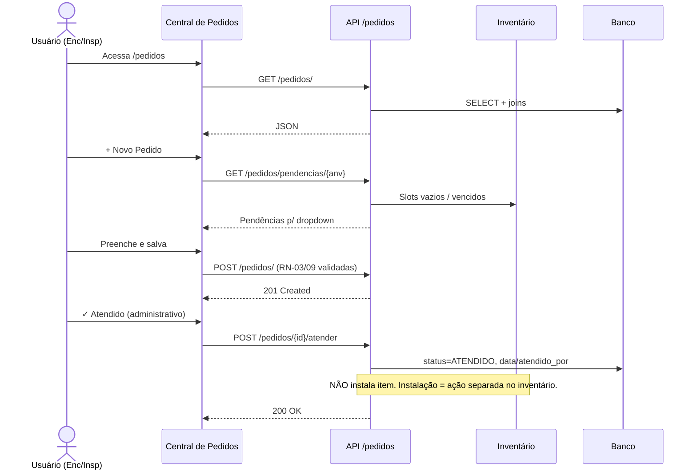

# 📦 Feature: Central de Pedidos — Módulo de Controle de Pedidos

> **Versão:** 1.2
> **Data:** 2026-08-02
> **Autor:** Equipe SAA29
> **Status:** 🟢 Layout Aprovado — Especificação Ajustada p/ Implementação
> **Prioridade:** Alta
> **Nota v1.2:** Documento único consolidado. Auditoria (rotas, RBAC, modelo, segurança, semântica de atendimento) incorporada. Histórico de correções em `relatorio_v2.md`.

---

## 1. Visão Geral

### 1.1 Problema

O SAA29 possui **Inventário** (equipamentos por slot/aeronave) e **Vencimentos** (prazos de calibração/manutenção), mas **não há mecanismo formal** para:

- Identificar aeronaves com **slots vazios** (equipamento faltante) ou **itens vencidos**.
- Registrar e acompanhar **pedidos de reposição/substituição**.
- Diferenciar pedidos de rotina (**NORMAL**) de urgência (**EMERGÊNCIA**).
- Manter **histórico auditável** de pedidos e status.

### 1.2 Solução Proposta

Módulo **Central de Pedidos** (`app/modules/pedidos/`) que:

1. Consulta o **inventário** e identifica **slots vazios** (via `equipamentos`).
2. Identifica **itens com vencimento crítico** (via `vencimentos`).
3. Permite **criar/gerir pedidos** vinculados a uma aeronave e a uma pendência.
4. Rastreia o ciclo de vida **administrativo** do pedido (PENDENTE → ATENDIDO/CANCELADO).
5. Oferece interface web na identidade visual do SAA29.

> **Princípio de design (v1.2):** **Pedido ≠ Inventário.** O ciclo do pedido é **logístico/administrativo**. A **instalação física** permanece 100% no módulo de inventário, com o RBAC dele. Atender um pedido **não** instala item e **não** baixa a pendência (ver RN-12/RN-14).

---

## 2. Integração com Módulos Existentes

### 2.1 Inventário (`app/modules/equipamentos/`)

| Entidade | Tabela | Relação com Pedidos |
|---|---|---|
| `SlotInventario` | `slots_inventario` | Define posições esperadas. Slot sem instalação ativa (`data_remocao IS NULL`) é candidato a pedido de origem `SLOT_VAZIO`. |
| `Instalacao` | `instalacoes` | A pendência do slot é baixada **apenas** quando o inventário registra uma instalação — **independente** do status do pedido. |
| `ModeloEquipamento` | `modelos_equipamento` | PN do equipamento necessário (via `slot.modelo_id` ou `modelo_id` do pedido genérico). |
| `ItemEquipamento` | `itens_equipamento` | Item físico (S/N) — referência em pedidos por vencimento (`item_id`). Instalação é ação do inventário. |

**Detecção de slots vazios (pseudo-SQL):**

```sql
SELECT s.id, s.nome_posicao, m.part_number, m.nome_generico
FROM slots_inventario s
JOIN modelos_equipamento m ON s.modelo_id = m.id
WHERE s.id NOT IN (
    SELECT i.slot_id FROM instalacoes i
    WHERE i.aeronave_id = :aeronave_id AND i.data_remocao IS NULL
)
```

### 2.2 Vencimentos (`app/modules/vencimentos/`)

| Entidade | Tabela | Relação com Pedidos |
|---|---|---|
| `ControleVencimento` | `controle_vencimentos` | Item `VENCIDO` gera pedido de substituição (origem `VENCIMENTO`, via `controle_vencimento_id` + `item_id`). |
| `TipoControle` | `tipos_controle` | Contextualiza o motivo (TLV, CRI, etc.). |

- **VENCIDO** → habilita pedido de substituição (slot pode estar ocupado; a pendência é temporal).
- **PRORROGADO** → não gera pedido automático (informação complementar).

### 2.3 Aeronaves (`app/modules/aeronaves/`)

| Entidade | Tabela | Relação |
|---|---|---|
| `Aeronave` | `aeronaves` | Pedido vinculado por `aeronave_id` (FK). Exibição por `matricula` (ex: 5906). |

---

## 3. Modelo de Dados

### 3.1 Tabela `pedidos`

| Campo | Tipo | Restrições | Descrição |
|---|---|---|---|
| `id` | UUID | PK, default `uuid4` | Identificador único |
| `numero_pedido` | String(50) | UNIQUE, NOT NULL, INDEX | Nº do pedido (server-side: `P-{ano}-{seq}`) |
| `aeronave_id` | UUID | FK→`aeronaves.id` (RESTRICT), NOT NULL, INDEX | Aeronave |
| `origem` | String(20) | NOT NULL, default `MANUAL` | `SLOT_VAZIO` \| `VENCIMENTO` \| `MANUAL` |
| `slot_id` | UUID | FK→`slots_inventario.id` (SET NULL), nullable, INDEX | Origem `SLOT_VAZIO` |
| `controle_vencimento_id` | UUID | FK→`controle_vencimentos.id` (SET NULL), nullable, INDEX | Origem `VENCIMENTO` |
| `item_id` | UUID | FK→`itens_equipamento.id` (SET NULL), nullable | Item vencido de referência |
| `modelo_id` | UUID | FK→`modelos_equipamento.id` (SET NULL), nullable | PN solicitado (pedido genérico) |
| `part_number_snapshot` | String(50) | nullable | Snapshot do PN (preserva texto do pedido) |
| `nome_equipamento_snapshot` | String(100) | nullable | Snapshot do nome |
| `tipo_pedido` | String(20) | NOT NULL, default `NORMAL` | `NORMAL` \| `EMERGENCIA` |
| `numero_emergencia` | String(50) | nullable | Obrigatório se `EMERGENCIA` (RN-03) |
| `quantidade` | Integer | NOT NULL, default `1` | 1..999 |
| `status` | String(20) | NOT NULL, default `PENDENTE`, INDEX | `PENDENTE` \| `ATENDIDO` \| `CANCELADO` |
| `observacao` | String(1000) | nullable | Observações |
| `data_pedido` | Date | NOT NULL, default `today` (server) | Data de criação (RN-15) |
| `data_atendimento` | DateTime tz | nullable | Quando foi atendido |
| `data_cancelamento` | DateTime tz | nullable | Quando foi cancelado |
| `motivo_cancelamento` | String(500) | nullable | Motivo do cancelamento |
| `solicitante_id` | UUID | FK→`usuarios.id`, **NOT NULL** | Quem criou (auditoria) |
| `atendido_por_id` | UUID | FK→`usuarios.id`, nullable | Quem atendeu |
| `cancelado_por_id` | UUID | FK→`usuarios.id`, nullable | Quem cancelou |
| `ativo` | bool | NOT NULL, default `True`, INDEX | Soft delete (padrão do projeto) |
| `created_at` | DateTime tz | default `now()` | Auditoria |
| `updated_at` | DateTime tz | nullable, onupdate `now()` | Auditoria |

**Restrições / índices:**
- `UNIQUE(numero_pedido)`.
- **Um pedido em aberto por pendência** (RN-09): validação no service **+** índice parcial opcional `WHERE status='PENDENTE' AND ativo=1` sobre `(aeronave_id, slot_id)` e `(controle_vencimento_id)`. Índice parcial é suportado em SQLite e PostgreSQL; validar compatibilidade na migração.

### 3.2 Enums (`app/shared/core/enums.py`)

```python
class StatusPedido(str, enum.Enum):
    PENDENTE = "PENDENTE"; ATENDIDO = "ATENDIDO"; CANCELADO = "CANCELADO"

class TipoPedido(str, enum.Enum):
    NORMAL = "NORMAL"; EMERGENCIA = "EMERGENCIA"

class OrigemPedido(str, enum.Enum):
    SLOT_VAZIO = "SLOT_VAZIO"; VENCIMENTO = "VENCIMENTO"; MANUAL = "MANUAL"
```

### 3.3 Modelo ORM (`app/modules/pedidos/models.py`)

```python
class Pedido(Base):
    """Pedido de reposição/substituição de equipamento (ciclo administrativo)."""
    __tablename__ = "pedidos"

    id: Mapped[uuid.UUID] = mapped_column(primary_key=True, default=uuid.uuid4)
    numero_pedido: Mapped[str] = mapped_column(String(50), nullable=False, unique=True, index=True)
    aeronave_id: Mapped[uuid.UUID] = mapped_column(
        ForeignKey("aeronaves.id", ondelete="RESTRICT"), nullable=False, index=True)
    origem: Mapped[str] = mapped_column(String(20), nullable=False, default=OrigemPedido.MANUAL.value)
    slot_id: Mapped[uuid.UUID | None] = mapped_column(
        ForeignKey("slots_inventario.id", ondelete="SET NULL"), nullable=True, index=True)
    controle_vencimento_id: Mapped[uuid.UUID | None] = mapped_column(
        ForeignKey("controle_vencimentos.id", ondelete="SET NULL"), nullable=True, index=True)
    item_id: Mapped[uuid.UUID | None] = mapped_column(
        ForeignKey("itens_equipamento.id", ondelete="SET NULL"), nullable=True)
    modelo_id: Mapped[uuid.UUID | None] = mapped_column(
        ForeignKey("modelos_equipamento.id", ondelete="SET NULL"), nullable=True)
    part_number_snapshot: Mapped[str | None] = mapped_column(String(50), nullable=True)
    nome_equipamento_snapshot: Mapped[str | None] = mapped_column(String(100), nullable=True)
    tipo_pedido: Mapped[str] = mapped_column(String(20), nullable=False, default=TipoPedido.NORMAL.value)
    numero_emergencia: Mapped[str | None] = mapped_column(String(50), nullable=True)
    quantidade: Mapped[int] = mapped_column(Integer, nullable=False, default=1)
    status: Mapped[str] = mapped_column(String(20), nullable=False, default=StatusPedido.PENDENTE.value, index=True)
    observacao: Mapped[str | None] = mapped_column(String(1000), nullable=True)
    data_pedido: Mapped[date] = mapped_column(Date, nullable=False, default=date.today)
    data_atendimento: Mapped[datetime | None] = mapped_column(DateTime(timezone=True), nullable=True)
    data_cancelamento: Mapped[datetime | None] = mapped_column(DateTime(timezone=True), nullable=True)
    motivo_cancelamento: Mapped[str | None] = mapped_column(String(500), nullable=True)
    solicitante_id: Mapped[uuid.UUID] = mapped_column(ForeignKey("usuarios.id"), nullable=False)
    atendido_por_id: Mapped[uuid.UUID | None] = mapped_column(ForeignKey("usuarios.id"), nullable=True)
    cancelado_por_id: Mapped[uuid.UUID | None] = mapped_column(ForeignKey("usuarios.id"), nullable=True)
    ativo: Mapped[bool] = mapped_column(default=True, nullable=False, index=True)
    created_at: Mapped[datetime] = mapped_column(DateTime(timezone=True), default=func.now())
    updated_at: Mapped[datetime | None] = mapped_column(DateTime(timezone=True), onupdate=func.now())

    # Relacionamentos (tipagem opcional coerente com FKs nullable)
    aeronave: Mapped["Aeronave"] = relationship()
    slot: Mapped["SlotInventario | None"] = relationship()
    controle_vencimento: Mapped["ControleVencimento | None"] = relationship()
    item: Mapped["ItemEquipamento | None"] = relationship()
    modelo: Mapped["ModeloEquipamento | None"] = relationship()
    solicitante: Mapped["Usuario"] = relationship(foreign_keys=[solicitante_id])
    atendido_por: Mapped["Usuario | None"] = relationship(foreign_keys=[atendido_por_id])
    cancelado_por: Mapped["Usuario | None"] = relationship(foreign_keys=[cancelado_por_id])
```

---

## 4. Regras de Negócio

### 4.1 Criação / Validação

| # | Regra |
|---|---|
| RN-01 | Pedido vinculado a uma **aeronave válida** (por `aeronave_id`). |
| RN-02 | `numero_pedido` **único**; **gerado pelo servidor** (`P-{ano}-{seq}`) se omitido. Conflito → **HTTP 409**. |
| RN-03 | `EMERGENCIA` ⇒ `numero_emergencia` **obrigatório** (validado no schema, server-side). |
| RN-04 | `NORMAL` ⇒ `numero_emergencia` é **forçado a NULL** no servidor. |
| RN-05 | Status inicial sempre `PENDENTE` (definido no service). |
| RN-06 | `quantidade` no intervalo **1..999**. |
| RN-07 | `origem` define o vínculo: `SLOT_VAZIO`→`slot_id`; `VENCIMENTO`→`controle_vencimento_id`(+`item_id`); `MANUAL`→`modelo_id`/snapshots. |
| RN-08 | Pedido **genérico** (sem slot/controle) exige identificação do equipamento via `modelo_id` **ou** `*_snapshot`. |
| RN-09 | **No máximo 1 pedido `PENDENTE` por pendência**: `(aeronave_id, slot_id)` ou `(controle_vencimento_id)`. Violação → **409**. |
| RN-15 | `data_pedido` definida pelo **servidor** (sem backdating pelo cliente). |

### 4.2 Transições de Status (impostas no service)

```
PENDENTE ──▶ ATENDIDO   (terminal)
PENDENTE ──▶ CANCELADO  (terminal)
```

| # | Regra |
|---|---|
| RN-10 | `PENDENTE` é editável; `ATENDIDO`/`CANCELADO` são **somente leitura**. |
| RN-11 | Transições **só a partir de `PENDENTE`**. Qualquer outra → **409**. Validado no service (não confiar no cliente). |
| RN-12 | **Atender é administrativo**: muda status, registra `data_atendimento` + `atendido_por_id`. **Não** cria `Instalacao` nem chama o service de inventário. |
| RN-13 | **Cancelar**: registra `data_cancelamento` + `cancelado_por_id` + `motivo_cancelamento` (obrigatório). |
| RN-14 | Atendimento **não baixa a pendência**. A pendência do slot só encerra com a instalação registrada no inventário (item pode ir a outra aeronave → gera-se novo pedido). |

### 4.3 Ciclo de Vida do Registro

| # | Regra |
|---|---|
| RN-16 | Exclusão via **soft delete** (`ativo=False`); operação `restaurar` disponível (padrão do projeto). |

---

## 5. RBAC (Controle de Acesso)

> **Princípio:** instalar/remover é *execução* (inventário); **gerir pedidos** é *coordenação/fiscalização*. Papéis **ortogonais** — INSPETOR gere pedidos mas não instala.

| Ação | Perfis | Dependência (já existe) |
|---|---|---|
| Visualizar pedidos / pendências / vencidos | Autenticado (MAN, ENC, INSP, ADM) | `CurrentUser` |
| Criar / Editar / Atender / Cancelar / Excluir / Restaurar | ENCARREGADO, INSPETOR, ADMINISTRADOR | `EncarregadoInspetorOuAdmin` |

Aplicar RBAC em **duas camadas** (Zero Trust): rota HTML (`app/web/pages/router.py`) e endpoints da API. Backend é a fonte de verdade.

---

## 6. Estrutura de Arquivos

```text
app/modules/pedidos/
├── __init__.py          # Registra o router
├── models.py            # Modelo ORM (Pedido)
├── schemas.py           # Schemas Pydantic (Create/Update/Cancelar/Out)
├── service.py           # CRUD, regras de negócio, integração inventário/vencimentos
└── router.py            # Endpoints da API REST

app/web/
├── templates/pedidos.html   # Template Jinja2 (estende base.html)
└── static/js/pedidos.js     # JS (fetch API, DOM, escapeHtml)
# Rota da página /pedidos: registrada em app/web/pages/router.py (NÃO criar pages/pedidos.py)
```

---

## 7. API REST

> Base: **`/pedidos`** (sem prefixo `/api`, conforme padrão do projeto). Ações de estado usam **sub-recurso com verbo** (padrão `/concluir`, `/restaurar`).

### 7.1 Endpoints

| Método | Rota | Permissão | Descrição |
|---|---|---|---|
| `GET` | `/pedidos/` | Autenticado | Lista (filtros: `status`, `tipo_pedido`, `origem`, `aeronave_id`, `texto`, `skip`, `limit`) |
| `GET` | `/pedidos/{id}` | Autenticado | Detalhe |
| `POST` | `/pedidos/` | Enc/Insp/Adm | Cria (status inicial `PENDENTE`) → **201** |
| `PUT` | `/pedidos/{id}` | Enc/Insp/Adm | Edita (**só** `PENDENTE`) |
| `POST` | `/pedidos/{id}/atender` | Enc/Insp/Adm | Marca `ATENDIDO` (administrativo) |
| `POST` | `/pedidos/{id}/cancelar` | Enc/Insp/Adm | Marca `CANCELADO` (body: `motivo`) |
| `DELETE` | `/pedidos/{id}` | Enc/Insp/Adm | Soft delete (`ativo=False`) → **204** |
| `POST` | `/pedidos/{id}/restaurar` | Enc/Insp/Adm | Restaura |
| `GET` | `/pedidos/pendencias/{aeronave_id}` | Autenticado | Slots vazios (integração inventário) |
| `GET` | `/pedidos/vencidos/{aeronave_id}` | Autenticado | Itens vencidos (integração vencimentos) |
| `GET` | `/pedidos/export?formato=csv\|xlsx` | Autenticado | Exportação (futuro; padrão `/inspecoes/export`) |

**Códigos:** `201` criado, `204` sem conteúdo, `401` não autenticado, `403` sem permissão, `404` não encontrado, `409` conflito (duplicidade/transição/numero_pedido), `422` validação Pydantic.

### 7.2 Schemas Pydantic (`schemas.py`)

```python
class PedidoCreate(BaseModel):
    aeronave_id: uuid.UUID
    origem: OrigemPedido = OrigemPedido.MANUAL
    slot_id: uuid.UUID | None = None
    controle_vencimento_id: uuid.UUID | None = None
    item_id: uuid.UUID | None = None
    modelo_id: uuid.UUID | None = None
    part_number_snapshot: str | None = Field(None, max_length=50)
    nome_equipamento_snapshot: str | None = Field(None, max_length=100)
    numero_pedido: str | None = Field(None, max_length=50)   # server gera se ausente
    tipo_pedido: TipoPedido = TipoPedido.NORMAL
    numero_emergencia: str | None = Field(None, max_length=50)
    quantidade: int = Field(default=1, ge=1, le=999)
    observacao: str | None = Field(None, max_length=1000)
    # data_pedido NÃO é aceita do cliente (RN-15)

    @model_validator(mode="after")
    def _validar_regras(self):
        if self.tipo_pedido == TipoPedido.EMERGENCIA and not self.numero_emergencia:
            raise ValueError("numero_emergencia é obrigatório para EMERGENCIA")  # RN-03
        if self.tipo_pedido == TipoPedido.NORMAL:
            self.numero_emergencia = None  # RN-04
        return self

class PedidoUpdate(BaseModel):  # aplicável só a PENDENTE
    slot_id: uuid.UUID | None = None
    controle_vencimento_id: uuid.UUID | None = None
    item_id: uuid.UUID | None = None
    modelo_id: uuid.UUID | None = None
    part_number_snapshot: str | None = Field(None, max_length=50)
    nome_equipamento_snapshot: str | None = Field(None, max_length=100)
    tipo_pedido: TipoPedido | None = None
    numero_emergencia: str | None = Field(None, max_length=50)
    quantidade: int | None = Field(None, ge=1, le=999)
    observacao: str | None = Field(None, max_length=1000)

class PedidoCancelar(BaseModel):
    motivo: str = Field(..., min_length=1, max_length=500)   # RN-13

class PedidoOut(BaseModel):
    model_config = ConfigDict(from_attributes=True)
    id: uuid.UUID
    numero_pedido: str
    origem: str
    tipo_pedido: str
    numero_emergencia: str | None
    status: str
    quantidade: int
    observacao: str | None
    data_pedido: date
    data_atendimento: datetime | None
    data_cancelamento: datetime | None
    motivo_cancelamento: str | None
    aeronave_matricula: str
    equipamento_nome: str | None          # via slot/modelo/snapshot
    part_number: str | None
    slot_nome: str | None
    solicitante_trigrama: str
    atendido_por_trigrama: str | None
    cancelado_por_trigrama: str | None
    ativo: bool
    created_at: datetime
```

---

## 8. Interface do Usuário

> **Referência visual definitiva:** `mockup_pedidos.html` (raiz do repositório). Abrir no navegador (`file:///`) para visualizar. Layout **aprovado em 01/08/2026** sem ressalvas.

**Tela principal:** header (marca + título + nav + tema) → 4 **cards de resumo** (Total, Pendentes, Atendidos, Emergências) → **barra de filtros** (aeronave, status, tipo, busca) + botão **Novo Pedido** → **lista** de pedidos (linha + observação + ações por status) → **paginação**.

| Elemento | Descrição |
|---|---|
| Cards | Contadores: Total, Pendentes, Atendidos, Emergências. |
| Filtros | Dropdowns (aeronave/status/tipo) + busca por nº pedido. |
| Lista | Status (badge), Data, ANV, Tipo, Nº Pedido, Nº Emergência, Qtd + linha de OBS. |
| Ações | `PENDENTE`: `Cancelar` / `Alterar` / `✓ Atendido`. `ATENDIDO`/`CANCELADO`: sem ações. |
| Modal | Criar/editar; campo `Nº Emergência` visível só se `Emergência` (espelha RN-03/04, **também validado no backend**). |

**Badges:** `PENDENTE` 🟡 warning · `ATENDIDO` 🟢 success · `CANCELADO` ⚫ muted · `EMERGÊNCIA` 🔴 danger.

### 8.1 Cor temática

`--pedido-color: #e74c3c` (vermelho carmesim). Classes `.btn-pedido` / `.btn-outline-pedido` (a criar). Reutilizar `glass-panel`, `card`, `form-input`, `modal-overlay`, badges e sistema de toasts existentes. Ícone 📦 na nav do `base.html`, entre "Vencimentos" e "Calendário".

### 8.2 Segurança no Frontend (obrigatório ao portar o mockup)

- **CSP:** política é `script-src 'self'` (sem `unsafe-inline`) → **externalizar** todo JS para `app/web/static/js/pedidos.js` (o `<script>` inline do mockup seria **bloqueado**). Idem CSS.
- **XSS:** dados vindos da API vão ao DOM via `textContent` ou `escapeHtml()`; **evitar `innerHTML`** com conteúdo dinâmico (o toast do mockup usa `innerHTML` — não copiar o padrão).
- **Eventos:** somente `addEventListener` (sem handlers inline).
- **CSRF:** toda mutação (POST/PUT/DELETE) envia o token CSRF; autenticação via JWT no header ou cookie `saa29_token`.
- **Estados:** tratar loading, erro de rede, vazio e permissão negada. Autorização é sempre reconfirmada no backend.

---

## 9. Fluxo de Uso Principal



---

## 10. Plano de Implementação

**Fase 1 — Backend (2-3d):** enums (`StatusPedido`/`TipoPedido`/`OrigemPedido`) · modelo `Pedido` · schemas + `model_validator` · service (CRUD, geração `numero_pedido`, RN-09/11/12/13, integração inventário/vencimentos) · router (RBAC `EncarregadoInspetorOuAdmin`) · migração Alembic (+ índice parcial) · registrar router no bootstrap.

**Fase 2 — Frontend (2-3d):** `pedidos.html` (estende `base.html`) · `pedidos.js` (fetch, escape, sem inline) · rota em `app/web/pages/router.py` · ícone 📦 no `base.html` · CSS `.btn-pedido` · modal · filtros + paginação.

**Fase 3 — Testes (1-2d):** service (CRUD/validações/RN) · router (endpoints/RBAC) · segurança (CSRF, auth, transição inválida→409) · arquitetura (SOLID, imports). Alinhar a `docs/tdd/` e `docs/guides/guia-testes.md`.

**Fase 4 — Polimento (1d):** UX/UI · teste manual · atualizar docs centrais (`SRS`, `SPECS`, `Database.md`, `referencia-api.md`, `overview.md`, `RBAC.md`).

---

## 11. Critérios de Aceite

- [ ] Listar pedidos com filtros funcionais (status/tipo/origem/aeronave/texto).
- [ ] Criar `NORMAL` sem campo de emergência.
- [ ] Criar `EMERGENCIA` com `numero_emergencia` **obrigatório** (bloqueado no backend, não só no JS).
- [ ] `numero_emergencia` é limpo quando `NORMAL`.
- [ ] Atender registra `data_atendimento` + `atendido_por_id` e **não** cria instalação.
- [ ] Cancelar exige `motivo` e registra `data_cancelamento` + `cancelado_por_id`.
- [ ] Editar apenas `PENDENTE`; `ATENDIDO`/`CANCELADO` são read-only.
- [ ] Transição inválida ou 2º pedido pendente p/ a mesma pendência → **409**.
- [ ] `numero_pedido` gerado/único; colisão → **409**.
- [ ] `data_pedido` não aceita backdating do cliente.
- [ ] Usuário sem permissão (MANTENEDOR criando) → **403**.
- [ ] Soft delete/restaurar funcionam.
- [ ] Cards de resumo corretos; Light/Dark mode OK.
- [ ] Sem violação de CSP (JS externo); sem `innerHTML` com dado dinâmico.
- [ ] Mínimo 15 novos testes passando.

---

## 12. Aprovação do Layout

| Item | Status |
|---|---|
| Data | 01/08/2026 |
| Aprovado por | Usuário (solicitante) |
| Resultado | 🟢 **APROVADO** — sem ressalvas |
| Referência visual | `mockup_pedidos.html` (raiz) |

> Alterações visuais futuras devem ser validadas antes da implementação.
