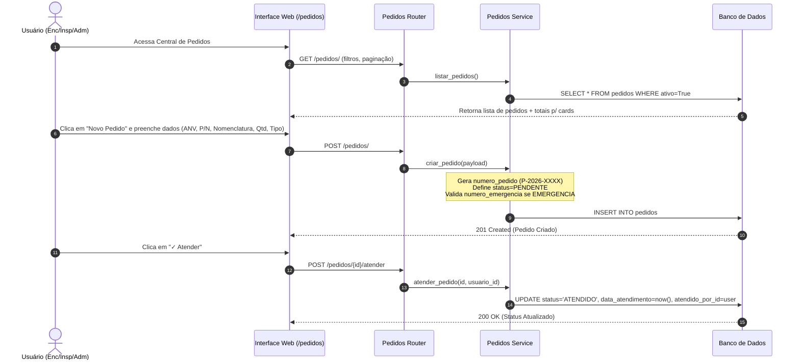
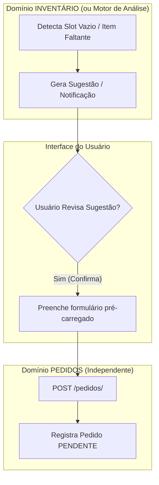

# 📦 Proposta de Revisão Arquitetural — Módulo Central de Pedidos

> **Documento de Arquitetura e Redefinição de Escopo**  
> **Versão:** 2.0 (Simplificada e Independente)  
> **Data:** 2026-08-09  
> **Autor:** Arquitetura de Software SAA29  
> **Status:** 🟢 Proposta Técnica Concluída  
> **Referência Anterior:** `docs/backlog/modulo_pedidos/feature_controle_pedidos.md` (v1.3)

---

## 1. Visão Geral e Justificativa

### 1.1 Diagnóstico do Acoplamento Anterior (v1.3)
Na concepção inicial do módulo **Central de Pedidos**, o escopo previa que o próprio módulo consultasse diretamente as tabelas do **Inventário** (`slots_inventario`, `instalacoes`) e do módulo de **Vencimentos** (`controle_vencimentos`) para varrer slots vazios e itens vencidos em aeronaves, sugerindo automaticamente pedidos.

Essa abordagem gerou acoplamento excessivo:
- **Violação de Limite de Domínio (Bounded Context):** O módulo de Pedidos assumiu a responsabilidade de *detectar a necessidade* de estoque (regra de inventário/manutenção), misturando-a com a *gestão logística do pedido*.
- **Dependência de Schemas Externos:** A entidade `Pedido` possuía Foreign Keys diretas para `slots_inventario.id`, `controle_vencimentos.id`, `itens_equipamento.id` e `modelos_equipamento.id`, exigindo queries com múltiplos `JOIN`s inter-módulos.
- **Complexidade de Validação:** Regras de duplicidade (ex: RN-09) dependiam da verificação do estado interno do inventário e de vencimentos.

### 1.2 Nova Diretriz Arquitetural
Aplicando o princípio da **Separação de Responsabilidades (Separation of Concerns)**:
1. **Detecção de Necessidade:** É responsabilidade exclusiva do módulo de **INVENTÁRIO**, **MANUTENÇÃO** ou de um motor de análise futuro ("A aeronave 5945 possui um item faltante/vencido").
2. **Gestão do Pedido:** É a responsabilidade única do módulo **PEDIDOS** ("Existe um pedido de 2 unidades do P/N XXXXX para a aeronave 5945, com status PENDENTE").

O módulo PEDIDOS passa a ser um **módulo independente e desacoplado**, focado no ciclo de vida administrativo/logístico dos pedidos.

---

## 2. Análise Comparativa do Escopo (O Que Muda)

### 2.1 O que deve ser REMOVIDO do escopo atual
- ❌ **Consultas Diretas ao Inventário/Vencimentos:** Remoção dos endpoints `GET /pedidos/pendencias/{aeronave_id}` e `GET /pedidos/vencidos/{aeronave_id}`.
- ❌ **Auto-detecção de Necessidades:** O módulo não varrerá slots vagos nem itens vencidos.
- ❌ **Dependência de Chaves Estrangeiras do Inventário:** Remoção dos campos `slot_id`, `controle_vencimento_id`, `item_id` e `modelo_id` da tabela `pedidos`.
- ❌ **Enum de Origem Dependente:** Remoção dos tipos de origem `SLOT_VAZIO` e `VENCIMENTO`.
- ❌ **Regras de Duplicidade Cruzada (ex-RN-09):** Não haverá trava no banco/service checando se o slot no inventário já tem pedido pendente.

### 2.2 O que deve ser MANTIDO
- ✅ **Ciclo de Vida Administrativo do Pedido:** Transição de status estrita `PENDENTE` ──▶ `ATENDIDO` | `CANCELADO`.
- ✅ **Tipificação do Pedido:** Classificação em `NORMAL` e `EMERGENCIA` (exigindo `numero_emergencia` obrigatório para emergências).
- ✅ **Numeração Única Server-Side:** Geração automática sequencial `P-{ano}-{seq}` (ex: `P-2026-0001`).
- ✅ **Auditoria Completa:** Registro de `solicitante_id`, `atendido_por_id`, `cancelado_por_id`, `data_pedido`, `data_atendimento`, `data_cancelamento` e `motivo_cancelamento`.
- ✅ **Segurança e RBAC:** Permissões baseadas na dependência `EncarregadoInspetorOuAdmin` (ENCARREGADO, INSPETOR, ADMINISTRADOR para gestão; MANTENEDOR para consulta).
- ✅ **Padrão de Soft-Delete:** Campo `ativo` (Boolean) e sub-recurso `/restaurar`.
- ✅ **Interface Web & UX:** Painel com cards de resumo, filtros, busca e modal de cadastro/edição (adaptado para dados de referência).
- ✅ **Exportação:** Suporte a exportação CSV/XLSX (`/pedidos/export`).

### 2.3 O que deve ser SIMPLIFICADO
- ⚡ **Modelo de Dados:** Reduzido a uma única tabela standalone `pedidos`, com apenas FK de identificação da Aeronave e campos textuais de referência para o item.
- ⚡ **Service Layer:** Operações CRUD diretas e rápidas, sem `JOIN`s com tabelas de inventário/vencimentos.
- ⚡ **Formulários de Entrada:** Entrada manual de Part Number e Nomenclatura ou seleção simples por referência, eliminando dropdowns complexos alimentados por varredura de estoque.

---

## 3. Referências Externas Necessárias

Para manter o baixo acoplamento, o módulo PEDIDOS consome apenas **dados de referência básica**:

| Domínio Externo | Dado Utilizado | Forma de Utilização | Finalidade |
|---|---|---|---|
| **AERONAVES** | `aeronave_id` / `matricula` | Chave Estrangeira de Referência (`FK -> aeronaves.id`) | Identificar para qual aeronave o pedido foi solicitado (ex: 5945). |
| **EQUIPAMENTOS / ITENS** | `part_number` | Atributo de Texto (`String(50)`) | Registrar o Part Number da peça solicitada. |
| **EQUIPAMENTOS / ITENS** | `nomenclatura` | Atributo de Texto (`String(100)`) | Registrar o nome/descrição funcional do equipamento. |
| **USUÁRIOS / AUTH** | `usuario_id` | Chave Estrangeira de Auditoria (`FK -> usuarios.id`) | Identificar solicitante, responsável pelo atendimento ou cancelamento. |

> **Nota Arquitetural:** O Part Number e a Nomenclatura são armazenados como atributos de referência direta no pedido. Isso garante que o pedido permaneça imutável e auditável mesmo se o catálogo de equipamentos for alterado posteriormente.

---

## 4. Responsabilidade Final do Módulo PEDIDOS

A responsabilidade do módulo **PEDIDOS** é **exclusivamente**:
1. Registrar a solicitação de itens/equipamentos para uma aeronave específica.
2. Gerenciar a numeração e o tipo de prioridade (Normal / Emergência).
3. Acompanhar a evolução logística do status (`PENDENTE`, `ATENDIDO`, `CANCELADO`).
4. Fornecer visibilidade (cards, filtros, relatórios) dos pedidos em aberto e concluídos para a gestão.
5. Manter o histórico auditável de quem solicitou, quem atendeu ou quem cancelou.

O módulo **NÃO** é responsável por:
- Saber se o item está instalado ou faltando na aeronave.
- Baixar pendências físicas de inventário.
- Validar se a aeronave realmente precisa do item solicitado.

---

## 5. Fluxo Principal de Funcionamento

### 5.1 Fluxo Atual Simplificado (Independente)



### 5.2 Comparativo de Fluxos

#### ❌ Fluxo Antigo (Descartado - Alto Acoplamento):
`Usuário` ──▶ `PEDIDOS` ──▶ `INVENTÁRIO` (busca slots vagos) ──▶ `VENCIMENTOS` (busca itens vencidos) ──▶ `Validação de Regras de Estoque` ──▶ `Geração de Pedido`

#### ✅ Novo Fluxo (Aprovado - Baixo Acoplamento):
`Usuário` ──▶ `Módulo PEDIDOS` ──▶ `Cadastro / Consulta / Gestão` ──▶ `Referência de Aeronave (Matrícula) e Item (P/N)`

---

## 6. Modelo Conceitual e Físico de Dados Simplificado

### 6.1 Tabela `pedidos`

| Campo | Tipo | Restrições | Descrição |
|---|---|---|---|
| `id` | UUID | PK, default `uuid4` | Identificador único do pedido |
| `numero_pedido` | String(50) | UNIQUE, NOT NULL, INDEX | Código gerado no servidor (`P-{ano}-{seq}`) |
| `aeronave_id` | UUID | FK -> `aeronaves.id` (RESTRICT), NOT NULL, INDEX | Aeronave de destino |
| `part_number` | String(50) | NOT NULL, INDEX | Part Number do item solicitado |
| `nomenclatura` | String(100) | NOT NULL | Nomenclatura / Descrição do equipamento |
| `tipo_pedido` | String(20) | NOT NULL, default `NORMAL` | `NORMAL` \| `EMERGENCIA` |
| `numero_emergencia` | String(50) | nullable | Obrigatório se `EMERGENCIA` |
| `quantidade` | Integer | NOT NULL, default `1` | Quantidade solicitada (1..999) |
| `status` | String(20) | NOT NULL, default `PENDENTE`, INDEX | `PENDENTE` \| `ATENDIDO` \| `CANCELADO` |
| `observacao` | String(1000) | nullable | Observações / Justificativas |
| `data_pedido` | Date | NOT NULL, default `today` | Data da solicitação (servidor) |
| `data_atendimento` | DateTime tz | nullable | Data/hora do atendimento |
| `data_cancelamento` | DateTime tz | nullable | Data/hora do cancelamento |
| `motivo_cancelamento` | String(500) | nullable | Motivo do cancelamento |
| `solicitante_id` | UUID | FK -> `usuarios.id`, NOT NULL | Usuário que criou o pedido |
| `atendido_por_id` | UUID | FK -> `usuarios.id`, nullable | Usuário que atendeu |
| `cancelado_por_id` | UUID | FK -> `usuarios.id`, nullable | Usuário que cancelou |
| `ativo` | Boolean | NOT NULL, default `True`, INDEX | Soft delete |
| `created_at` | DateTime tz | default `now()` | Timestamp de criação |
| `updated_at` | DateTime tz | nullable, onupdate `now()` | Timestamp de atualização |

### 6.2 Enums (`app/shared/core/enums.py`)

```python
class StatusPedido(str, enum.Enum):
    PENDENTE = "PENDENTE"
    ATENDIDO = "ATENDIDO"
    CANCELADO = "CANCELADO"

class TipoPedido(str, enum.Enum):
    NORMAL = "NORMAL"
    EMERGENCIA = "EMERGENCIA"
```

> **Nota:** O enum `OrigemPedido` (`SLOT_VAZIO`, `VENCIMENTO`, `MANUAL`) foi **removido** pois criava acoplamento conceitual com as origens de outros módulos.

### 6.3 Modelo ORM (`app/modules/pedidos/models.py`)

```python
import uuid
from datetime import date, datetime
from sqlalchemy import Boolean, Date, DateTime, ForeignKey, Integer, String, func
from sqlalchemy.orm import Mapped, mapped_column, relationship
from app.bootstrap.database import Base
from app.shared.core.enums import StatusPedido, TipoPedido

class Pedido(Base):
    """Modelo relacional independente da Central de Pedidos."""
    __tablename__ = "pedidos"

    id: Mapped[uuid.UUID] = mapped_column(primary_key=True, default=uuid.uuid4)
    numero_pedido: Mapped[str] = mapped_column(String(50), nullable=False, unique=True, index=True)
    aeronave_id: Mapped[uuid.UUID] = mapped_column(
        ForeignKey("aeronaves.id", ondelete="RESTRICT"), nullable=False, index=True
    )
    part_number: Mapped[str] = mapped_column(String(50), nullable=False, index=True)
    nomenclatura: Mapped[str] = mapped_column(String(100), nullable=False)
    tipo_pedido: Mapped[str] = mapped_column(String(20), nullable=False, default=TipoPedido.NORMAL.value)
    numero_emergencia: Mapped[str | None] = mapped_column(String(50), nullable=True)
    quantidade: Mapped[int] = mapped_column(Integer, nullable=False, default=1)
    status: Mapped[str] = mapped_column(String(20), nullable=False, default=StatusPedido.PENDENTE.value, index=True)
    observacao: Mapped[str | None] = mapped_column(String(1000), nullable=True)
    data_pedido: Mapped[date] = mapped_column(Date, nullable=False, default=date.today)
    data_atendimento: Mapped[datetime | None] = mapped_column(DateTime(timezone=True), nullable=True)
    data_cancelamento: Mapped[datetime | None] = mapped_column(DateTime(timezone=True), nullable=True)
    motivo_cancelamento: Mapped[str | None] = mapped_column(String(500), nullable=True)

    solicitante_id: Mapped[uuid.UUID] = mapped_column(ForeignKey("usuarios.id"), nullable=False)
    atendido_por_id: Mapped[uuid.UUID | None] = mapped_column(ForeignKey("usuarios.id"), nullable=True)
    cancelado_por_id: Mapped[uuid.UUID | None] = mapped_column(ForeignKey("usuarios.id"), nullable=True)

    ativo: Mapped[bool] = mapped_column(Boolean, default=True, nullable=False, index=True)
    created_at: Mapped[datetime] = mapped_column(DateTime(timezone=True), default=func.now(), nullable=False)
    updated_at: Mapped[datetime | None] = mapped_column(DateTime(timezone=True), onupdate=func.now(), nullable=True)

    # Relacionamentos estritamente necessários para exibição/auditoria
    aeronave: Mapped["Aeronave"] = relationship()
    solicitante: Mapped["Usuario"] = relationship(foreign_keys=[solicitante_id])
    atendido_por: Mapped["Usuario | None"] = relationship(foreign_keys=[atendido_por_id])
    cancelado_por: Mapped["Usuario | None"] = relationship(foreign_keys=[cancelado_por_id])
```

---

## 7. Regras de Negócio Enxutas

| ID | Regra de Negócio | Descrição |
|---|---|---|
| **RN-01** | **Vínculo com Aeronave** | Todo pedido deve estar vinculado a uma aeronave existente (`aeronave_id` válida). |
| **RN-02** | **Numeração Server-Side** | O `numero_pedido` é único e gerado automaticamente pelo servidor no formato `P-{ANO}-{SEQ}`. |
| **RN-03** | **Validação de Emergência** | Se `tipo_pedido == EMERGENCIA`, o campo `numero_emergencia` é **obrigatório**. |
| **RN-04** | **Limpeza para Pedido Normal** | Se `tipo_pedido == NORMAL`, o campo `numero_emergencia` é forçado para `NULL`. |
| **RN-05** | **Status Inicial** | Todo novo pedido é criado obrigatoriamente com `status = PENDENTE`. |
| **RN-06** | **Faixa de Quantidade** | A quantidade deve ser um número inteiro entre `1` e `999`. |
| **RN-07** | **Dados do Item** | Os campos `part_number` e `nomenclatura` são obrigatórios e representam o item solicitado. |
| **RN-08** | **Imutabilidade em Status Terminais** | Somente pedidos `PENDENTE` podem ser editados ou transicionados. Pedidos `ATENDIDO` ou `CANCELADO` são somente leitura. |
| **RN-09** | **Transição de Atendimento** | A transição para `ATENDIDO` registra `data_atendimento` e `atendido_por_id`. Não altera fisicamente outros módulos. |
| **RN-10** | **Transição de Cancelamento** | A transição para `CANCELADO` exige o envio de `motivo_cancelamento` e registra `data_cancelamento` e `cancelado_por_id`. |
| **RN-11** | **Data do Pedido** | A `data_pedido` é sempre definida pelo servidor no momento da criação (impede backdating do cliente). |
| **RN-12** | **Ciclo de Exclusão** | Exclusão é realizada via Soft Delete (`ativo = False`), permitindo restauração via `/restaurar`. |

---

## 8. API REST Simplificada

**Base Path:** `/pedidos`

| Método | Rota | Permissão (RBAC) | Descrição |
|---|---|---|---|
| `GET` | `/pedidos/` | Autenticado | Lista pedidos com suporte a filtros (`status`, `tipo_pedido`, `aeronave_id`, `texto`, `skip`, `limit`) |
| `GET` | `/pedidos/{id}` | Autenticado | Retorna detalhes de um pedido específico |
| `POST` | `/pedidos/` | Enc/Insp/Adm | Cria um novo pedido (retorna `201 Created`) |
| `PUT` | `/pedidos/{id}` | Enc/Insp/Adm | Edita campos de um pedido `PENDENTE` |
| `POST` | `/pedidos/{id}/atender` | Enc/Insp/Adm | Registra atendimento do pedido |
| `POST` | `/pedidos/{id}/cancelar` | Enc/Insp/Adm | Registra cancelamento (body: `{ "motivo": "..." }`) |
| `DELETE` | `/pedidos/{id}` | Enc/Insp/Adm | Soft delete do pedido (retorna `204 No Content`) |
| `POST` | `/pedidos/{id}/restaurar` | Enc/Insp/Adm | Restaura um pedido desativado |
| `GET` | `/pedidos/export` | Autenticado | Exportação em formato CSV ou XLSX (`?format=csv\|xlsx`) |

---

## 9. Visão de Integrações Futuras (Evolução Opcional)

A arquitetura simplificada preserva 100% a possibilidade de futuras integrações sem acoplar a base de dados do módulo PEDIDOS.

Caso no futuro o módulo de **INVENTÁRIO** (ou outro sistema/agente) deseje sugerir pedidos automaticamente:



**Benefícios dessa integração futura:**
1. O módulo PEDIDOS continua sem conhecer o schema interno do Inventário.
2. A integração ocorre no nível da aplicação/UI (ou via API REST desacoplada).
3. O módulo PEDIDOS pode ser implantado, testado e mantido de forma totalmente autônoma.

---

## 10. Resumo dos Impactos e Próximos Passos

1. **Facilidade de Testes:** Com o modelo desacoplado, os testes unitários do `service.py` e de integração das rotas não exigirão *fixtures* nem *mocks* de inventário ou vencimentos.
2. **Desempenho:** Consultas de listagem tornam-se extremamente rápidas por envolverem apenas a tabela `pedidos` com `JOIN` simples em `aeronaves` e `usuarios`.
3. **Manutenibilidade:** Alterações no módulo de Inventário ou Vencimentos jamais quebrarão o módulo de Pedidos.
4. **Documentação:** Atualização das especificações de backlog para consolidar a nova arquitetura independente.
