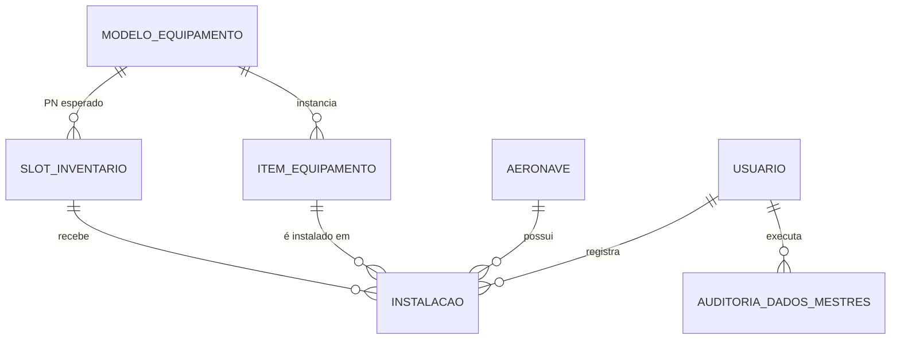

# SPEC-CONF-001 — Módulo de Gestão de Equipamentos, Slots e Inventário

| Campo | Valor |
|---|---|
| **ID** | SPEC-CONF-001 |
| **Título** | Gestão administrativa de Equipamentos, Slots e Inventário via tela de Configurações |
| **Tipo** | Feature Specification (PRD + Technical Design) |
| **Versão** | 2.6 — Implementada; ver `plano_implementacao.md` §0.3 para o registro de execução |
| **Data** | 2026-08-30 (v2.0 em 2026-08-19) |
| **Autor** | *(preencher)* |
| **Status** | ✅ Implementada — fatias 1, 2 e 3 em `development` (2026-08-31). Pendente: portões de produção antes do merge em `main` |
| **Épico** | EP-INV — Manutenção de dados mestres de inventário |
| **Stakeholders** | Seção de Manutenção, Suprimento/Almoxarifado, Controle de Configuração, TI/Sustentação |

> ✅ **Nota de revisão (v2.5 — 2026-08-30):** a linha de base de qualidade foi medida e corrigida antes de iniciar (PR-0, `plano_implementacao.md` §0.2). O branch `development` já estava vermelho por motivos alheios a esta feature: 11 erros de `ruff` (CI reprovando desde 21/08) e 4 falhas de `pytest` por contaminação entre testes. Ambos corrigidos — `ruff check .` limpo e `pytest -q` com 770 passed. Sem isso, o DoD "`ruff check .` limpo" e o critério "a suíte continua verde" eram inalcançáveis por construção.

> ✅ **Nota de revisão (v2.4 — 2026-08-30):** o pré-check da Seção 13 foi executado no banco de **produção**: 33 slots, 0 duplicidades em `(nome_posicao, sistema)`, 0 nulos em `sistema`/`posicao_xlsx`, e `alembic_version = 2676d7fdd987` — produção já está no head do repositório. A premissa da UNIQUE está confirmada contra dado real, não apenas contra o ambiente local.

> ⚠️ **Nota de revisão (v2.3 — 2026-08-30):** as exclusões de slot e item passam de `DELETE` com corpo JSON para `POST /{id}/remover` com corpo. RF-10 continua valendo — justificativa segue obrigatória —, mas `DELETE`-com-corpo não tem precedente no projeto (dos 10 `@router.delete` existentes, nenhum recebe body) e é descartado por muitos proxies, o que importa porque a aplicação roda atrás do nginx da VPS. O padrão real do repositório é `POST /{id}/<verbo>` com corpo (`app/modules/pedidos/router.py:208`). Consequência: `DELETE /equipamentos/{id}` permanece **intocado**.

> ⚠️ **Nota de revisão (v2.2 — 2026-08-30):** a inspeção do pipeline (`.github/workflows/deploy.yml`, `scripts/start.sh`) mostrou que **a migration chega a produção sem porteiro manual** e que a Seção 19 (Rollback) descrevia o ambiente errado. Consequências: a entrega passa a ser fatiada em 3 PRs (Seção 16), o pré-check da Seção 13 passa a ser obrigatório **no banco de produção**, e a Seção 19 foi reescrita com o mecanismo real (R2 + snapshot manual).

> ⚠️ **Nota de revisão (v2.1 — 2026-08-30):** re-verificação contra o código corrigiu quatro pontos da v2.0: (a) o head do Alembic não é mais `b63e385e3395` (Seção 13); (b) `ordem_exibicao` só surte efeito se o `sort` em Python de `listar_inventario_aeronave` for alterado junto (Seção 6.3); (c) exclusão de item precisa bloquear também por `ControleVencimento`, não só por `Instalacao` (RN-06); (d) tornar `sistema`/`posicao_xlsx` obrigatórios quebra 18 das 20 construções de slot nas suítes — não é uma entrega sem alteração de testes (Seções 14 e 15). Acrescentado RF-13 (reativar slot), sem o qual um slot inativado fica inacessível pela UI.

> ⚠️ **Nota de revisão (v2.0):** a v1.0 deste documento foi escrita sobre um modelo de dados hipotético (`equipamento`/`slot`/`inventario`, campos `sn_siloms`/`sn_real`, PostgreSQL, perfis "Supervisor"/"Somente Leitura") que **não corresponde ao código do SAA29**. Esta revisão substitui essas premissas pelo sistema real: 4 tabelas (`modelos_equipamento`, `slots_inventario`, `itens_equipamento`, `instalacoes`), SQLite, e os 4 papéis definidos em `app/shared/core/enums.py` (`TipoPapel`). O histórico da v1.0 permanece disponível no git.

---

## 1. Contexto e Declaração do Problema

O sistema de gestão da manutenção aeronáutica possui uma tela de **Inventário** (`/inventario`) que exibe, por aeronave, os equipamentos instalados com as colunas:

`Loc | Slot | P/N | S/N (SILOMS) | Atualização/Trigrama | S/N (REAL) | Anv Ant.`

Essa tela é uma **projeção**, montada em tempo real cruzando os slots configurados com a instalação ativa de cada um por aeronave (`app/modules/equipamentos/service.py:295-327`) — não existe uma tabela `inventario` no banco.

**Situação atual (AS-IS), confirmada no código:**

O catálogo de Part Numbers (`modelos_equipamento`) já tem CRUD completo pela tela de Configurações (`app/modules/equipamentos/router.py:24-79`, consumido por `configuracoes.js:690-840`). Os slots (`slots_inventario`) e os itens físicos (`itens_equipamento`) **só têm criação** (`POST /equipamentos/slots/` e `POST /equipamentos/itens/` — `router.py:94-137`); não há `PATCH`/`DELETE` para nenhum dos dois. Na prática:

- Slot criado errado (nome, Loc/`sistema` ou PN esperado) não pode ser corrigido nem removido pela aplicação.
- Item físico com S/N digitado errado não pode ser corrigido — só existe o fluxo de "Sincronizar" na tela de Inventário (`ajustar_inventario_item`, `service.py:474-546`), que cria uma nova instalação/item, mas não edita o registro já criado.
- Não existe trilha de auditoria de dados mestres: quem criou/alterou um PN, slot ou item não fica registrado (o histórico que existe hoje, `GET /equipamentos/inventario/historico`, cobre apenas instalação/remoção física, não o cadastro).
- Um bug real de integração: `SlotInventarioCreate` não aceita `posicao_xlsx` (`schemas.py:49-52`). Um slot cadastrado pela tela nasce com `posicao_xlsx = NULL`; o importador XLSX casa slots por `(part_number, posicao_xlsx)` (`xlsx_service.py:173-175`), então esse slot **nunca é encontrado** na carga automática e a linha recebe o serial sintético `XXXXXXX-{nome_posicao}` (`xlsx_service.py:195`), gravado como se fosse real.

**Consequências / dor:**

| # | Impacto |
|---|---|
| 1 | Correção de slot/item exige acesso direto ao banco ou aos scripts de seed — sem trilha de auditoria. |
| 2 | Divergências entre o inventário do sistema e a configuração física da aeronave persistem até intervenção manual. |
| 3 | Slots cadastrados pela UI (sem `posicao_xlsx`) quebram silenciosamente a importação XLSX, um fluxo já em produção. |
| 4 | Nenhuma alteração de dado mestre (PN, slot, item) é rastreável a um usuário e a um motivo. |

**Situação desejada (TO-BE):** um Administrador realiza o ciclo completo de CRUD sobre Slots e Itens de Equipamento pela própria aplicação (o CRUD de Equipamento/PN já existe), com validação de integridade referencial, confirmação de operações destrutivas e trilha de auditoria completa.

---

## 2. Glossário

| Termo | Definição |
|---|---|
| **Loc** | Coluna de exibição da tela de Inventário, alimentada por `SlotInventario.sistema` (ex.: `CEI`, `1P`, `2P`, `CES`). |
| **Slot** | Registro em `slots_inventario` — posição física prevista na aeronave (ex.: `MDP1`, `VUHF2`). É **global da frota**, não por aeronave individual (ver P4 na Seção 4.3). |
| **P/N** | *Part Number* — `ModeloEquipamento.part_number`, único no catálogo. |
| **S/N** | *Serial Number* — `ItemEquipamento.numero_serie`, único por `(modelo_id, numero_serie)`. |
| **S/N (SILOMS)** | Rótulo de UI para o serial da instalação ativa no slot (`ItemEquipamento.numero_serie` via `Instalacao`). Não existe coluna própria. |
| **S/N (REAL)** | Campo de **conferência efêmero** na tela de Inventário: o usuário digita o serial encontrado fisicamente; o botão "Sincronizar" chama `ajustar_inventario_item` para corrigir a instalação. Não é persistido como texto — vira a própria instalação corrigida. |
| **Divergência** | Estado transitório de UI enquanto o valor digitado em S/N (REAL) ainda não bate com o S/N (SILOMS) exibido. Resolvida no ato pelo "Sincronizar"; não é um estado armazenado no banco. |
| **Trigrama** | `Usuario.trigrama` — 3 letras do usuário autenticado, exibido no histórico de movimentações. |
| **Atualização** | Data/hora da última movimentação da instalação (`Instalacao.created_at` ou `removido_em`). |
| **Anv Ant.** | Aeronave anterior — última aeronave em que o mesmo `ItemEquipamento` esteve instalado, calculada em `_mapear_aeronaves_anteriores` (`service.py:371`). |
| **Equipamento / Modelo (PN)** | `ModeloEquipamento` — registro de catálogo. Não representa uma peça física. |
| **Item de Equipamento** | `ItemEquipamento` — instância física de um PN, identificada por S/N. |
| **Instalação** | `Instalacao` — vínculo `Item × Slot × Aeronave`, com `data_instalacao`/`data_remocao`. É o registro que faz o papel de "linha de inventário"; instalação sem `data_remocao` é a **ativa**. |
| **posicao_xlsx** | Código curto usado como chave de casamento na importação da planilha SILOMS (`SlotInventario.posicao_xlsx`). |

---

## 3. Objetivos e Métricas de Sucesso

| Objetivo | Métrica (KPI) | Baseline | Meta |
|---|---|---|---|
| Eliminar dependência de TI/banco para corrigir slot ou item | Nº de correções feitas via SQL direto / mês | *(medir)* | 0 |
| Rastreabilidade total de dados mestres | % de CREATE/UPDATE/DELETE de PN/slot/item com registro de auditoria | 0% (PN/slot/item sem tabela de auditoria) | 100% |
| Fechar o bug de integração XLSX | % de slots com `posicao_xlsx` preenchido | *(medir; slots antigos do seed têm; slots criados pela UI hoje não têm o campo)* | 100% |
| Reduzir tempo de correção | Tempo entre detecção de slot/item errado e correção no sistema | dias (via TI) | < 5 min |

---

## 4. Escopo

### 4.1 Dentro do escopo (In Scope)

1. CRUD completo de **Slots** (`slots_inventario`): editar, inativar, **reativar**, remover — criar já existe.
2. CRUD completo de **Itens de Equipamento** (`itens_equipamento`): editar, excluir — criar já existe.
3. Correção do schema de criação de slot para aceitar `posicao_xlsx`, `descricao`, `ordem_exibicao`.
4. Tabela `auditoria_dados_mestres` (append-only) e instrumentação das escritas de PN/Slot/Item.
5. UI de gestão dentro do modal já existente em Configurações (card "Equipamentos e PNs"), estendendo o padrão de `#modal-catalogo`.
6. Validação de integridade referencial com mensagens de erro acionáveis (409 com detalhe do impedimento).
7. Controle de acesso: toda escrita restrita a `ADMINISTRADOR` (via `AdminRequired`).

### 4.2 Fora do escopo (Out of Scope)

- CRUD de Equipamento/PN — **já implementado** (`router.py:24-79`).
- Persistir `sn_siloms` × `sn_real` como colunas separadas com status `DIVERGENTE` — decisão do produto: a divergência continua resolvida no ato via "Sincronizar" (ver Seção 20, Q2).
- Refatoração dos scripts de seed para upsert idempotente com `--dry-run` — backlog separado.
- *Optimistic locking* (RNF-06 da v1.0) — usuário único ADMIN nesta operação; auditoria já dá rastreabilidade suficiente.
- Fluxo de aprovação em duas etapas (*maker-checker*) — depende de resposta normativa (Q4).
- Importação/exportação em massa de slots/itens via planilha — exportação de inventário por aeronave (CSV/XLSX) **já existe** (`GET /equipamentos/inventario/export`).
- Migração de banco para PostgreSQL — proibido por `docs/ia/rules.ctx` (RN-14).
- Introdução de `modelo_aeronave` como entidade — o modelo real de slot é global da frota (ver P4).

### 4.3 Premissas — confirmadas contra o código

- **P1** — Backend em **FastAPI 0.115 + SQLAlchemy 2.0 (async) + Alembic 1.14**. `requirements.txt:7-16`.
- **P2 (corrigida)** — As entidades relevantes são **quatro**, não três: `modelos_equipamento`, `slots_inventario`, `itens_equipamento`, `instalacoes`. Não existe tabela `inventario`; a "linha de inventário" é a instalação ativa de cada slot por aeronave.
- **P3** — Autenticação por sessão/JWT com usuário identificável, e `Usuario.trigrama` já existe (`app/modules/auth/models.py`).
- **P4 (refutada)** — `Slot` **não** é definido por modelo de aeronave; é um registro **global da frota**, vinculado apenas ao PN esperado (`modelo_id`). A mesma linha de slot é compartilhada por todas as aeronaves; o vínculo por aeronave só existe em `Instalacao`. Confirmado pelo comentário do próprio model (`models.py:108-114`) e pelos dados reais (33 slots × 22 aeronaves = 726 instalações). Não existe — e este documento não propõe criar — a entidade `modelo_aeronave`.

---

## 5. Personas e Matriz de Permissões (RBAC)

Papéis reais do sistema (`TipoPapel`, `app/shared/core/enums.py:44-57`): **MANTENEDOR**, **ENCARREGADO**, **INSPETOR**, **ADMINISTRADOR**. Não existem os perfis "Supervisor" ou "Somente Leitura" citados na v1.0.

| Ação | Mantenedor | Encarregado | Inspetor | Administrador |
|---|---|---|---|---|
| Visualizar inventário (`/inventario`) | ✅ | ✅ | ✅ | ✅ |
| Acessar Configurações / gestão de dados mestres | ❌ | ❌ | ❌ | ✅ |
| Criar/Editar/Remover Equipamento (PN) | ❌ | ❌ | ❌ | ✅ (já implementado) |
| Criar/Editar/Inativar/Remover Slot | ❌ | ❌ | ❌ | ✅ (novo) |
| Criar/Editar/Excluir Item de Equipamento (S/N) | ❌ | ❌ | ❌ | ✅ (novo) |
| Sincronizar S/N na tela de Inventário (fluxo operacional já existente) | ✅ | ✅ | ❌ | ✅ |
| Consultar log de auditoria de dados mestres | ❌ | ❌ | ❌ | ✅ |

**Regra:** decisão do produto (ver histórico da sessão): toda escrita de dados mestres (slot, item, PN) é **admin-only**, coerente com `/configuracoes` já ser uma rota `AdminRequired` (`app/web/pages/router.py:213-216`, ver também `docs/BACKLOG/melhorias_pagina_configuracoes.md`). A UI usa `data-role="ADMINISTRADOR"` para ocultação client-side; o backend é a autoridade real via `AdminRequired`.

---

## 6. Modelo de Dados

### 6.1 Diagrama de Entidade-Relacionamento (real)



### 6.2 `modelos_equipamento` (catálogo — já existe, sem alteração)

| Coluna | Tipo | Nulo | Regra |
|---|---|---|---|
| `id` | CHAR(32) UUID PK | N | `models.py:35` |
| `part_number` | VARCHAR(50) | N | UNIQUE + index, normalizado maiúsculas/trim pelo schema (`Identificador`, `schemas.py:13-20`) |
| `nome_generico` | VARCHAR(100) | N | — |
| `descricao` | VARCHAR(500) | S | — |
| `created_at` | DATETIME | N | `func.now()` |

### 6.3 `slots_inventario` — **alterações propostas**

| Coluna | Tipo | Nulo | Situação |
|---|---|---|---|
| `id` | CHAR(32) UUID PK | N | existente |
| `nome_posicao` | VARCHAR(100) | N | existente |
| `sistema` | VARCHAR(50) | **N** (era nullable) | existente — passa a obrigatório; é a coluna **Loc** |
| `posicao_xlsx` | VARCHAR(20) | **N** (era nullable) | existente — passa a obrigatório na criação (corrige o bug de integração da Seção 1) |
| `modelo_id` | FK `modelos_equipamento.id` ON DELETE RESTRICT | N | existente |
| `descricao` | VARCHAR(200) | S | **novo** |
| `ordem_exibicao` | INTEGER | S | **novo** — ordenação na tela de Inventário. ⚠️ Um `ORDER BY` no SQL **não basta**: `listar_inventario_aeronave` reordena em Python por `(sistema, nome_posicao)` (`service.py:322`) e sobrescreveria qualquer ordenação vinda da query. A chave desse `sort` precisa passar a `(ordem_exibicao, sistema, nome_posicao)`. |
| `ativo` | BOOLEAN | N, default `true` | **novo** — inativação em vez de exclusão física quando há histórico |
| `created_at` | DATETIME(timezone=True) | N | **novo** |
| `updated_at` | DATETIME(timezone=True) | S | **novo** |

Constraint nova: `UniqueConstraint("nome_posicao", "sistema", name="uq_slot_nome_sistema")` — formaliza a chave natural que o seed já usa de fato (`seed_slots.py:64-69`) mas que hoje não é garantida pelo banco.

### 6.4 `itens_equipamento` (já existe, sem alteração de schema)

| Coluna | Tipo | Nulo | Regra |
|---|---|---|---|
| `id` | CHAR(32) UUID PK | N | — |
| `modelo_id` | FK `modelos_equipamento.id` ON DELETE RESTRICT | N | — |
| `numero_serie` | VARCHAR(100) | N | UNIQUE com `modelo_id` (`uq_item_sn_per_pn`) |
| `status` | VARCHAR(20) | N | `StatusItem`: `ATIVO`, `ESTOQUE`, `REMOVIDO` |
| `created_at` / `updated_at` | DATETIME | N/S | — |

### 6.5 `instalacoes` (já existe — é o "item de inventário" real, sem alteração de schema)

| Coluna | Tipo | Nulo | Regra |
|---|---|---|---|
| `id` | CHAR(32) UUID PK | N | — |
| `item_id` | FK `itens_equipamento.id` | N | — |
| `aeronave_id` | FK `aeronaves.id` | N | — |
| `slot_id` | FK `slots_inventario.id` | N | — |
| `usuario_id` | FK `usuarios.id` | S | autor da movimentação — vem sempre da sessão (`service.py:484-487`), nunca do payload |
| `data_instalacao` / `data_remocao` | DATE | N/S | encerramento temporal = soft delete do domínio |
| `removido_em` | DATETIME | S | timestamp do evento, imune a updates posteriores |
| `created_at` / `updated_at` | DATETIME | N/S | — |

Índice único parcial existente: `uq_instalacao_ativa_por_slot_aeronave (slot_id, aeronave_id) WHERE data_remocao IS NULL` — no máximo uma instalação ativa por par slot/aeronave. Padrão a reaproveitar para a UNIQUE de slot (Seção 6.3) e para qualquer índice condicional novo.

### 6.6 `auditoria_dados_mestres` — **nova tabela**

| Coluna | Tipo (SQLAlchemy) | Regra |
|---|---|---|
| `id` | `sa.Uuid()` PK | convenção do projeto — ver `20260810_0932_a6ebf9f13490_add_pedidos_module.py:34`. **Não usar `sa.CHAR(32)`**: divergiria do `Mapped[uuid.UUID]` do ORM e do tipo da FK `usuarios.id`, gerando drift permanente no `--autogenerate`. |
| `entidade` | VARCHAR(30) | `MODELO_EQUIPAMENTO`, `SLOT`, `ITEM` |
| `entidade_id` | `sa.Uuid()` | — |
| `acao` | VARCHAR(10) | `CREATE`, `UPDATE`, `DELETE` |
| `valores_anteriores` | **JSON** (não JSONB — SQLite) | somente campos alterados. ⚠️ Todo valor gravado precisa ser serializável por `json.dumps`: `uuid.UUID`, `datetime` e `date` devem ser convertidos para `str` **antes** da gravação, sob pena de `TypeError` em tempo de execução. |
| `valores_novos` | **JSON** | somente campos alterados — mesma regra de serialização acima |
| `justificativa` | VARCHAR(500) | obrigatória na ação `DELETE` das entidades novas (slot e item, via `POST /{id}/remover`); `NULL` no `DELETE /equipamentos/{id}`, cujo contrato não muda |
| `usuario_id` | FK `usuarios.id` ON DELETE RESTRICT | autor — sempre da sessão |
| `ip_origem` | **VARCHAR(45)** (não INET — SQLite não tem tipo de IP nativo; 45 cobre IPv6) | `request.client.host`. ⚠️ Em produção a aplicação roda atrás do nginx da VPS: sem `ProxyHeadersMiddleware` (ou leitura de `X-Forwarded-For`), este campo registra o IP do proxy, não o do usuário. Aceitável para esta entrega — registrar como limitação conhecida, não como rastreabilidade de rede. |
| `criado_em` | DATETIME(timezone=True) | append-only — nenhuma rotina de UPDATE/DELETE sobre esta tabela, no padrão de `execucoes_vencimento_historico` (`app/modules/vencimentos/models.py:125-151`) |

Índices: `(entidade, entidade_id)` e `(criado_em)`.

### 6.7 Constraints e Índices — resumo das alterações

| ID | Constraint | Situação |
|---|---|---|
| `uq_modelos_equipamento_part_number` | UNIQUE em `part_number` | já existe |
| `uq_item_sn_per_pn` | UNIQUE `(modelo_id, numero_serie)` | já existe |
| `uq_instalacao_ativa_por_slot_aeronave` | UNIQUE parcial `(slot_id, aeronave_id) WHERE data_remocao IS NULL` | já existe |
| `uq_slot_nome_sistema` | UNIQUE `(nome_posicao, sistema)` | **novo** — exige saneamento prévio de duplicidades (ver Seção 13) |
| `fk_slot_modelo` | `slots_inventario.modelo_id` ON DELETE RESTRICT | já existe |

---

## 7. Requisitos Funcionais

| ID | Requisito | Prioridade | Situação |
|---|---|---|---|
| RF-01 | Cadastrar/editar/consultar Equipamento (PN) | Must | ✅ Já implementado |
| RF-02 | Remover Equipamento, bloqueando se houver item ou slot vinculado | Must | ✅ Já implementado (`service.py:151-190`) |
| RF-03 | Cadastrar Slot com `posicao_xlsx`, `descricao` e `ordem_exibicao` | Must | 🔴 Novo — hoje `SlotInventarioCreate` não aceita esses campos |
| RF-04 | Editar Slot (nome, Loc, PN esperado, `posicao_xlsx`, `descricao`, `ordem_exibicao`) | Must | 🔴 Novo |
| RF-05 | Inativar Slot (`ativo=false`) sem apagar histórico | Must | 🔴 Novo |
| RF-06 | Remover Slot, bloqueando se existir qualquer instalação (ativa ou histórica) vinculada | Must | 🔴 Novo |
| RF-07 | Editar Item de Equipamento (S/N, status) | Must | 🔴 Novo |
| RF-08 | Excluir Item de Equipamento, bloqueando se houver instalação vinculada | Must | 🔴 Novo |
| RF-09 | Toda operação de escrita em PN/Slot/Item grava registro em `auditoria_dados_mestres` | Must | 🔴 Novo |
| RF-10 | Operações destrutivas exigem modal de confirmação + justificativa, via `POST /{id}/remover` (não `DELETE` com corpo — ver §10.1) | Must | 🔴 Novo |
| RF-11 | Disponibilizar "Ver histórico" por registro (PN, slot ou item) | Should | 🔴 Novo |
| RF-12 | Filtrar slots inativos fora da grade de Inventário e do preview de importação XLSX | Must | 🔴 Novo (efeito colateral necessário de RF-05) |
| RF-13 | Reativar Slot (`ativo=true`) e listar slots inativos na tela de gestão | Must | 🔴 Novo — sem ele, RF-05 + RF-12 tornam um slot inativado permanentemente inacessível pela aplicação |

Removidos da v1.0 por já implementados ou inaplicáveis: RF-16 (criar item de inventário — o fluxo "Sincronizar" já cobre isso) e RF-19 (exportar CSV — já existe em `GET /equipamentos/inventario/export`).

---

## 8. Regras de Negócio

| ID | Regra |
|---|---|
| RN-01 | `part_number` e `numero_serie` são normalizados (maiúsculas, trim) pelo tipo `Identificador` do schema (`schemas.py:13-20`) — já implementado, reaproveitado. |
| RN-02 | Equipamento (PN) com itens ou slots vinculados não pode ser removido — retorna 409 com o motivo. *(já implementado, `service.py:151-190`)* |
| RN-03 | Slot com qualquer instalação vinculada (ativa ou histórica) não pode ser removido; a API retorna 409 sugerindo `ativo=false`. |
| RN-04 (reescrita) | Trocar o `modelo_id` (PN esperado) de um **slot** é uma operação de configuração que afeta **toda a frota**, não uma aeronave isolada — o slot é global. Bloquear a troca enquanto houver instalação ativa nesse slot em qualquer aeronave; exigir confirmação explícita quando não houver. |
| RN-05 (corrigida) | `usuario_id`/`trigrama` de qualquer registro de auditoria vêm **sempre** da sessão autenticada, nunca de payload do cliente — mesma regra já aplicada em `ajustar_inventario_item` para corrigir o BUG-01 documentado (*"a trilha de auditoria do inventário era forjável"*, `service.py:484-487`). Não expor campo editável de autor/trigrama em nenhum formulário novo. |
| RN-06 (ampliada) | Item de Equipamento não pode ser excluído se tiver **instalação** vinculada **ou controles de vencimento** (`ControleVencimento.item_id`, `app/modules/vencimentos/models.py:77`) — sugerir `status=REMOVIDO` como alternativa (enum já existe, `enums.py:19-23`). A checagem de `ControleVencimento` é obrigatória: a FK não tem `ondelete`, então sem ela o `DELETE` estoura `IntegrityError` (500) em vez de 409 — e como `criar_item_com_heranca` cria controles herdados para todo item novo (`service.py:232`), esse é o caminho comum, não a exceção. Mesmo precedente já tratado em `remover_modelo` (MELHORIA-06, `service.py:178-187`). |
| RN-07 | `S/N (REAL)` continua efêmero: divergência entre o valor digitado e o S/N (SILOMS) exibido é resolvida na hora pelo botão "Sincronizar" (`ajustar_inventario_item`); nenhum estado `DIVERGENTE` é persistido. *(decisão do produto — fora de escopo desta entrega)* |
| RN-08 | Nenhuma exclusão física de `slots_inventario` ou `itens_equipamento` pela aplicação quando há histórico — usar `ativo=false` (slot) ou `status=REMOVIDO` (item). Exclusão física só é permitida quando não há nenhum vínculo (RN-03/RN-06). |
| RN-09 | Registros de `auditoria_dados_mestres` são *append-only* — nenhuma rotina de UPDATE/DELETE, no mesmo padrão de `execucoes_vencimento_historico`. |
| RN-10 | `posicao_xlsx` é obrigatório na criação de slot — evita o bug de integração descrito na Seção 1. |

Removidas da v1.0 por dependerem de colunas que não existirão (`sn_siloms`, `sn_real`, `status` derivado do inventário): RN-06/07/12/13 originais.

---

## 9. Requisitos Não Funcionais

| ID | Categoria | Requisito |
|---|---|---|
| RNF-01 (recalibrado) | Desempenho | Listagens de slots/itens respondem em < 300 ms para o volume real (33 slots, 26 PNs, ~700 itens/instalações) — sem necessidade de paginação server-side dedicada; reaproveitar o padrão de `_aplicar_paginacao` (`service.py:257-263`) se o catálogo crescer. |
| RNF-02 | Segurança | Autorização validada no backend via `AdminRequired`; CSRF já coberto pelo middleware global; toda entrada validada por Pydantic. |
| RNF-03 | Auditabilidade | 100% das escritas de PN/Slot/Item rastreáveis a usuário, timestamp e IP via `auditoria_dados_mestres`. |
| RNF-04 | Usabilidade | Mensagens de erro específicas (ex.: *"Slot MDP1 está ocupado em 3 aeronaves"*), no padrão de `ConflitoNegocioError`. |
| RNF-05 | Integridade | Cada operação de escrita + auditoria em uma única transação (padrão `db.begin_nested()` já usado no módulo). |
| RNF-06 | Concorrência | *Optimistic locking* fica **fora de escopo** — operação admin-only, baixo volume de escrita concorrente; auditoria já cobre rastreabilidade. |
| RNF-07 | Acessibilidade | Navegação por teclado e rótulos ARIA nos modais novos, seguindo o padrão já usado nos modais de Configurações. |
| RNF-08 (precisado) | Compatibilidade | A migração e as novas rotas não podem quebrar o **comportamento** de `/inventario` nem o fluxo de "Sincronizar" existente — cobrir com testes de regressão (`tests/unit/test_inventario.py`). Isso **não** implica suítes intocadas: a obrigatoriedade de `sistema`/`posicao_xlsx` exige atualizar as construções de slot listadas na Seção 14. |
| RNF-09 | CSP | Zero `onclick` inline nos novos modais/JS — `script-src 'self'` sem `'unsafe-inline'` (RN-16, `docs/ia/rules.ctx`; `app/shared/middleware/security.py`). |

---

## 10. Contrato de API

**Base real:** `/equipamentos` (não `/api/v1/configuracoes`). **Auth:** cookie/JWT de sessão. **Envelope de erro:** padrão FastAPI `{"detail": "..."}`, já consumido por `apiFetch` (`app/web/static/js/app.js:199-208`) — não há envelope `{"error": {...}}` customizado no projeto.

### 10.1 Equipamentos (PN) — já implementado, sem alteração de contrato

`GET/POST /equipamentos/`, `GET/PATCH/DELETE /equipamentos/{id}`.

Estes endpoints ganham apenas instrumentação de auditoria (RF-09) — assinatura e corpo de entrada permanecem idênticos. `DELETE /equipamentos/{id}` audita com `justificativa=None`. Se a Q4 (Qualidade) exigir justificativa também para PN, a resposta é acrescentar `POST /equipamentos/{id}/remover` ao lado do `DELETE`, sem quebrar o consumidor existente (`configuracoes.js:763`).

> **Convenção adotada (v2.3):** ação destrutiva que exige motivo é modelada como `POST /{id}/<verbo>` com corpo, não como `DELETE` com corpo — seguindo `app/modules/pedidos/router.py:208` (`POST /{pedido_id}/cancelar`) e `:223` (`DELETE /{pedido_id}`, sem corpo). Nenhum dos 10 endpoints `@router.delete` do projeto recebe body.

### 10.2 Slots — extensão proposta

| Método | Rota | Descrição | Perfil | Situação |
|---|---|---|---|---|
| `GET` | `/equipamentos/slots/` | Lista slots | `CurrentUser` | já existe |
| `POST` | `/equipamentos/slots/` | Cria slot | `AdminRequired` | já existe — schema estendido |
| `PATCH` | `/equipamentos/slots/{slot_id}` | Atualiza slot | `AdminRequired` | **novo** |
| `POST` | `/equipamentos/slots/{slot_id}/remover` | Remove slot com justificativa (bloqueia se ocupado) | `AdminRequired` | **novo** |
| `POST` | `/equipamentos/slots/{slot_id}/inativar` | Inativa slot | `AdminRequired` | **novo** |
| `POST` | `/equipamentos/slots/{slot_id}/reativar` | Reativa slot (RF-13) | `AdminRequired` | **novo** |
| `GET` | `/equipamentos/slots/{slot_id}/ocupacao` | Lista aeronaves que ocupam o slot | `AdminRequired` | **novo** |

> `GET /equipamentos/slots/` passa a aceitar `?incluir_inativos=true` (default `false`). Sem esse parâmetro a tela de gestão não teria como exibir — nem reativar — um slot inativado.

### 10.3 Itens de Equipamento — extensão proposta

| Método | Rota | Descrição | Perfil | Situação |
|---|---|---|---|---|
| `GET` | `/equipamentos/itens/` | Lista itens | `CurrentUser` | já existe |
| `POST` | `/equipamentos/itens/` | Cria item | `AdminRequired` | já existe |
| `PATCH` | `/equipamentos/itens/{item_id}` | Atualiza S/N ou status | `AdminRequired` | **novo** |
| `POST` | `/equipamentos/itens/{item_id}/remover` | Exclui item com justificativa (bloqueia se instalado ou com controles de vencimento) | `AdminRequired` | **novo** |

### 10.4 Auditoria — nova

| Método | Rota | Descrição |
|---|---|---|
| `GET` | `/equipamentos/auditoria?entidade=&entidade_id=&page=` | Consulta a trilha de auditoria de dados mestres |

### 10.5 Códigos de status (padrão real do projeto)

`200`/`201`/`204`/`400`/`401`/`403`/`404`/`409`/`422` — sem alteração; segue `SAA29BaseException` (`app/shared/core/exceptions.py:19-42`).

---

## 11. Épico e User Stories

> **EP-INV** — *Como Administrador, preciso corrigir slots e itens de equipamento diretamente na aplicação, com rastreabilidade, sem depender de acesso ao banco.*

### US-01 — Gerenciar slots

```gherkin
Cenário: Editar slot sem ocupação
  Dado que sou ADMINISTRADOR e abro o modal "Gerenciar Slots" em Configurações
  Quando altero a Loc e o PN esperado de um slot sem instalação vinculada
  E confirmo
  Então a alteração é persistida
  E um registro de auditoria UPDATE é gravado com meu usuário e o diff dos campos

Cenário: Editar PN esperado de slot ocupado
  Dado um slot com instalação ativa em ao menos uma aeronave
  Quando tento alterar o modelo_id (PN esperado) desse slot
  Então recebo 409 informando as aeronaves que ocupam o slot

Cenário: Remoção bloqueada por ocupação
  Dado um slot com qualquer instalação vinculada (ativa ou histórica)
  Quando chamo POST /equipamentos/slots/{id}/remover
  Então recebo 409 com a lista de aeronaves/instalações impedientes
  E o sistema sugere "Inativar slot" como alternativa

Cenário: Inativação
  Quando escolho "Inativar slot"
  Então ativo passa a false
  E o slot deixa de aparecer na grade de Inventário e no preview de importação XLSX
  E as instalações existentes permanecem íntegras

Cenário: Slot duplicado
  Quando cadastro um slot com o mesmo (nome_posicao, sistema) de um já existente
  Então recebo 409 "Já existe um slot com este nome nesta localização"

Cenário: posicao_xlsx obrigatório
  Quando submeto o formulário de novo slot sem preencher posicao_xlsx
  Então recebo 422 apontando o campo
```

### US-02 — Gerenciar itens de equipamento

```gherkin
Cenário: Corrigir S/N digitado errado
  Dado um item sem instalação ativa
  Quando altero o numero_serie e salvo
  Então a alteração é persistida
  E a auditoria registra o valor anterior e o novo

Cenário: S/N duplicado para o mesmo PN
  Quando altero o S/N de um item para um valor já usado no mesmo modelo_id
  Então recebo 409

Cenário: Exclusão bloqueada por vínculo
  Dado um item instalado em uma aeronave, ou com controles de vencimento herdados
  Quando chamo POST /equipamentos/itens/{id}/remover
  Então recebo 409 (nunca 500)
  E o sistema sugere marcar status=REMOVIDO como alternativa

Cenário: Exclusão de item sem vínculo
  Dado um item sem instalação
  Quando confirmo a exclusão com justificativa
  Então o item é excluído
  E a auditoria registra DELETE com a justificativa
```

### US-03 — Consultar histórico de dados mestres

```gherkin
Cenário: Ver histórico de um slot
  Dado um slot com 2 edições anteriores
  Quando abro "Ver histórico" desse slot
  Então vejo os registros CREATE e UPDATE, cada um com autor, data e campos alterados
```

---

## 12. UI / UX

### 12.1 Onde a funcionalidade vive

Reaproveita o card **"Equipamentos e PNs"** já existente em `/configuracoes` (`configuracoes.html:61-93`) — não é criada uma página nova nem uma rota `/configuracoes/gestao-inventario`. Novo botão `#btn-gerenciar-slots` no mesmo card, abrindo um modal `glass-panel` no padrão já validado 7 vezes na página (`docs/BACKLOG/melhorias_pagina_configuracoes.md`).

```
Configurações
   └── Card "Equipamentos e PNs"
          ├── [Cadastrar PN] → modal-novo-pn (já existe)
          ├── [Gerenciar Catálogo] → modal-catalogo (já existe, ganha botão "Histórico" por linha)
          ├── [Gerenciar Slots] → modal-slots (NOVO) → modal-form-slot (NOVO)
          └── [Upload XLSX] → já existe
```

### 12.2 Diretrizes de interface (reaproveitadas do padrão já validado)

| Item | Diretriz |
|---|---|
| Formulários | Modal `glass-panel`, mesmo esqueleto de `#modal-catalogo` (`configuracoes.html:405-440`). |
| Confirmações destrutivas | Modal com resumo do registro + campo obrigatório de justificativa + botão vermelho com o rótulo da ação. |
| Feedback | `showToast` para sucesso/erro; erros de conflito exibem a mensagem de `detail` do backend. |
| Handlers | Registrados em `DOMContentLoaded`, nunca `onclick` inline (CSP). |
| Visibilidade | `data-role="ADMINISTRADOR"` no card, lido por `window.hasPermission` (`auth_check.js`). |

---

## 13. Migração

Migration única gerada por `alembic revision --autogenerate` a partir do head atual do **repositório**: **`2676d7fdd987`** (`migrations/versions/20260820_1400_2676d7fdd987_publicacoes_manuais_origem.py`). A v2.0 deste documento citava `b63e385e3395`, que é o head do **banco local** (`saa29_local.db`), não o do repositório — rodar `alembic upgrade head` antes de gerar a migration, ou o `down_revision` nascerá errado.

Passos manuais obrigatórios:

**A migração é entregue em duas partes**, em PRs distintos (ver Seção 16): uma **aditiva** (tabela de auditoria + colunas novas de slot, todas nullable ou com default) e uma **destrutiva** (`NOT NULL` + `UNIQUE`). Só a segunda exige os portões abaixo.

> ⚠️ **Por que os portões existem.** O pipeline migra produção sozinho: `deploy.yml:44` e `scripts/start.sh:28` rodam `alembic upgrade head` no deploy **e a cada start do container**, sob `set -e`. Uma migration que falha não degrada — **o container não sobe**. Uma duplicata em `(nome_posicao, sistema)` na VPS derruba a aplicação no merge.

1. ✅ **Pré-check de duplicidade e nulos — no banco de PRODUÇÃO. Executado em 2026-08-30:**

   | Métrica | Produção (VPS) | Local |
   |---|---|---|
   | Slots | 33 | 33 |
   | Duplicidades `(nome_posicao, sistema)` | **0** | 0 |
   | Nulos em `sistema`/`posicao_xlsx` | **0** | 0 |
   | `alembic_version` | **`2676d7fdd987`** | `b63e385e3395` |

   A UNIQUE não encontra obstáculo e o backfill será um no-op. Produção estar no head do repositório confirma que `down_revision = "2676d7fdd987"` está correto e que não há migrations acumuladas a aplicar antes da nova.

   ⚠️ **Reexecutar antes do merge da parte destrutiva** — `POST /equipamentos/slots/` segue disponível para ADMIN, então a janela entre hoje e o merge permite a criação de um slot que introduza a duplicata inexistente hoje. Sanear manualmente qualquer duplicidade encontrada: o backfill do passo 2 resolve **nulo**, não resolve **duplicata**.
   ```sql
   SELECT nome_posicao, sistema, COUNT(*) FROM slots_inventario GROUP BY 1,2 HAVING COUNT(*)>1;
   SELECT COUNT(*) FROM slots_inventario WHERE sistema IS NULL OR posicao_xlsx IS NULL;
   ```
2. Backfill: `UPDATE slots_inventario SET sistema = '' WHERE sistema IS NULL` antes de tornar a coluna `NOT NULL` (idem para `posicao_xlsx`, se houver nulos).
3. `op.batch_alter_table(...)` em todas as alterações — obrigatório em SQLite (`env.py` já liga `render_as_batch=True` para URLs `sqlite`).
4. `downgrade()` **executado** localmente antes do merge — não apenas lido. É o caminho de retorno se a UNIQUE estourar em produção.
5. Snapshot manual do banco de produção imediatamente antes do deploy da parte destrutiva (ver Seção 19 — o backup automático não serve como ponto de retorno).

> Este documento **não** propõe scripts de seed idempotentes com `--dry-run` — fica registrado como débito técnico separado (ver `plano_implementacao.md`, seção de riscos).

---

## 14. Estratégia de Testes

| Nível | Cobertura |
|---|---|
| Integração | Cada novo endpoint × RBAC (ADMIN passa, ENCARREGADO/MANTENEDOR/INSPETOR → 403); cada 409 (slot ocupado, item instalado, S/N duplicado, slot duplicado); 422 em `posicao_xlsx` ausente e em justificativa ausente no DELETE. |
| Auditoria | Toda escrita gera exatamente 1 linha em `auditoria_dados_mestres` com `usuario_id` da sessão (nunca do payload). |
| Linha de base | Estabelecida em 2026-08-30 pelo PR-0: `pytest -q` = **770 passed, 3 skipped**, `ruff check .` limpo. É contra este número que "continua verde" passa a significar alguma coisa. |
| Regressão | `/inventario` e o preview XLSX continuam corretos com slot inativo (RNF-08). **Atenção:** "continuar verde" aqui **não** significa "sem alteração nos testes" — ver a linha seguinte. |
| Adequação obrigatória das suítes | Tornar `sistema` e `posicao_xlsx` `NOT NULL` quebra **18 das 20** construções de `SlotInventario(...)` hoje existentes em `tests/` e `scripts/seed/`. Precisam ser atualizadas: `test_dashboard.py:97,185`, `test_encarregado.py:121,154`, `tests/architecture/test_performance_audit.py:24,85` (não passam nem `sistema`), além de `test_vencimentos_criticos.py`, `test_equipamentos_achados_revisor.py`, `test_equipamentos_refatoracao.py`, `test_equipamentos_correcoes_urgentes.py`, `test_inventario.py`, `test_equipamentos_xlsx.py` e `scripts/seed/seed_slots.py`. Também os dois `POST /equipamentos/slots/` de `test_equipamentos.py:239,266`, que passariam a retornar 422. |
| Integração XLSX | Slot criado via API com `posicao_xlsx` casa corretamente no preview de importação (regressão do bug descrito na Seção 1). |

Fixtures a reaproveitar de `tests/conftest.py`: `client`, `db`, `usuario_e_token` (ADMIN), `usuario_encarregado_e_token`, `dados_aeronave_valida` — sem criar fixtures novas de usuário/aeronave.

---

## 15. Riscos e Mitigações

| ID | Risco | Prob. | Impacto | Mitigação |
|---|---|---|---|---|
| R1 | Duplicidades legadas em `(nome_posicao, sistema)` impedem a criação da UNIQUE | Média | Alto | Relatório de duplicidades antes da migration (Seção 13) |
| R2 | Slot inativado continua entrando no preview XLSX | Média | Médio | Filtrar `ativo=True` em `xlsx_service.py:138-142` (RF-12) |
| R3 | Duas fontes de PN por slot já divergem hoje (`seed_slots.py` vs `scripts/maintenance/force_sync_slots.py` — 4 PNs diferentes: MDP, DVR, UFCP, PIC/NAV) | Alta | Médio | Fora de escopo desta entrega; registrar como débito técnico a resolver antes de rodar os seeds de novo |
| R4 | Reintroduzir o BUG-01 (auditoria forjável) ao aceitar `usuario_id`/trigrama no payload de um formulário novo | Baixa | Alto | RN-05 — nunca aceitar autor via payload |
| R5 | Editar `modelo_id` de um slot ocupado corrompe a leitura de PN esperado para toda a frota | Média | Alto | RN-04 — bloquear enquanto houver instalação ativa |
| R6 | `DELETE` de item retorna 500 (`IntegrityError`) em vez de 409 por causa da FK `ControleVencimento.item_id` sem `ondelete` | **Alta** | Alto | RN-06 ampliada — checar `ControleVencimento` antes de excluir, no mesmo padrão de `remover_modelo` |
| R7 | Auditoria falha com `TypeError` ao serializar `uuid.UUID`/`datetime` na coluna `JSON` | **Alta** | Alto | Normalizar todo valor para tipo serializável antes de gravar (Seção 6.6) |
| R8 | Tornar `sistema`/`posicao_xlsx` obrigatórios quebra 18 de 20 construções de slot nas suítes e nos seeds | **Alta** | Médio | Atualizar as construções listadas na Seção 14 no mesmo PR da migration |
| R10 (recalibrado: Alta → **Baixa**) | Duplicidade ou nulo em produção faz a migration destrutiva falhar sob `set -e`, impedindo o container de subir | Baixa | Alto | Pré-check executado em 2026-08-30: 0/0 em produção (Seção 13). Reexecutar antes do merge; snapshot manual mantido (Seção 19) |
| R9 | Slot inativado fica permanentemente inacessível: some da listagem (RF-12) e não há como reativar | Média | Alto | RF-13 + `?incluir_inativos=true` no `GET /equipamentos/slots/` |

---

## 16. Plano de Entrega

Entrega fatiada em **3 PRs**, pela regra "o que é aditivo vai junto; o que é destrutivo vai sozinho, para poder ser revertido sozinho":

| PR | Conteúdo | Migration | Risco |
|---|---|---|---|
| **PR-1** — base aditiva | Tabela de auditoria; colunas novas de slot (nullable/default); `posicao_xlsx`/`sistema` obrigatórios **no schema Pydantic**; filtro de inativos no XLSX | `create_table` + `add_column` | Baixo |
| **PR-2** — funcionalidade | CRUD de slots e itens, reativação, auditoria nas escritas, UI | nenhuma | Baixo |
| **PR-3** — aperto de schema | `NOT NULL` + `UNIQUE` + adequação das suítes | **destrutiva, isolada** | Alto |

**O bug do XLSX é fechado já no PR-1.** A causa é "slot criado pela API nasce com `posicao_xlsx = NULL`"; tornar o campo obrigatório no schema Pydantic resolve isso por completo. O `NOT NULL` no banco é cinto-e-suspensório — e é ele, sozinho, que arrasta backfill, UNIQUE, reescrita de 18 testes e o risco em produção. Por isso o valor chega antes do risco.

Ver `docs/BACKLOG/resolvidos/modulo_inventario/plano_implementacao.md` (Seção 0.1) para o passo a passo técnico, o mapa etapa→PR e os portões do PR-3.

---

## 17. Definition of Ready (DoR)

- [x] Premissas P1–P4 confirmadas contra o código
- [x] Modelo de dados real anexado a esta especificação (Seção 6)
- [x] Perfis de acesso reais mapeados (Seção 5)
- [x] Head do Alembic reconferido em 2026-08-30 (`2676d7fdd987`) — Seção 13
- [x] Pré-check de duplicidade/nulos executado no banco de **produção** em 2026-08-30: 0 duplicidades, 0 nulos (Seção 13)
- [x] Produção confirmada no head do repositório — sem migrations acumuladas antes da nova
- [x] Linha de base verde estabelecida em 2026-08-30 (PR-0): `ruff check .` limpo e `pytest -q` com 770 passed, 3 skipped
- [ ] Q4 (maker-checker normativo) respondida antes de iniciar, caso mude o escopo

## 18. Definition of Done (DoD)

- [ ] Todos os critérios de aceite das US-01 a US-03 aprovados
- [ ] `pytest -q` verde, incluindo os testes de regressão de `/inventario` e do preview XLSX
- [ ] Migration validada com `alembic upgrade head` e `alembic downgrade -1`
- [ ] Toda escrita de PN/Slot/Item — **incluindo as criações** (`criar_modelo`, `criar_slot`, `criar_item_com_heranca`) — gera registro consultável em `auditoria_dados_mestres`, com `valores_anteriores`/`valores_novos` efetivamente serializáveis em JSON
- [ ] `ruff check .` limpo
- [ ] Nenhuma violação de CSP nos novos modais/JS
- [ ] Homologação (UAT) assinada pelo dono do produto

---

## 19. Rollback

> ⚠️ **Corrigido na v2.2.** A v2.0 dizia "restauração do arquivo `saa29_local.db` a partir de backup" — isso descreve o ambiente de desenvolvimento. Em produção o banco é `/app/data/saa29.db`, no volume `sqlite_data` do serviço `web`, e o mecanismo de preservação é outro.

### 19.1 Como o banco de produção é preservado hoje

| Passo | Onde | Efeito |
|---|---|---|
| Restore na subida | `scripts/start.sh:23` | `r2_manager.py restore` — o container **restaura o banco do R2 ao iniciar** |
| Migração automática | `scripts/start.sh:28`, `deploy.yml:44` | `alembic upgrade head`, sem porteiro, sob `set -e` |
| Backup | `app/bootstrap/tasks.py:50-60` | *debounced por escrita* — dispara após uma escrita, não por deploy |

### 19.2 Por que o backup automático não é ponto de retorno

O backup é disparado **por escrita**. Assim que a primeira escrita ocorre depois da migration, o snapshot no R2 **já é o banco migrado**: o estado pré-migration é sobrescrito em segundos. **Não existe snapshot pré-migration automático** — daí o snapshot manual ser portão obrigatório do PR-3 (Seção 13, passo 5).

### 19.3 Procedimento por PR

- **PR-1** — `git revert` do merge + redeploy. A migration aditiva tem `downgrade()` sem perda de dado.
- **PR-2** — `git revert` + redeploy. Não há migration; as rotas são aditivas e não alteram `/inventario` nem o "Sincronizar".
- **PR-3** — se a migration falhar, o container não sobe e `alembic downgrade` fica indisponível: reverter o merge em `main` e redeployar **primeiro**; só então, se a migration tiver sido aplicada parcialmente, restaurar o snapshot manual sobre o volume `sqlite_data`.

### 19.4 Por que não há feature flag

Não existe infraestrutura de flags no projeto, e ela não é necessária: as rotas novas são aditivas, então reverter o merge basta para PR-1 e PR-2. Só o PR-3 altera dado existente — e é exatamente por isso que ele viaja sozinho.

O passo a passo com os comandos está em `plano_implementacao.md`, Seção 16.

---

## 20. Questões Abertas

| ID | Questão | Status |
|---|---|---|
| Q1 | Um slot vazio deve poder ser preenchido pela tela de gestão, ou só pelo fluxo operacional de "Sincronizar"? | **Respondida:** o fluxo operacional já cobre isso (`ajustar_inventario_item`); esta entrega não duplica esse caminho. |
| Q2 | O S/N (SILOMS) deve virar campo editável e persistido, separado do S/N (REAL)? | **Respondida pelo produto:** não — permanece efêmero (RN-07). |
| Q3 | Slot é definido por modelo de aeronave ou é global da frota? | **Respondida pelo código:** global da frota (P4). |
| Q4 | Existe requisito normativo que exija *maker-checker* para alteração de configuração de slot/item? | **Em aberto** — responsável: Qualidade. Se "sim", volta a alterar o escopo desta entrega. |
| Q5 | Qual o volume atual das tabelas? | **Respondida:** 26 PNs, 33 slots, ~726 itens/instalações (banco local). |
| Q6 | O trigrama vem do usuário logado ou é digitável? | **Respondida pelo código:** sempre do usuário logado — nunca aceitar via payload (RN-05, precedente BUG-01). |

---

## Anexo A — Rastreabilidade Ideia → Requisito

| Item da ideia original | Requisito | Situação |
|---|---|---|
| Botão na página Configurações | Reaproveita card existente "Equipamentos e PNs" | Sem rota nova |
| Adicionar equipamento | RF-01 | ✅ Já implementado |
| Editar equipamento | RF-01 | ✅ Já implementado |
| Remover equipamento | RF-02 | ✅ Já implementado |
| Adicionar slot | — | ✅ Já implementado (`POST /equipamentos/slots/`) |
| Editar slot | RF-04 | 🔴 Novo |
| Remover slot | RF-05, RF-06, RF-13 | 🔴 Novo |
| Editar inventário | Fora de escopo — coberto pelo fluxo "Sincronizar" já existente | — |
| Remover inventário | RF-08 (a nível de item, não de instalação) | 🔴 Novo, com ressalva |
| Auditoria de dados mestres | RF-09 | 🔴 Novo |
