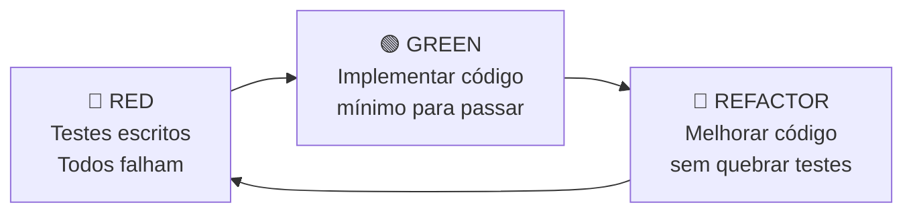

# TDD — Inventário de Equipamentos por Aeronave

Documento de especificação de testes para o módulo de inventário, seguindo a
metodologia **TDD (Test-Driven Development)**: os testes são escritos **antes**
da implementação.

**Arquivo de testes:** `tests/test_inventario.py`

---

## Resumo

| ID | Teste | Classe | Status |
| :---: | :--- | :--- | :---: |
| T01 | Inventário retorna itens instalados | `TestInventarioEndpoint` | ✅ IMPLEMENTADO |
| T02 | Resposta contém campos obrigatórios | `TestInventarioEndpoint` | ✅ IMPLEMENTADO |
| T03 | Ignora itens removidos (data_remocao != NULL) | `TestInventarioEndpoint` | ✅ IMPLEMENTADO |
| T04 | Aeronave sem itens retorna lista vazia | `TestInventarioEndpoint` | ✅ IMPLEMENTADO |
| T05 | Aeronave inexistente retorna 404 | `TestInventarioEndpoint` | ✅ IMPLEMENTADO |
| T06 | Filtro por nome exato de equipamento | `TestInventarioFiltros` | ✅ IMPLEMENTADO |
| T07 | Filtro por nome parcial (case-insensitive) | `TestInventarioFiltros` | ✅ IMPLEMENTADO |
| T08 | Itens ordenados por sistema e nome | `TestInventarioAgrupamento` | ✅ IMPLEMENTADO |
| T09 | Campo sistema presente para agrupamento | `TestInventarioAgrupamento` | ✅ IMPLEMENTADO |
| T10 | Requer autenticação (401 sem token) | `TestInventarioPermissoes` | ✅ IMPLEMENTADO |
| T11 | Mantenedor pode consultar inventário | `TestInventarioPermissoes` | ✅ IMPLEMENTADO |
| T12 | Endpoint é somente leitura (POST → 405) | `TestInventarioPermissoes` | ✅ IMPLEMENTADO |
| T13 | Não mistura itens entre aeronaves | `TestInventarioIsolamento` | ✅ IMPLEMENTADO |
| T14 | Item transferido aparece só no destino | `TestInventarioIsolamento` | ✅ IMPLEMENTADO |
| T15 | Dados refletem JOIN correto (nome, PN, SN) | `TestInventarioIsolamento` | ✅ IMPLEMENTADO |
| T16 | Página /inventario retorna HTML 200 | `TestInventarioPagina` | ✅ IMPLEMENTADO |

---

## Detalhamento dos Testes

### Grupo 1: Endpoint de Inventário (`TestInventarioEndpoint`)

Esses testes validam o endpoint principal `GET /equipamentos/inventario/{aeronave_id}`
que ainda **não existe** e deverá ser criado na **Fase 1** da implementação.

#### T01 — Inventário retorna itens instalados
```
DADO    aeronave 5900 com 3 itens instalados (ADF, VUHF1, PDU)
QUANDO  GET /equipamentos/inventario/{aeronave_id}
ENTÃO   status 200 e lista com 3 itens
```

#### T02 — Resposta contém campos obrigatórios
```
DADO    inventário com itens instalados
QUANDO  consultar o inventário
ENTÃO   cada item contém: equipamento_nome, part_number, sistema,
        numero_serie, status_item, instalacao_id, data_instalacao
```

#### T03 — Ignora itens removidos
```
DADO    aeronave com 2 itens, sendo 1 removido (data_remocao preenchida)
QUANDO  consultar inventário
ENTÃO   retornar apenas 1 item (instalação ativa)
```

#### T04 — Aeronave sem itens retorna lista vazia
```
DADO    aeronave sem nenhum equipamento instalado
QUANDO  consultar inventário
ENTÃO   retornar [] com status 200
```

#### T05 — Aeronave inexistente retorna 404
```
DADO    UUID de aeronave que não existe no banco
QUANDO  consultar inventário
ENTÃO   retornar 404 Not Found
```

---

### Grupo 2: Filtros (`TestInventarioFiltros`)

Esses testes validam o parâmetro de query `?nome=` para filtrar por nome de equipamento.

#### T06 — Filtro por nome exato
```
DADO    inventário com ADF, VUHF1 e PDU
QUANDO  GET /equipamentos/inventario/{id}?nome=ADF
ENTÃO   retornar apenas 1 item (ADF)
```

#### T07 — Filtro por nome parcial (case-insensitive)
```
DADO    inventário com ADF, VUHF1 e PDU
QUANDO  GET /equipamentos/inventario/{id}?nome=vu
ENTÃO   retornar 1 item (VUHF1) — busca parcial, ignora maiúsculas
```

---

### Grupo 3: Agrupamento por Compartimento (`TestInventarioAgrupamento`)

Esses testes validam a ordenação que permite o frontend agrupar por seção.

#### T08 — Itens ordenados por sistema e nome
```
DADO    itens em compartimentos distintos (COMP. ELETRONICO, 1P)
QUANDO  consultar inventário
ENTÃO   itens vêm ordenados por campo 'sistema' (alfabético)
```

#### T09 — Campo sistema presente para agrupamento
```
DADO    inventário com itens instalados
QUANDO  consultar inventário
ENTÃO   todos os itens têm campo 'sistema' preenchido (não null)
```

---

### Grupo 4: Permissões e Segurança (`TestInventarioPermissoes`)

#### T10 — Requer autenticação
```
DADO    requisição sem token JWT
QUANDO  consultar inventário
ENTÃO   retornar 401 Unauthorized
```

#### T11 — Mantenedor pode consultar
```
DADO    usuário MANTENEDOR autenticado
QUANDO  consultar inventário
ENTÃO   acesso permitido (endpoint é somente leitura)
```

#### T12 — Endpoint é somente leitura
```
DADO    requisição POST para /equipamentos/inventario/{id}
QUANDO  tentar criar via POST
ENTÃO   retornar 405 Method Not Allowed
```

---

### Grupo 5: Isolamento entre Aeronaves (`TestInventarioIsolamento`)

Esses testes garantem que os dados de inventário são isolados por aeronave.

#### T13 — Não mistura itens entre aeronaves
```
DADO    aeronave A com 2 itens e aeronave B com 1 item
QUANDO  consultar inventário da aeronave A
ENTÃO   retornar apenas 2 itens (sem dados da B)
```

#### T14 — Item transferido aparece apenas no destino
```
DADO    item removido da aeronave A e instalado na aeronave B
QUANDO  consultar inventário da aeronave A
ENTÃO   item NÃO aparece
QUANDO  consultar inventário da aeronave B
ENTÃO   item aparece
```

#### T15 — Dados refletem JOIN correto
```
DADO    item do tipo VUHF1 (PN 6110.3001.12) instalado
QUANDO  consultar inventário
ENTÃO   equipamento_nome="VUHF1", part_number="6110.3001.12", numero_serie correto
```

---

### Grupo 6: Página Frontend (`TestInventarioPagina`)

#### T16 — Página /inventario retorna HTML
```
DADO    rota /inventario configurada em pages/router.py
QUANDO  GET /inventario
ENTÃO   retornar HTML com status 200
```

---

## Como Executar

```bash
# Rodar apenas os testes de inventário
pytest tests/test_inventario.py -v

# Rodar um teste específico
pytest tests/test_inventario.py::TestInventarioEndpoint::test_t01_inventario_retorna_itens_instalados -v

# Rodar todos os testes do projeto
pytest -v
```

---

## Ciclo TDD



### Ordem de implementação sugerida (para fazer os testes passarem)

1. **T10** → Autenticação (já funciona via `CurrentUser` existente)
2. **T04, T05** → Criar endpoint básico (retorna `[]` ou `404`)
3. **T01, T02** → Implementar query de inventário com JOINs
4. **T03** → Filtrar `data_remocao IS NULL`
5. **T08, T09** → Adicionar `ORDER BY sistema, nome`
6. **T06, T07** → Implementar parâmetro `?nome=`
7. **T13, T14, T15** → Validar isolamento (já coberto pela query se implementada corretamente)
8. **T12** → Confirmado automaticamente (GET only)
9. **T11** → Confirmado automaticamente (endpoint usa `CurrentUser`, não `EncarregadoOuAdmin`)
10. **T16** → Criar rota de página e template HTML

---

*Documento criado em 18 de abril de 2026 seguindo metodologia TDD para o módulo de inventário do SAA29.*
